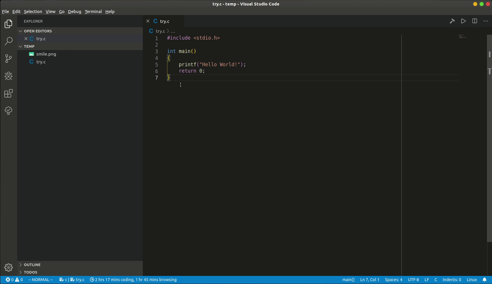

<div align='right'>Language:
<a href='{{ location.host }}/2018/12/30/Configure-C-C-environment-in-VSCode'><kbd>English</kbd></a>
<a href='{{ location.host }}/zh-CN/2018/12/30/配置VSCode中调试C-C-环境'><kbd>中文</kbd></a>
</div>

Here is a tutorial for configuration of VSCode to run C/C++ programs on **Windows**.
Mainly I wrote it for my [C/C++ Extension Pack](https://marketplace.visualstudio.com/items?itemName=LeoJhonSong.ccpp-extension-pack)
:tada:

<!-- More -->

Actually how can we run C/C++ code in VSCode has been described clearly in
[the C++ part of VSCode document](https://code.visualstudio.com/docs/languages/cpp),
here is just my personal understanding of this work and I suppose my description
is more friendly with beginners :smile:

1. [Requirements](#Requirements)
   1. [Compiler](#Compiler)
      1. [Installation](#Installation)
      2. [Add to Path](#Add-to-Path)
      3. [Test](#Test)
   2. [VSCode Extensions](#VSCode-Extensions)
2. [Configuration files](#Configuration-files)
   1. [IntelliSense configuration](#IntelliSense-configuration)
   2. [Compilation configuration](#Compilation-configuration)
      1. [In total](#In-total)
   3. [Debugger configuration](#Debugger-configuration)
      1. [Program to debug](#Program-to-debug)
      2. [Debugger path and options](#Debugger-path-and-options)
      3. [Compile before launch](#Compile-before-launch)
      4. [In total](#In-total-1)
3. [Enjoy](#Enjoy)

# Requirements

VSCode itself is just a editor, can not do things like compilation, even we add
VSCode's official extension for C/C++ called
[cpptools](https://marketplace.visualstudio.com/items?itemName=ms-vscode.cpptools),
it does not install a compiler for us.

## Compiler

So undoubtedly, our first step is to install a compiler. There are a few
choices, the one recommended by VSCode's document on Windows platform is [MinGW-w64](https://sourceforge.net/projects/mingw-w64/).

:warning: we have to notice that there is another thing called [MinGW](http://www.mingw.org/)
which is different from **MinGW-w64**. Although **MinGW** also works, but this
project hasn't update for a while and we need more steps to install it. In
addition, there should be a reason that VSCode document does not recommend it
but **MinGW-w64**.

### Installation

after downloaded the installer we are good to start installation, there are
mainly two options we have to change and leave the other options as the default:

- on the first page of the install wizard you are asked to choose your
  `Architecture`, set it to **x86_64** if your computer is 64-bit, set it to
  **i386** if your computer is 32-bit.
- you can install it to where ever you want but make sure you can find it later,
  since we have to add it to **Path** manually after the installation.

### Add to Path

After the installation we have to add our compiler to the **Path** so that it
can be called from the command line / powershell. (this is actually how VSCode
calls the compiler)

But what path to add?

The path add to the **Path** is actually the folder path of the executable file
of the application we want to call. For example I installed MinGW-w64 to
**D:\Softwares\mingw-w64\x86_64-8.1.0-posix-seh-rt_v6-rev0**, then I should add
**D:\Softwares\mingw-w64\x86_64-8.1.0-posix-seh-rt_v6-rev0\mingw64\bin** to the
**Path**. You can see the two applications we are going to call, `gcc.exe` and
`gdb.exe` are exactly there :v:

:link: If you are no sure how to add something to the **Path**,
[this](https://www.architectryan.com/2018/03/17/add-to-the-path-on-windows-10/)
may helps you :thumbsup:

### Test

Now! We can test if we successfully add the compiler to the **Path** by typing `gcc`
 in the cmd.

:heavy_check_mark: What we should see is:

```shell
C:\Users\LeoJh>gcc
gcc: fatal error: no input files
compilation terminated.
```

:x: What we should not see is:

```shell
`gcc`is not recognized as an internal or external command,
operable program or batch file.
```

Which means you may have added wrong path to **Path**.

## VSCode Extensions

We are not far from completion as we have successfully get our compiler ready
:smile: Actually we are now able to develop C/C++ code! (Although it may seems
hardcore) Don't believe? Open cmd and get into te folder where you have a piece
of C/C++ code to test, type `gcc test.c` or `gcc test.cpp` and you will find a
**a.exe** is generated in the current folder. This is exactly the executable
file we just compiled!

But this does not feels good, so we use extensions in VSCode to improve the
situation.

I recommend my
[C/C++ Extension Pack](https://marketplace.visualstudio.com/items?itemName=LeoJhonSong.ccpp-extension-pack)
since it includes only a few but really useful tools.

# Configuration files

In some tutorials it is said that we have to generate `c_cpp_properties.json`,
`tasks.json`, `launch.json` three files, but the situation has changed! :tada:
`c_cpp_properties.json` has been totally replaced by settings in
`settings.json`. The advantage is that we can set different values for different
workspace. Also, you will later see that configuring `tasks.json` and
`launch.json` becomes REALLY easy too!

:link: click
[here](https://github.com/Microsoft/vscode-cpptools/blob/master/Documentation/LanguageServer/Customizing%20Default%20Settings.md)
to learn more about what has been replaced by `settings.json` in
`c_cpp_properties.json`.

:link: click
[here](https://github.com/Microsoft/vscode-cpptools/blob/master/Documentation/LanguageServer/c_cpp_properties.json.md)
to learn more about what could have been set in `c_cpp_properties.json`.

:warning: the following configuration uses my settings as an example.

## IntelliSense configuration

As mentioned above, we are able to develop C/C++ without VSCode, so, from my
point of view, IntelliSense which provides us with smart suggestions is a very
important part of language support for C/C++ in VSCode. We could configure the
IntelliSense by editing `settings.json`. The most useful ones are:

```json
"C_Cpp.autocomplete": "Default",
"C_Cpp.clang_format_style": "{ BasedOnStyle: LLVM, UseTab: Never, IndentWidth: 4, TabWidth: 4, BreakBeforeBraces: Allman, AllowShortIfStatementsOnASingleLine: false, IndentCaseLabels: false, ColumnLimit: 0, AccessModifierOffset: -4 }",
"C_Cpp.clang_format_fallbackStyle": "{ BasedOnStyle: LLVM, UseTab: Never, IndentWidth: 4, TabWidth: 4, BreakBeforeBraces: Allman, AllowShortIfStatementsOnASingleLine: false, IndentCaseLabels: false, ColumnLimit: 0, AccessModifierOffset: -4 }",
"C_Cpp.default.compilerPath": "D:\\Softwares\\mingw-w64\\x86_64-8.1.0-posix-seh-rt_v6-rev0\\mingw64\\bin\\gcc.exe",
"C_Cpp.default.cStandard": "c99",
"C_Cpp.default.cppStandard": "c++11",
"C_Cpp.default.intelliSenseMode": "gcc-x64",
"C_Cpp.intelliSenseEngine": "Default",
"C_Cpp.errorSquiggles": "Enabled",
```

the segments **C_Cpp.clang_format_style** and
**C_Cpp.clang_format_fallbackStyle** specify the format style of how VSC format
C/C++ code. The above value makes a code style similar to C/C++ code style in
**Visual Studio**. If you prefer **Google Style**, the following piece is what
you need.

```json
"C_Cpp.clang_format_style": "{BasedOnStyleStyle: Google, IndentWidth: 4}",
"C_Cpp.clang_format_fallbackStyle": "{BasedOnStyleStyle: Google, IndentWidth: 4}",
```

🌟 In latest VSC, things becomes REALLY easy. You can learn how to generate
`tasks.json` and `launch.json` simply by this gif 👇



💡 This gif is recorded under Linux system (Ubuntu).

Following are some explanations of `tasks.json` and `launch.json`.

## Compilation configuration

Then we generate the `tasks.json` to help us compile the code.

✔️ `tasks.json` and `launch.json` are prepared for specific
piece of code as different programs may require different configurations. But if
most of your code shares the same configuration, you can put your `tasks.json`
and `launch.json` in the parent folder of all the programs. If a few programs
among them require specific configuration, you can generate another `tasks.json`
and `launch.json` in its folder.

After you have generate a `tasks.json` following the instruction in VSCode's document,
add the following task to the **tasks** list:

```json
{
   "label": "Compile",
   "type": "shell",
   "command": "gcc",
   "args": [
         "${file}",
         "-o",
         "${fileDirname}/${fileBasenameNoExtension}.exe",
         "-g",
         "-Wall",
         "-std=c++17"
   ],
   "group": {
         "kind": "build",
         "isDefault": true
   }
}
```

`label` is the name of this task, it will be [used later](#Copile-before-launch).

From this we can see that every time we call this task it actually inputs the
following command to shell:

```shell
gcc ${file} -o ${fileDirname}/${fileBasenameNoExtension}.exe -g -Wall -std=c++17
```

Things like ${file}, ${fileDirname} are actually
[variables defined by VSCode](https://code.visualstudio.com/docs/editor/variables-reference).

And the `-o` option allows us to specify the name of output file.

The settings about **group** allow us to call this task by shortcut
`Ctrl+shift+B`. check [this](https://code.visualstudio.com/docs/editor/tasks#_typescript-hello-world)
for more details.

### In total

So in total my `tasks.json` looks like this:

```json
{
    // See https://go.microsoft.com/fwlink/?LinkId=733558
    // for the documentation about the tasks.json format
    "version": "2.0.0",
    "tasks": [
        {
            "label": "Compile",
            "type": "shell",
            "command": "gcc",
            "args": [
                "${file}",
                "-o",
                "${fileDirname}/${fileBasenameNoExtension}.exe",
                "-g",
                "-Wall",
                "-std=c++17"
            ],
            "group": {
                "kind": "build",
                "isDefault": true
            }
        }
    ]
}
```

## Debugger configuration

The last thing we need is `launch.json`. This is actually a easy task since
VSCode provide us with a lot of templates, (normally I use the template **(gdb)
Launch**) only a few options need modification:

### Program to debug

```json
"program": "${workspaceFolder}/a.exe"
```

`program` means the program we want to debug. If not specified, the name of the
output file will be **a.exe**, so the program name is the above one. But if you
have specified the name of output file just like what I did in the `tasks.json`,
you should use this:

```json
"program": "${workspaceFolder}/${fileBasenameNoExtension}.exe"
```

### Debugger path and options

Set your debugger path simply by this:

```json
"miDebuggerPath": "gdb.exe"
```

And we can easliy find out that gdb will output something useless first every
time evoked. We could use option `-q` to disable this:

```json
"miDebuggerArgs": "-q"
```

### Compile before launch

If you always forget to compile the modified code before debugging, VSCode
provides a very useful option: **preLaunchTask**. We can specific this task to
our task named **Compile**, so our code will be compiled first every time we
start debugging :thumbsup:

```json
"preLaunchTask": "Compile"
```

### In total

So in total my `launch.json` look like this:

```json
{
    // Use IntelliSense to learn about possible attributes.
    // Hover to view descriptions of existing attributes.
    // For more information, visit: https://go.microsoft.com/fwlink/?linkid=830387
    "version": "0.2.0",
    "configurations": [
        {
            "name": "(gdb) Launch",
            "type": "cppdbg",
            "request": "launch",
            "program": "${workspaceFolder}/${fileBasenameNoExtension}.exe",
            "args": [],
            "stopAtEntry": false,
            "cwd": "${workspaceFolder}",
            "environment": [],
            "externalConsole": true,
            "MIMode": "gdb",
            "miDebuggerPath": "gdb.exe",
            "miDebuggerArgs": "-q",
            "setupCommands": [
                {
                    "description": "Enable pretty-printing for gdb",
                    "text": "-enable-pretty-printing",
                    "ignoreFailures": true
                }
            ],
            "preLaunchTask": "Compile"
        }
    ]
}
```

# Enjoy

Congratulations! :tada: You are now able to develop C/C++ code with VSCode and
hope you enjoy it!