**前言** ：博主是个不怎么懂软件的菜鸟，前几天为了学习Soft Robotics企图装一个带SoftRobots插件的SOFA，但我搜了半天也没有较新的安装教程（连下载方式都变了好吗）。虽然有官网的安装教程但我在安装过程中还是出了很多意外。感慨于在身边诸多大佬们的帮助下我这个对软件一窍不通的人才安装成功，我以一个不怎么接触编程的人的角度写下这篇博客帮助也想学习Soft Robotics的各位。(博主为了写这篇教程忍痛把安好的SOFA删了又下了一遍）
<!-- More -->
**P.S.** 由于我并不是软件相关专业的有很多理解和做法可能并不准确，仅供参考，也欢迎指教。

***教程仍然是跟着[SOFT ROBOTS Plugins for SOFA官网](https://project.inria.fr/softrobot/)来的，顺序有些许调整，要更详细一些。***

官网教程是[这个](https://project.inria.fr/softrobot/install-get-started-2/download/)，[这个](https://project.inria.fr/softrobot/install-get-started-2/building-on-windows/)和[这个](https://www.sofa-framework.org/community/doc/getting-started/build/windows/ )

实际上开发SoftRobots插件的项目组也考虑到要装这个软件太麻烦了，提供了[一个已经嵌入了SOFA的Ubuntu虚拟机映像](https://softroboticstoolkit.com/sofa/plugin),但这个下载链接无效了。不过据说给项目组发邮件的话回复很快。此处为了运行速度和想安在Windows系统下偏向虎山行。

# 预备工作

要下一个SOFA，首先你得下一堆东西...

`建议各位看完每一个小节下的内容再操作，有的提供不止一种方法`

## Visual Studio2015或以上版本

> 利用其中的**MSVC编译器**来编译本软件，只需要用到基础功能。

建议安装**VS2017 community**版，安装可以参考[这个](https://blog.csdn.net/qq_36556893/article/details/79430133)

### <span id='pthread'>pthread库</span>

> 博主在Cmake时曾因缺少这个库报错。这是**一个实行了POSIX线程标准的线程库**，Windows下的pthreads-win32是从类Unix系统移植来的。

或许你可以先跳过这一步，如果你也遇到了这个报错再安装也不迟。安装参考[这个](https://blog.csdn.net/cry1994/article/details/79115394?tdsourcetag=s_pctim_aiomsg)。单纯安装后博主也遇到了左边链接中提到的 **“timespec”:“struct”类型重定义** 问题，因此建议加上那个宏定义。

## Qt (版本>= 5.5.0)

> 我猜这个是用来绘制SOFA的图形界面的

官网提供的下载链接是[这个](http://download.qt.io/official_releases/online_installers/),选择*qt-unified-windows-x86-online.exe*，是在线安装包。你也可以安装[离线安装包](https://download.qt.io/official_releases/qt/5.11/5.11.1/?tdsourcetag=s_pctim_aiomsg),选择*qt-opensource-windows-x86-5.11.1.exe*.
安装可以参考[这个](https://www.cnblogs.com/chenmingjun/p/8392713.html)

但实际上，只是为了安装SOFA的话，
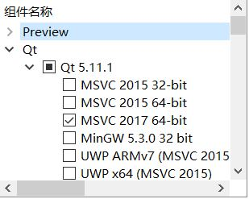
只需要如上图这个**MSVC 2017 64-bit**组件(博主当初不知道，把Qt5.11.1和Tools下所有东西都装了，下死我了)
## Git

> 接下来下载SOFA源代码，SoftRobots插件源代码，vcpkg等都要用到这个高级百*云

安装和使用教程可以参考[廖雪峰老师的Git教程](https://www.liaoxuefeng.com/wiki/0013739516305929606dd18361248578c67b8067c8c017b000/00137396287703354d8c6c01c904c7d9ff056ae23da865a000)

## Boost (版本>= 1.54.0)

> Boost是一个影响甚大，应用广泛的C\+\+库（SOFA基于C\+\+）

在大佬的推荐下博主并没有直接安装Boost，而是安装了**一个面向VS的开源C++库集成器*Vcpkg***,通过Vcpkg傻瓜式安装了Boost。Vcpkg的安装和使用教程参考[这个](https://blog.csdn.net/cjmqas/article/details/79282847)。

然后Boost的安装就很轻松愉快了：在Vcpkg.exe所在文件夹shift+右键点击**在此处打开powershell**，在powershell中

```bash
#x64平台的电脑输入
.\vcpkg.exe install Boost:x64-windows
#x86平台的电脑输入
.\vcpkg.exe install Boost:x86-windows
```

截至写博客时，通过这种方法下载下来的是Boost1.68.0

**P.S.**当然你也可以直接安装Boost。实际上这样可能更容易让Cmake找到Boost，博主通过Vcpkg安装的Boost需要手动让Cmake找到，<a href='#Boost'>见编译部分</a>。

## Python 2.7

> 我们所必须的SoftRobots插件很大程度上依赖于SofaPython插件，另外有了SoftPython插件SOFA才可以识别“.py",".pyscn"扩展名的文件。SofaPython插件是默认安装的，前提是你有Python2.7。

`注意，要成功安装SofaPython插件必须用Python2.7，不能使用Python3，否则生成Makefile时会出错。(血泪亲测)`

因为博主之前为Python这个博主唯一接触过一点的语言下了[Anaconda](https://www.anaconda.com/),于是博主试图用在Anaconda中激活的一个Python2.7环境来满足条件，但博主尝试了许久也无法让Cmake找到我这个2.7的Python，他只找到了在我Anaconda根目录的Python3.5...

因此我为了安装SOFA专门下了一个[Python2.7.15](https://www.python.org/downloads/release/python-2715/)(截至写博客时最新版Python2.7.x)。x64平台电脑下载**Windows x86-64 MSI installer**，x86平台电脑下载**Windows x86 MSI installer**。如果图省事一路默认选项安装即可（是的博主甚至安到了C盘）

<br />

**好的，有了以上这些我们可以开始下载SOFA了**

# 下载

## SOFA源代码下载

SOFA官网提供稳定版（v18.06）和不稳定版。一开始博主下了稳定版，一秒下载两秒安装，那叫一个爽。但不幸的是<span style='color:red;'>要安装SoftRobots插件的话只能安装不稳定版</span>。刺激。

找一个你认为适合安装SOFA的文件夹（博主安装在了D盘根目录），此处打开powershell，输入

```bash
git clone -b master https://github.com/sofa-framework/sofa.git sofa/src/
```

然后你可以去看一集番。因为Github的鬼屎速度303.37MiB左右博主下了二十几分钟。

下好之后在**sofa/**文件夹下新建一个**build**文件夹一会放runsofa.sln和编译好的软件用。

## 补充的库下载

需要额外下载四个库**libPNG, libJPEG, libTIFF, Zlib, Glew**.VS2015用户下载[这个](https://www.sofa-framework.org/download/WinDepPack/VS-2015/latest)，VS2017用户下载[这个](https://www.sofa-framework.org/download/WinDepPack/VS-2017/latest)。直接将解压出来的**include，lib，licenses**三个文件夹放到 **sofa/src/** 文件夹下就可以了。

## SoftRobots插件源代码下载

进入**sofa/src/applications/plugins**文件夹，此处打开powershell，输入

```bash
git clone https://github.com/SofaDefrost/SoftRobots
```

这一次17.52MiB博主下了十分钟。(What?!)

实际上除了SoftRobots，项目组还提供了一个插件[SoftRobots.Inverse](https://project.inria.fr/softrobot/install-get-started-2/download/),但这个插件目前不向公众开发。有兴趣的话各位可以发邮件给项目组，下载来试试。

*别忘记将刚下的**HIDAPI**放进去*

# 生成runsofa.sln

然后就可以点开CMake图形界面了，做好多次报错的心理准备。

> 博主推荐先修改一下设定，打开`Options`下的**Warning Messages...**,像下面这样勾选抑制警告的两项，关掉可能很多条，干扰视线而不影响Cmake的Warning提示，有利于稍后更容易地找出报错原因。

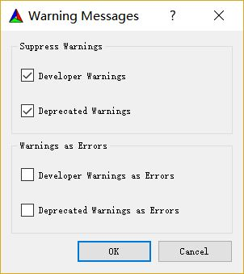

首先在*where is the source code*一栏填上你的**sofa/src**的地址，在*where to build the binaries*一栏填上你的**sofa/build**的地址，然后点击`Configure`。
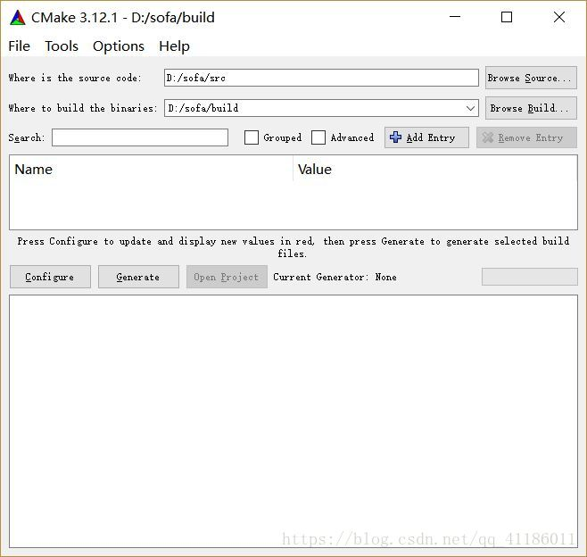

然后为项目选择你将要使用的编译器，向下面这样选择。
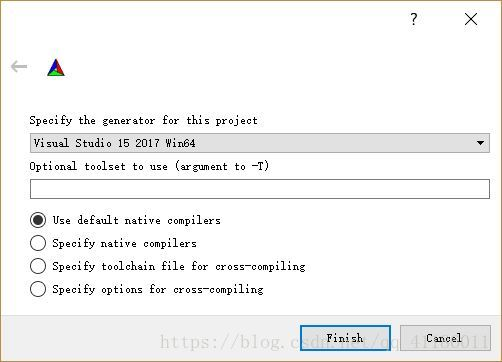

P.S.虽然官网教程有提及可以使用**Ninja**来代替此处的选择，但我没研究出怎么使用，此处仍然选择VS的**MSVC**编译器。

> 第一次Configure用时较长，，尤其是可能在**Cloning into 'SofaHighOrder'...**一行停留许久。你可以稍微歇息一下


然后是频繁出现地报错。

但不用担心，Configure这个操作本来就是要多次进行来逐渐更正错误，甚至可以在此期间调整要安装的插件。经过我的观察Generate多次也没有问题，只会在原本的基础上改动，不会出现重复的文件。因此放心大胆地来，每次你觉得修正了几个问题了就可以运行一次Configure。经过博主摸索发现了两种找报错原因的方式

- 直接看`Configure`和`Generate`两个按键下面的信息框里的报错信息
- 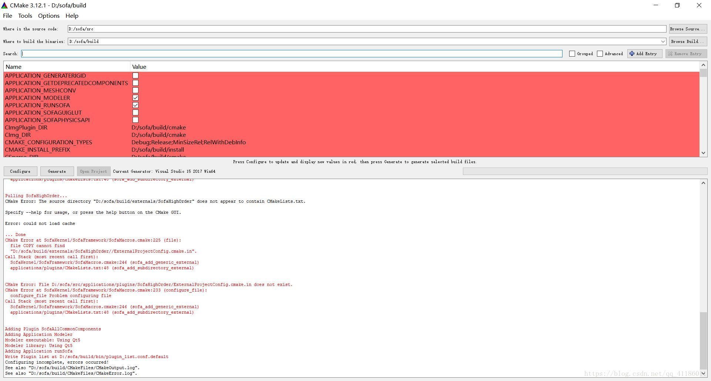
- 打开在**sofa/src/build/CMakeFiles/**下的*CMakeError.log*（错误日志）。这个日志会记录你在Cmake过程中所有的报错 (包括每一次Configure的报错)。我的经验是错误原因通常在”**生成失败。**“这句话附近。如果有多个错误，一个一个耐心解决。

## SOFA本体Configure过程中遇到的一些报错及解决

以下是博主在Cmake过程中遇到的一些报错及博主的解决方式。

### fatal error C1083: 无法打开包括文件: “pthread.h”: No such file or directory

好的，如果你出了这个报错说明你刚刚没有安装<a href='#pthread'>推荐你安的pthread库</a>，让你懒哈哈哈哈哈

不过即便安装pthread库后在*CMakeError.log*中仍然会有pthread相关报错。但不会影响SOFA的安装，可以忽略。

### <span id='Boost'>Unable to find the Boost header files</span>

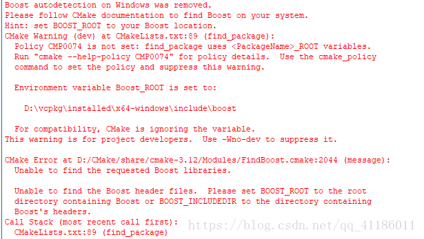

如果你得到了类似这样的报错信息那你大概是像博主一样利用Vcpkg安装的Boost，Cmake没能找到你的Boost。(我错了，下次还犯)但用Vcpkg安装Boost真的很容易。Cmake给出了提示：

#### 方法1：

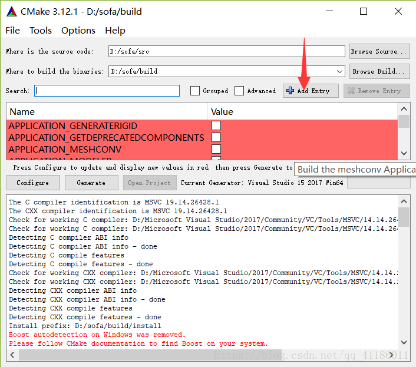

点击`Add Entry`按键添加一个下面这样的Entry。

| Name        | Boost_ROOT                                                   |
| ----------- | ------------------------------------------------------------ |
| Type        | **path**                                                     |
| Value       | **你安装Vcpkg的文件夹/vcpkg/installed/x64-windows/include**(比如博主的是*D:\vcpkg\installed\x64-windows\include*) |
| Description | 空                                                           |

<br />
注意Value不能填<b>你安装Vcpkg的文件夹/vcpkg/installed/x64-windows/include/boost</b>,需要填包含Boost文件夹的文件夹的路径，否则仍然会像上图那样报错。

#### 方法2：

在环境变量中添加一个下面这样的系统变量

| 变量名     | 值                                                           |
| ---------- | ------------------------------------------------------------ |
| Boost_ROOT | **你安装Vcpkg的文件夹/vcpkg/installed/x64-windows/include**(比如博主的是*D:\vcpkg\installed\x64-windows\include*) |

### sofa/src/applications/plugins/SofaHighOrder/ExternalProjectConfig.cmake.in does not exist.

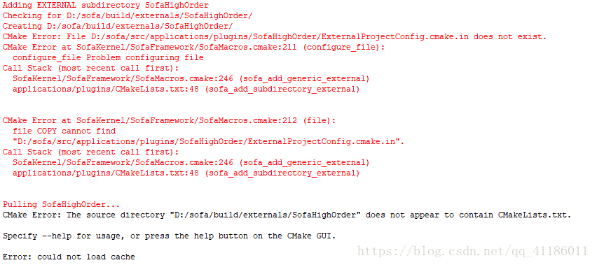

有可能当添加SofaHighOrder的子目录EXTERNAL的时候会发生这样的报错，有时候又不会发生。我怀疑*ExternalProjectConfig.cmake.in*这个文件特别容易丢包。但解决很容易，博主在前面下载SOFA源码的Github仓库里找到了这个[ExternalProjectConfig.cmake.in](https://github.com/sofa-framework/sofa/tree/master/applications/plugins/SofaHighOrder)你说神不神奇。把这个文件下载下来放到<b>sofa/src/applications/plugins/SofaHighOrder/</b>文件夹下即可。(其实博主不知道怎么下这个文件，就在sofa/src/applications/plugins/SofaHighOrder/文件夹下新建了一个ExternalProjectConfig.cmake.in并把Github上该文件里的内容复制粘贴了进去)

在运行到SofaHighOrder这部分的时候你可能会碰到像下面这样的乱码，但不要紧，再Configure几次就没有了。

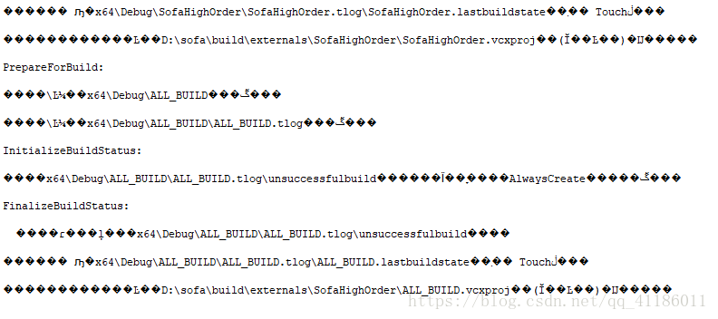

### 找不到Python

博主为此专门下了一个Python2.7。

`你需要在搜索框中搜索Python以确保你确实添加上了SofaPython插件`。即便你单独下好了Python2.7你也可能需要手动勾选SofaPython选项（勾选前Enter列表中**SofaPython_DIR**显示找不到SofaPython，但你手动添加这个插件的话其实他找得到）

### 找不到Qt

类似找不到Boost的解决办法，点击`Add Entry`,添加一个下面这样的Entry

| Name        | CMAKE_PREFIX_PATH                                            |
| ----------- | ------------------------------------------------------------ |
| Type        | **path**                                                     |
| Value       | **你安装Qt的文件夹/Qt/5.11.1/msvc2017_64**(比如博主的是*D:/Qt/5.11.1/msvc2017_64*) |
| Description | 空                                                           |

再次运行Configure后刚添加的这个叫CMAKE_PREFIX_PATH的Entry会消失，取而代之的是一帮Qt的Entry

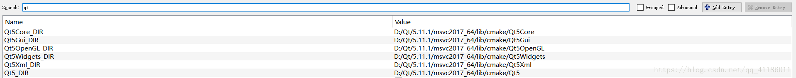

**以上便是博主安装SOFA本体过程中遇到过的报错，如果你遇到了别的无法解决的报错也欢迎讨论**

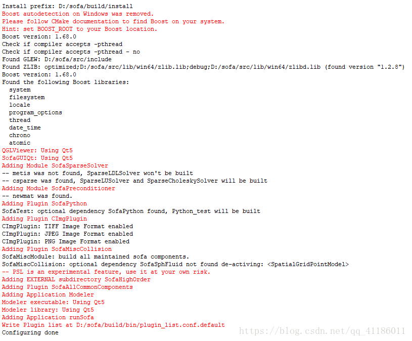
这是博主在加装SoftRobots插件前得到的无误的反馈信息。并且你会发现本来一片红色的Entry列表此时全都是白/灰这种看起来就很OK的颜色。(如果还有红色的请再Configure一次。这之后如果还有，忽略)

在此之前，在搜索框里输入python并确保你的**PLUGIN_SOFAPYTHON**打了勾，**SofaPython_DIR**不是not found

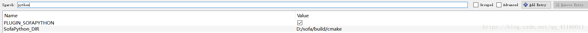

这样SOFA软件本体的安装就没有问题了，接下来添加SoftRobots插件(现在你在搜索框查找SoftRobots是什么也查不到的)。

## 添加SoftRobots插件

> 博主一开始没看到正规添加SoftRobots插件的方法，手足无措下自行修改了SOFA的CMakeList.txt文件安上的...(狗屎英语教程)

正规方法是在搜索框搜索**SOFA_EXTERNAL_DIRECTORIES**，找到这个Entry并将Value填为**你安装SOFA的文件夹/sofa/src/applications/plugins/SoftRobots**(比如博主的是*D:/sofa/src/applications/plugins/SoftRobots*)，


再次Configure，你就得到了与SoftRobots相关的几个Entry。不勾选这几个可选组件orz博主研究了很久也没能成功安装他们。根据名字和需要的库博主猜测**SOFTROBOTS_GAMETRAKCONTROLLER**是一个实现可以通过usb设备或蓝牙和外设交互的组件，**SOFTROBOTS_COMMUNICATIONCONTROLLER**似乎是实现利用网络通信和外设交互的组件，而**SOFTROBOTS_ROBOTINOCONTROLLER**猜测需要配合**Robotino**使用。**Robotino**是一款商业化的移动机器人系统，明显买不起。博主暂时不需要这个插件。

再次Configure。

完美。

这是博主最终的无误版**Configure**的反馈信息。

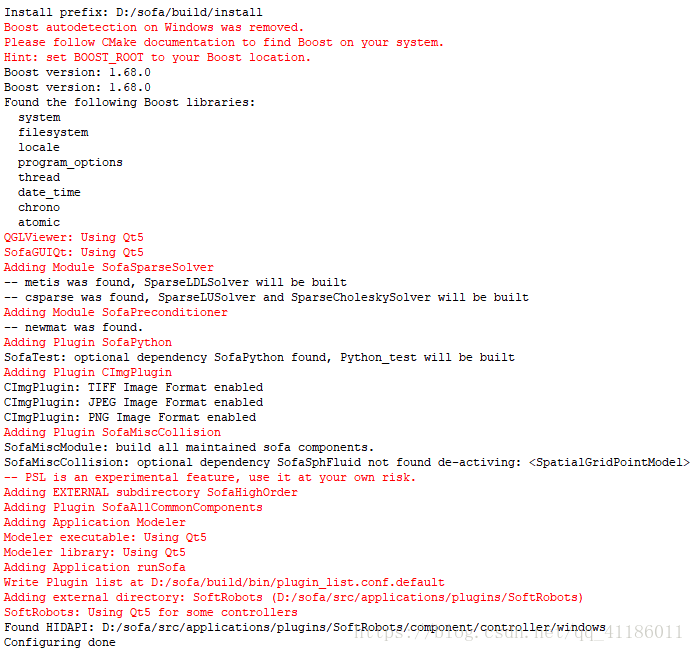

现在安装已经接近尾声了(步骤方面，时间方面还得要一会)，你可以选择性的再安装几个部件。(报错了的话就放弃吧哈哈哈哈哈)给出官网上[相关网页](https://www.sofa-framework.org/community/doc/getting-started/build/build-options/)以供参考。

当你对Configure的结果感到满意后，`Generate`，点击！


`注意，编译完成之前暂时先不要关闭CMake界面，否则可能编译失败`

# 编译

> 你可以睡前来做这个

进入**sofa/build/**,用VS打开*Sofa.sln*,经过一段令人尴尬的等待，

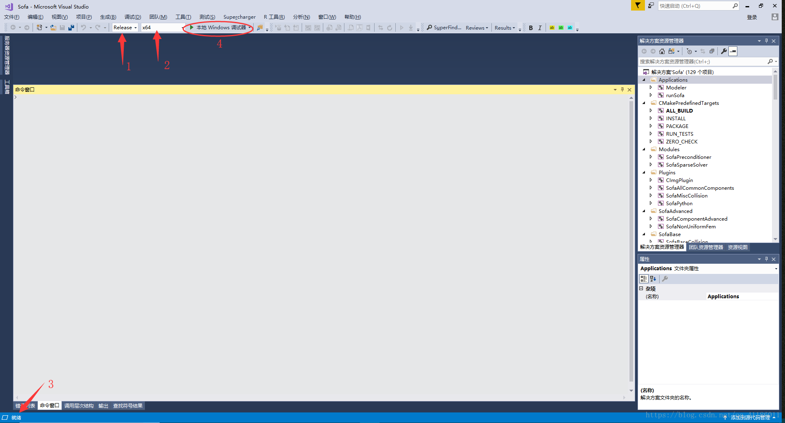

进入界面后先将解决方案配置调为**Release**，然后确保解决方案平台确实是你电脑的平台(博主的电脑是x64平台)，等待左下角显示**就绪**后，点击**本地Windows调试器**开始编译。

然后你就可以去睡觉了。(即便你想用电脑做点别的应该也很难，不知道是我人品太差还是SOFA的编译真的很考验电脑，我的电脑呈现出了这样的尴尬局面 )

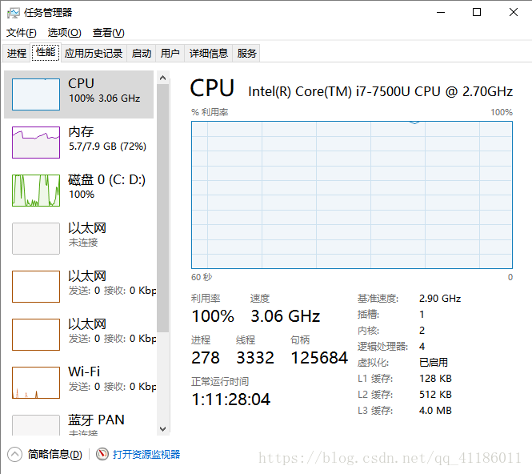

第二天(博主的电脑编译了两个多小时)，你会看到一个无法打开ALL_BUILD的报错，这是正常现象，无须在意。

`如果你没有看到其他报错，恭喜你编译成功了!`

# 测试

现在就可以来测试一下软件是否真的安装成功了。进入**sofa/build/bin/release/**，运行*rensofa.exe*,会进入这个蛇绕柱子的Demo。

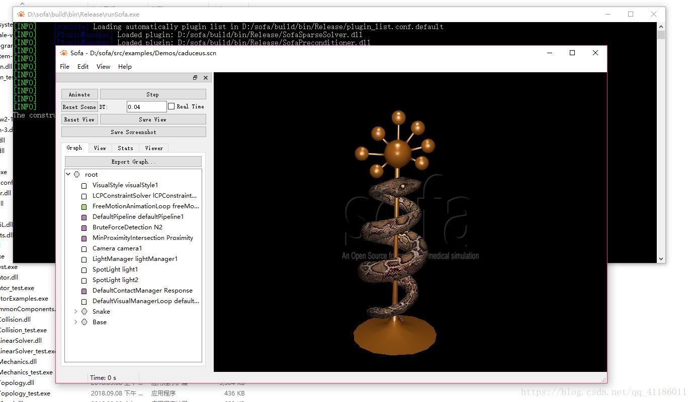

你可以通过打开在SoftRobots下的几个Example来进一步测试。可以参考官网给出的[样例教程](https://project.inria.fr/softrobot/install-get-started-2/tutorial/)。或者你也可以探索SOFA官网上的[入门教程](https://www.sofa-framework.org/community/doc/getting-started/tutorials/)。

<br />

**至此，本次在Win10下安装SOFA仿真软件并加装SoftRobots插件的任务便完成了。**

**恭喜你能坚持安装完成，也祝你接下来的研究顺利。**

<br />
<br />

> 顺带一提，电子科大微软学生俱乐部真是个好地方，里面人才又多，说话又好听