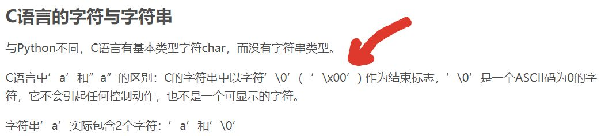

我想记录一下我遇到过的各种bug, 不论大小. 原本我从一开始学编程的时候就在这么做了, 但我也忘了我什么
时候竟然怠慢了这件事! 我会想到记录这些是上大学前的暑假看到
[这篇让人深受启发的教诲](https://zhuanlan.zhihu.com/p/22266788)而想要养成的习惯之一.
我认为这绝对不是浪费时间. 正如初高中学习时的错题本 (虽然我那时的错题本一共也没能记几笔)
只要我偶尔能想起来记几笔, 我想总是能为以后节省一些时间的.

<!-- More -->

# 有时候等号两侧不能加空格

- 在bash中赋值时等号两侧不能有空格
- 在swift中等号两侧要不都加等号, 要不都不加, 不可只有单侧有等号

# 此python非彼python

有时会遇到明明刚安装了一个包但调用的时候报错未找到该包, 再次安装显示已安装最新版的神奇情况

有以下几种可能 (总体来说是安装包的python环境和调用包的python环境不一样):

1. 如果你是用命令行安装的 (或者你安装了Anaconda,用conda安装的), 在IDE中调用的, 那你应当检查一
   下你的IDE调用的pytohn interpreter和cmd调用的是不是一个了. 比如Anaconda自带的Spyder默认的
   是python2.7, 但我设置的cmd调用的是一个3.6.4的python

   :heavy_check_mark: Anaconda中切换Spyder环境可以参考
   [这里](https://www.zhihu.com/question/49144687)
2. 如果环境中同时有python2和python3, 有可能将包安装到了python2的环境中但你的程序是
   python3的程序, 可以将`pip install` 换为 `pip3 install` 试试

:warning: 如果安装了conda那么安装python库最好使用conda, 尽量不要混用conda和pip,
**conda和pip的包格式不同, 两者是不兼容的, 甚至有的库在conda和pip中名字不同**.
有关在conda中没有某库但pip中有的情况可以
参考[这里](https://www.zhihu.com/question/49144687), 而关于混用conda与pip的危害可以
参考[这位日本兄弟的文章](http://onoz000.hatenablog.com/entry/2018/02/11/142347)

# 谨防数据溢出

这个例子是我在尝试细化图像的时候遇到的

## 代码

```python
def Xihua(image, array, num=1):
    iXihua = np.zeros(image.shape, np.uint8)
    iXihua = image.copy()
    for i in range(num):
        VThin(iXihua, array)
    return iXihua


def VThin(image, array):
    h = height
    w = width
    NEXT = 1
    for i in range(h):
        for j in range(w):
            if NEXT == 0:
                NEXT = 1
            else:
                M = (image[i, j-1] + image[i, j] + image[i, j+1]) if 0<j<w-1 else 1
                if image[i, j] == 0 and M != 0:
                    a = [0] * 9
                    for k in range(3):
                        for l in range(3):
                            if -1<(i-1+k)<h and -1 <(j-1+l)<w and image[i-1+k, j-1+l]==255:
                                a[k*3+l] = 1
                    sum = a[0]*1+a[1]*2+a[2]*4+a[3]*8+a[5]*16+a[6]*32+a[7]*64+a[8]*128
                    image[i, j] = array[sum] * 255
                    if array[sum] == 1:
                        NEXT = 0
    return image
```

## 报错信息


## 原因

M默认与image[i, j]同数据类型，而image[i, j]设定的是ubyte类型，范围-255~256，M极有可能数据溢出。

## 解决方法

将18行改为下面代码, 将M数据类型强制转为int

```python
M = (int(image[i, j-1]) + int(image[i, j]) + int(image[i, j+1])) if 0<j<w-1 else 1
```

# 迭代中的计数器记得归零

在迭代中的迭代中的计数器 (简称迭中迭) 要记得在一次迭代后归零, 或者应当将一次迭代的代码
分割出来封装成一个函数, 在函数中给计数器设定初值. 这样每次调用都会是从零开始而不是累积的.

# python中赋值的坑

一次我得到一个list, 想要将其从小到大重新排序, 但不影响原来的list. 因此我试图将这个`list`
复制到`listSort`中, 对listSort排序:

```python
listSort = list
listSort.sort()
```

但我发现这样完全没有达到我的目的! list会随着listSort的改变而改变, 与我想保持list不变的
目的完全相悖. 随后我才知道在python中**赋值是将变量名指向对象**, 与C语言中变量不止是个
名字, 也是字节集合并真实存在于内存某个位置上的情况是不同的.

## 错误原因

### 可变对象与不可变对象

python中的不可变对象有:

- int
- float
- bool
- string
- tuple

python中的可变对象有:

- list
- dict
- set

:exclamation: 要注意python中对一个可变对象重新赋值对象重新赋值对象地址不会变化, 而
对一个不可变对象重新赋值其地址会发生改变 (可以用`id(var)`语句来查看变量的地址).

另外python中向函数传递参数只是**引用传递**: 如果参数为可变对象, 在函数中变化会影响外层该变量,
而不可变对象不会. 在向类传递参数时也是如此.

可变对象有时是一种很方便的特性, 但很多时候是**很危险的**.

#### 函数默认参数一定要设定为**不可变对象**

否则可能会引发一些错误, 我们来看下面一个例子:

```python
>>> def myfunc(l=[]):
...     l.append('add')
...     print(l)
...
>>> myfunc([1, 2, 3])
[1, 2, 3, 'add']
>>> myfunc(['a', 'b'])
['a', 'b', 'add']
```

上面代码是正常运行的, 我们来看下面这些:

```python
>>> myfunc()
['add']
>>> myfunc()
['add', 'add']
>>> myfunc()
['add', 'add', 'add']
```

按理说应该每次都是`['add']`, 但是现在出现了意想不到的错误.

这是因为`l = []`是在**函数定义时就确定下来了的**, 所以之后每次调用这个函数, 使用的**l**都是同一个, 如果不指定这个参数的新值, 就会出现上面这个问题.

上面这个**l**可以默认设置为**None**, 这就是一个不可变对象.

#### 类的属性通常是可变对象

有意思的是类的属性通常都是可以访问和修改的, 也就是说属性都是可变对象. 主要有两种方法使我们可以创建不可变的属性:

- 设置`__setattr__`直接抛出异常, 即只要想设置属性值, 就会抛出异常
- 设置`__slot__`限制属性的访问, 如果属性都不能访问了, 那就肯定不能修改

## 复制列表的正确操作

:link: 这个[链接](https://www.cnblogs.com/ifantastic/p/3811145.html)说明了我的
错误原因并列出了五种复制列表的方法的比较, 但实际上还有一种
[我很喜欢的方法](https://www.programiz.com/python-programming/methods/list/copy)
他没有列出. 从中可以看出`copy.deepcopy()`是最保险的方法.

## 赋值, 浅拷贝与深拷贝

:link: 请参考[这里](https://www.jianshu.com/p/1059318d38e0)

# python写入中文字符串变乱码

🔗 [Python 2 字符串编码踩坑小结](https://ericfu.me/python-2-str-and-unicode/)

虽然我并不怎么写python2的代码但👆这篇文章确实对python中编码问题很有启发.

🔗 [Processing Raw Text](https://www.nltk.org/book/ch03.html)

而在网上搜图的时候我搜到了这段讲python中处理文本的各种方法的话.

其中提到了如下图这样的方式防止出现乱码.


正如 "Python 2 字符串编码踩坑小结" 中提到的, 在python3中`str`类型数据都以Unicode码点格式
储存. 实际上我们[可以直接输入Unicode码点](https://zh.wikipedia.org/wiki/Unicode#%E8%BE%93%E5%85%A5%E6%96%B9%E6%B3%95).

# Verilog中要写完整控制语句

Verilog中如果不写完整if-else结构和case结构会产生latch, 会将毛刺传给下一级电路的那种latch.

参见我的另一篇博客 [Verilog 杂记-有关default](https://leojhonsong.github.io/zh-CN/Verilog%E6%9D%82%E8%AE%B0/#%E5%85%B3%E4%BA%8E%20default)

# Verilog中因不同条件触发的变量应在不同always块中描述

参见我的另一篇博客 [Verilog 杂记-有关always](https://leojhonsong.github.io/zh-CN/Verilog%E6%9D%82%E8%AE%B0/#%E6%9C%89%E5%85%B3%20always)

# C++字符串赋值坑

在写一段C++代码时我遇到了这样的问题: 用如下代码给一个string类型的变量`str`赋值为
"\xfe\xfe\x03\x00\x00\x3e\xfd", 也就是一个16进制表示的ASCII编码值为 fe fe 03 00 00 3e fd 的字符串,但这样做始终只能让`str`的值变为"\xfe\xfe\x03"!

```C++
std::string str = "\xfe\xfe\x03\x00\x00\x3e\xfd";
```

但同时我发现用`assign()`来指定长度赋值就不会出现这种问题:

```C++
std::string str;
str.assign("\xfe\xfe\x03\x00\x00\x3e\xfd", 7);
```

⚠️要注意的是传给`assign()`的字符串长度不能用`length()`, `size()`等函数来给出, 他们同样
会把\0视为字符串末尾... 我的方法是手动给出, 反正我的程序里字符串是定长的.

我拿这个问题问我的C++大佬同学, 他说应该是因为\0让C++认为字符串到头了, 于是只有前三个字符.

我说: ? 我这字符串里哪有\0? 你别骗我读书少.

然后他发了一张图来:



...我是真的吃了读书少的亏, 竟然特么\0和\x00是一个意思🤦‍

然后在string类型变量里写入\0的方法似乎只有用`assign()`和指定字符串长度的构造函数
. 其实用`=`赋值在变量声明和定义同时出现时是只有字符串值这个参数的构造函数, 否则
就是只有字符串值这个参数的`assign()`函数.

# socket的Address already in use问题

前几天写了一段socket服务器端的代码, 运行了一遍没毛病, 再运行第二遍竟然在创建业务
socket时报错了. 过了一会运行第三遍竟然又没问题了🤦‍ 我记得报错似乎是这个**Error:
Address already in use**, 我的服务器端监听的端口处于 **TIME_WAIT** 状态. 后来我
发现[这个描
述](https://stackoverflow.com/questions/15198834/bind-failed-address-already-in-use/15199016#15199016)
符合我的情况 (虽然我是在创建业务socket时出错的). 没想到是因为socket关得太慢了我
重新启动程序时上次程序的socket还在占用端口...虽然我觉得这有点神奇但设置
**SO_REUSEADDR** 确实解决了我的问题. 解决方法很简单,紧跟着创建了监听socket代码的
那一行后面加两句:

```C++
int enable = 1;
setsocketopt(sockfd, SOL_SOCKET, SO_REUSEADDR, &enable, sizeof(enable));
```

或者更严谨一点:

```C++
int enable = 1;
if (setsockopt(sockfd, SOL_SOCKET, SO_REUSEADDR, &enable, sizeof(enable)) < 0)
    error("setsockopt(SO_REUSEADDR) failed");
```

# make编译提示Clock skew detected

有次在用make编译时给出如下warning:

```shell
make: warning: Clock skew detected. Your build may be incomplete.
```

💡 Clock skew 可以翻译时钟错误

我当时都懵了, 这编译咋还和时间扯上关系了...查了一下说这个warning是说**某个文件的
时间戳大于系统的当前时间**. 而之所以说编译可能不完全是因为**make完全依赖各个文件
的时间戳来确定哪个文件最近被修改了, 随后决定哪个文件需要重新生成**, 因此文件时间
戳出问题了的话, make对需要编译哪些文件的判断可能出错. 虽然此处只是文件时间大于系
统时间, 看起来并没有顺序问题. 但是因为时间戳问题通常出现于**NFS** (网络文件系统)
中, 因为不同设备的时间不同步而导致, 而这**很可能导致最新的代码无法被应**用, 算是
很严重的问题, 因此make还是会给出给出warning.

但是! 我一直是在本地运行的, 通常来说是不会出现这种问题的啊...

后来我发现是因为[我Linux系统时间比Windows系统时间多八个小
时](https://leojhonsong.github.io/zh-CN/Linux%E6%9D%82%E8%AE%B0/#Linux%E7%B3%BB%E7%BB%9F%E6%97%B6%E9%97%B4%E5%92%8CWindows%E7%B3%BB%E7%BB%9F%E6%97%B6%E9%97%B4%E5%B7%AE8%E5%B0%8F%E6%97%B6),
而虽然我的Linux系统能够自动进行网络校时, 但我这次关闭Windows系统 (Windows系统校
准过时间) 再打开Linux系统使用过程中并没有联网... **这使得Linux系统时间比实际时间少
了8个小时**. 那么如果距我上次对Makefile的修改没到八个小时就会遇到这个warning 😁

💡 这个问题解决起来很简单, 只需要`touch`每一个文件来更新时间戳即可. 找到当前目录
下每个文件并touch的命令如下:

```shell
find . -type f -exec touch {} +
```
