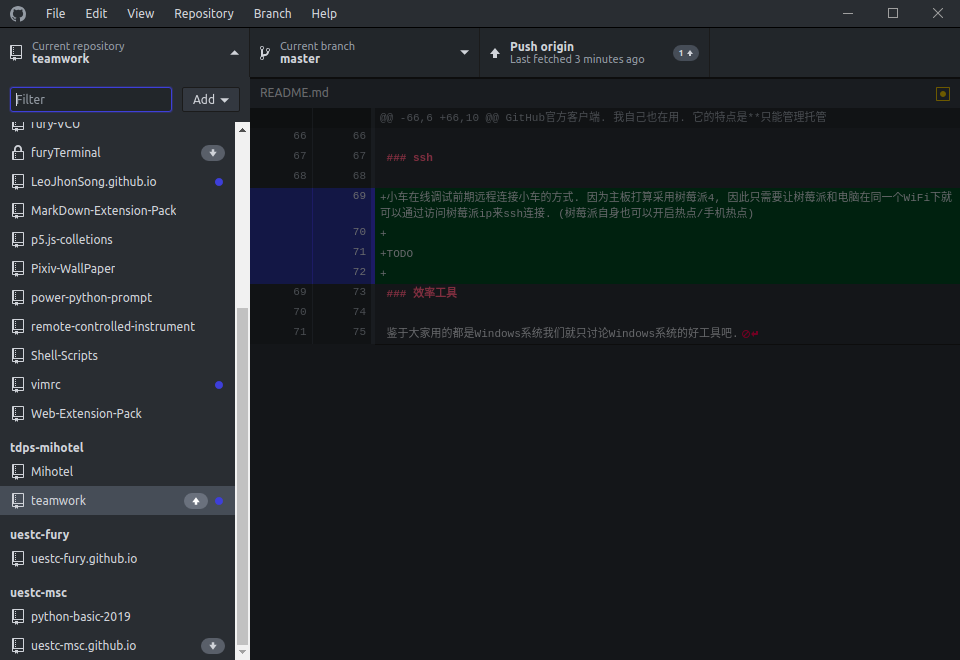
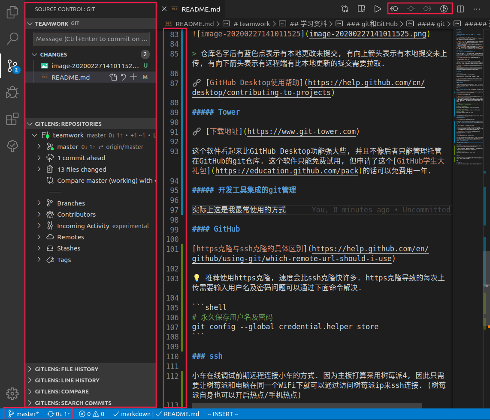

先有git, 许久后才有了GitHub等代码托管平台. git是一个软件而GitHub是一个网站. 他们的关系是你可以通过git将你的代码托管给GitHub (就是把你的代码存到GitHub的服务器上). 不过随着发展, 这些代码托管平台现在提供极为丰富的服务, 我认为其中生态做得最好的还得是github. 从github自带的github pages, github action到应用市场的各种应用, 应有尽有.

<!-- More -->

## git

git是一个**分布式版本控制**软件. 与它齐名的另一个版本控制软件是**SVN**.

🔗 [为什么要版本控制及分布式版本控制原理](https://blog.csdn.net/xiaoqiangyonghu/article/details/78400313)

### 图形化软件

虽然有人仍喜欢用纯命令行, 并且有的命令确实只能在命令行输入 (很多命令图形界面无法提供), 但我平时更喜欢使用图形化软件来操作git. 此处推荐三款软件.

#### GitHub Desktop

🔗 [下载地址](https://desktop.github.com/)

GitHub官方客户端. 这是一个对新手很友好的客户端, 我自己也在用. 它的缺点是**只能管理托管在GitHub的git仓库**. 它很有用的一点是**能在一个面板上看到你每个仓库的更新情况**. (我经常忘记哪个仓库有没有上传)

❗️ 要打开软件等它检测一会才会显示出来状态.



> 仓库名字后有蓝色点表示有本地更改未提交, 有向上箭头表示有本地提交未上传, 有向下箭头表示有远程端有比本地更新的提交需要拉取.

🔗 [GitHub Desktop使用帮助](https://help.github.com/cn/desktop/contributing-to-projects)

#### Tower

🔗 [下载地址](https://www.git-tower.com/)

这个软件看起来比GitHub Desktop功能强大些, 并且不像后者只能管理托管在GitHub的git仓库. 这个软件只能免费试用, 但申请了这个[GitHub学生大礼包](https://education.github.com/pack)的话可以免费用一年.

#### 开发工具集成的git管理

🌟 实际上这是我最常使用的方式



这是装了**GitLens**插件的**Visual Studio Code**的源代码控制面板和编辑窗口截图. 可以看到左下角显示了当前分支及同步状态, 编辑窗口里有颜色条标示文件更改情况, 右上角有可以对文件进行的一些git操作, etc...

### 登陆git

```shell
git config --global user.name "Your Name"
git config --global user.email "email@example.com"
```

⚠ 建议每台设备使用不同的`user.name`, 这样才能区分它们. 为了方便记忆可以统一使用**昵称-设备型号**的命名方式.

值得一提的是git的配置文件分三级: 系统级(所有用户的), 全局级(当前用户的), 仓库级. 在配置时分别使用`--system`, `--global`, `--local`参数来访问. 如果想直接进入配置文件而不是一个参数一个参数地设置可以使用:

```shell
git config -e
```

要注意默认情况下`git config -e`访问**仓库级配置文件**.

### http连接与ssh连接

最常用的连接git远程仓库的方式是通过http, ssh这两种协议.

**我建议使用http连接**, 一方面http连接无论从远程端下载还是上传到远程端都会比用ssh**快许多** (原因我不清楚, 但确实是这样), 另一方面对于普通用户来说http连接**麻烦事少一些**. 这里的麻烦事指的是如果想通过ssh连接远程端那么需要在本地生成ssh秘钥对并把生成的公钥添加到远程端.

💡 也许有人说通过http连接每次push都需要输入账号密码, 但其实可以设置git记住账号密码:

```shell
git config --global credential.helper store
```

另外在github的[在克隆仓库时使用什么协议](https://help.github.com/en/github/using-git/which-remote-url-should-i-use)中也是推荐使用http协议😏

#### 有关SSH

##### 获取SSH Key

首先查看有没有`~/.ssh`这个文件夹以及文件夹下有没有类似`id_rsa`和`id_rsa.pub`的文件.
如果有, 那就不用生成了.

这两个就是SSH Key的秘钥对，`id_rsa`是私钥，不能泄露出去，`id_rsa.pub`是公钥
可以放心地告诉任何人. 比如加入GitHub的SSH Key.

###### 生成key

```bash
ssh-keygen -t rsa -C "youremail@example.com"
```

如果没有特别需求(比如甚至想设置密码), 直接连敲三次回车.

💡 其实在输入命令后第一个选项是指定生成的秘钥文件名, 可以指定为`id_rsa_github`,
`id_rsa_gitee`这样, 加上远程端的名字, 这样有多个远程端时也不会混乱.

##### 同时上传到多个远程端

新建`~/.ssh/config`, 如果远程端是github和gitee, github和gitee的ssh key是像上面说
的这样命名的, 那么内容如下:

```shell
# github
Host github.com
HostName github.com
PreferredAuthentications publickey
IdentityFile ~/.ssh/id_rsa_github

# gitee
Host gitee.com
HostName gitee.com
PreferredAuthentications publickey
IdentityFile ~/.ssh/id_rsa_gitee
```

### 常用命令

#### 克隆一个repository

💡 **克隆与下载的区别**: 如果下载一个仓库的压缩包, 你获得的只是这个仓库**当前版本**的代码, 而如果克隆一个仓库则首先得到的是记录了该仓库所有版本的版本库, 然后git从中释放出了当前版本. 这个版本库就是仓库根目录的`.git`文件夹. 因此经常出现到开发后期.git文件夹大小比当前版本的代码大很多的情况.

```shell
git clone [url]
```

🔗 [GitHub中文帮助文档-如何从GitHub克隆仓库](https://help.github.com/cn/github/creating-cloning-and-archiving-repositories/cloning-a-repository)

##### 让克隆更快

###### 克隆特定分支

一个社区活跃的项目通常会有许多分支, 其中会有很多是你不需要关注的, 别人正在开发feature或者修bug等的分支, 可以通过只克隆指定分支来减少不必要的下载时间.

❗️ 这样的坏处是看不到其他分支.

```shell
git clone -b <branch> --single-branch <url>
```

❗️ 如果不带`--single-branch`这个参数那效果仅仅是在完成克隆后切换到你指定的这个分支, 克隆的仍是完整的, 有多个分支的仓库 (如果你的仓库有多个分支的话)

###### 浅克隆

随着时间推移版本库的迭代次数可能越来越多, 多到对你来说并不是所有版本都是有意义的了. 比如涉及到某个文件的提交次数可能有100次, 但可能只有后20次对你是有意义, 你可能会查看的, 那么此时可以通过指定克隆深度来减少不必要的下载时间.

```shell
git clone --depth <depth> <url>
```

克隆 https://github.com/LeoJhonSong/vimrc 这个仓库master分支最新一次提交到用户主目录下的`.vimrc`文件夹:
```shell
git clone -b master --single-branch --depth 1 https://github.com/LeoJhonSong/vimrc ~/.vimrc
```

当你发现你克隆的提交次数少了, 你需要看更往前的提交但仍不想把所有提交都克隆下来的时候, 你可以:
1. 再往前多下几个提交 `git fetch --deepen=<depth>`
2. 把直到一个日期的提交都下下来 `git fetch --shallow-since=15/11/2012`

而当你有时间了又想要将这个浅克隆转为一个完整深度的克隆时, 输入:
```shell
git fetch --unshallow
```

###### 利用代理

很多人的代码托管在GitHub (这意味着服务器在美国), 因此可能下载/上传速度很慢. 如果你知道你的翻墙工具的代理端口那么你可以设置git使用这个端口, 速度会好很多. (如果你的翻墙工具是直接全局代理了所有流量那么不需要这一步)

```shell
# 比如我知道自己VPN的http代理端口为: 127.0.0.1:1234,
# socks代理端口为: 127.0.0.1:5678

# 设置git使用http代理端口
git config --global http.proxy http://127.0.0.1:1234

# 设置git使用socks代理端口
git config --global http.proxy socks5://127.0.0.1:5678

# 取消git使用代理
git config --global --unset http.proxy
```

###### 利用gitee

如果你没有翻墙工具或者你的翻墙工具失效了😏, 那么还有一种曲折一点的方式可以快速克隆下来.

正如上面所说, 之所以从github克隆仓库速度很慢是因为它的服务器离我们太远了, 因此如果你习惯了直连github克隆仓库的破速度再体验从国内服务器克隆仓库的MB级速度你一定会感动得泪流满面👍

而我要说的就是利用一个国内的很棒的代码托管平台**gitee**提供的一个很贴心的功能: **从github/gitlab导入仓库**! (推荐大家也体验一下gitee, 它还提供了一些很贴心的github所没有的小功能)

利用gitee可以从github导入仓库, 我们可以轻松将一个仓库从遥不可及的服务器移到国内服务器来🎉 gitee导入仓库的时间可以忽略不计, 然后与从github克隆仓库一样的流程急速将仓库克隆到本地! 但一般网烂到这种程度我们还选择克隆仓库而不是下载压缩包是因为要加入开发, 因此从gitee克隆下来仓库后需要**更改远程端的地址为github的仓库地址**.

打开仓库根目录下`.git/config`文件, 你会看到类似下面这样的字段:

```shell
[remote "origin"]
    url = https://gitee.com/someone/something.git
```

你只需要把url中的`gitee`改为`github`就可以了😏神不神奇

#### 查看状态

```shell
git status
```

#### 暂存所有更改

```shell
git add .
```

#### 提交

```shell
git commit
```

#### 推送

```shell
git push
```

⚠️ 个人仓库的话提交之后一定不要忘记上传! 我在格式化电脑前忘记将本地commit上传, 失去了好几篇博文啊😢 (但应该一般没有我这么蠢的)

💡 在VSC中可以通过设置`git.enableSmartCommit`, `git.postCommitCommand`两项来实现**暂存所有更改, 提交, 推送的一键三连**😏 不过我只在自己随意写的版本库中这样用, **在正规开发流程中十分不推荐提交后立即推送**, 因为传到了远程端再想更改提交的内容会很麻烦. 应当完成一个阶段后再进行推送. (另外可能还需要`git rebase`等)

### git仓库瘦身

我也终于遇到了git仓库被搞太大需要瘦身的情况了.

> [BFG](http://rtyley.github.io/bfg-repo-cleaner/) 是为将像大文件或者密码这些不想要的数据从 Git 仓库中删除而专门设计的，所以它有一一个简单的标志用来删除那些大的历史文件（不在当前的提交里面）：`--strip-blobs-bigger-than`

⚠️ 要用bfg你需要有java

1. 首先以`--mirror`选项从远程端下载仓库. 按照bfg的说法这样下到的是一个"bare repo".

> This is a bare repo, which means your normal files won't be visible, but it is a full copy of the Git database of your repository

(我试了一下普通clone的仓库操作完最后推送不上去...)

```shell
git clone --mirror git://example.com/some-big-repo.git
```

2. 然后进入仓库, 然后按照文件大小或者文件名清理文件.

❗️ 在这一步文件并没有在物理上被删除, 在这一步bfg会清理所有commit, branch, tag, 去掉该文件的记录.

- 清理大于指定值的文件

```shell
java -jar bfg.jar --strip-blobs-bigger-than 100M
```

> 大小超过 100MB 的任何文件（不包含在你*最近的*提交中的文件——因为 BFG [默认会保护你的最新提交的内容](http://rtyley.github.io/bfg-repo-cleaner/#protected-commits)）将会从你的Git仓库的历史记录中删除.

- 清理指定文件名文件:

```shell
java -jar bfg.jar --delete-files *.mp4
```

3. 将上面清理出来的文件删除

```shell
git reflog expire --expire=now --all && git gc --prune=now --aggressive
```

4. 当你觉得删得差不多就可以推送了. ❗️ 这样会改变远程端所有ref.

```shell
git push
```

## GitHub

我认为github现在已经远不止是托管代码 (也就是单纯把代码放在他的服务器) 那么简单的, 它已经建立起了一个**远程协作生态**.

关于github入门我很推荐他们的官方文档, 大部分是有中文版的, 比如:

🔗 [GitHub术语表](https://help.github.com/cn/github/getting-started-with-github/github-glossary)

🔗 [GitHub官方出品git使用cheat sheet](https://github.github.com/training-kit/downloads/zh_CN/github-git-cheat-sheet/)

🔗 [如何注册GitHub账号](https://help.github.com/cn/github/getting-started-with-github/signing-up-for-github) (在这个页面左侧你可以看到还有辣么多页面值得你去看👍)