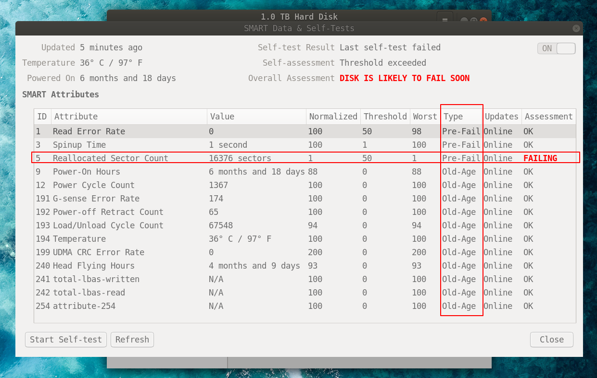

行吧, 电脑城是真的坑. 这辈子不会进电脑城了. 不会真香的.

<!-- More -->

## 吐槽一下

我现在的电脑是刚入大学时买的, 在电脑城😁. 我进大学被一群大佬带飞之前是个纯小白, 每天打开电脑跟随360提示赚取积分那种. 后来在群里窥视大佬们聊天, 学到了第一课:

什么? **360杀毒是毒瘤?** 什么? **电脑城就是个坑?**

我开始是不太信的, 后来我格式化了电脑告别360. 再后来我在小米之家看着和我电脑同价位但配置好许多的电脑沉默了一会.

**但是!!** 这次出的幺蛾子让我忍不了. 前几天电脑刚开机就弹出👇

什么? <b style="color:red;">我硬盘快挂了?</b>
当时把我吓坏了, 还以为我硬盘要爆炸了, 点开了 **Disks** 工具的
**SMART Data & Self-Tests**.

我???

上网搜索了一下[年老的硬盘就容易出这种事](https://help.ubuntu.com/stable/ubuntu-help/disk-check.html.en). 加上那个self-test也说我硬盘 **Old-Age** 了, 最多也就该有**50**个
的坏道我现在有**16376**个, 那大概硬盘是真的快挂了吧. 行吧.

秋头麻袋. 我这电脑才买了一年啊💢 我和几个群友交流了一下自认使用习惯还是不算差, 虽然没有及时发现坏道并隔离 (我才知道这玩意还能传染) 是我的锅, 但铁定我买来这电脑就有点问题. 忍不了💢

## 信息整理

顺便整理一下我从群友们那听来的购买笔记本电脑的知识点好了:

- 只是编程不打游戏的话主要关注**内存大小**和**硬盘读写速度**就好了. (机械硬盘是不能要的, 这我已经得到血泪教训了)

- 笔记本电脑的话不管 **i5**, **i7** 还是 **i9** 区别很小, 因为一般散热性能都不够, 处理器
  升温之后性能下降, 基本性能差不多. 也就是说为了省钱买 **i5** 就可以了. 当然有钱肯定是 **i9**
  走着.

- **显卡**一般也就游戏, 设计, 科学计算会用到的样子, 因此我这不打游戏的直男程序员就不需要太好的显卡了
  (但我发现显卡过于差的话放PPT都卡)

- 虽然几个群友强烈安利我买有至少有2k画质显示屏的电脑, 或者买来后自己换一个屏幕, 因为2k以上分辨率的屏幕体验极佳. 但他们都说**看惯了2k完全不适应1080P**. 那我当然是只买1080P啊😁 另外个人觉得干活用的电脑没必要弄触屏屏幕, 鼠标都嫌打断思路, 更何况触摸屏.

- 虽然linux也是用户群体极大的系统, 但linux对一些硬件设备支持相当的差, 比如有人蓝牙经常断之类. 网上也有许多地方列出了一些公认linux支持不错的电脑. 我看了一圈感觉**ThinkPad**和 **Dell** 都值得信赖. 我还翻到了个[Ubuntu 个人电脑认证硬件](https://certification.ubuntu.com/certification/desktop/). 不明觉厉.

- 另外个人觉得比较重要的一点是**键盘背光灯**! 晚上不开灯没有背光的话真的只能埋头打字啊!

- 很多电脑虽然 **处理器, 内存, 显卡, 硬盘, 屏幕** 这几项是一样或者相当的, 但价格相差很多. 这是因为其他方面有关. 比如说 **电池容量** (和续航能力有比较大的关系), **接口数量及类型** (比如有几个雷电3), **电脑外壳材质** (比如X1C是碳纤维外壳), 是否有**指纹识别器** (现在Linux下也有指纹识别器的驱动了, 似乎*可以拿来输入sudo的密码*), 是否有**红外摄像头** (这个linux下似乎没有相关驱动, 目前唯一用处似乎就是Windows Hello), **可拓展性** (比如ThinkPad T480可以把内存加到32G, 而T480S最多只能加到24G), 键盘手感 (我倒是一直用不惯机械键盘😒), **售后服务**等