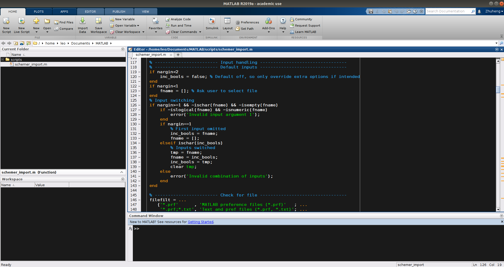

再开学的课程就要用MATLAB了, 而且了解很多机械系唯一要求学的编程语言就是MATLAB, 我
决定还是稍微了解下.

<!-- More -->

首先, [MATLAB到底是不是编程语言?](https://www.zhihu.com/question/37824202/answer/767114071)

从**TIOBE**上有MATLAB而且MATLAB排名还不低可以看出MATLAB确实是一门编程语言, 但从
上面链接可以看出MATLAB算是残疾的编程语言, 很多特性没有, 更多的是用来验证算法可行
性.但我又想验证算法可行性为啥不用Python什么的? 然后我发现原本用Octave教深度学习
的吴恩达现在用该用Python了 😁 而且因为商业使用MATLAB很贵, 速度也慢, 因此公司里基
本没有用MATLAB的

因此我觉得MATLAB的优势主要就在:

- 语法简单, 没有编程基础的工科生也能快速掌握, 尤其计算方面的语法比Python简单太多
- 集成度特别高, 各种工具都能轻松快速配置好
- 能和多种语言交互, 编写界面简单
- 很多工具都有图形界面, 操作简单, 按按键就可以, 不用写那么多代码.

因此虽然缺点多多, MATLAB还是很值得一学的

# MATLAB软件个性化设置

## 设置初始工作文件夹

使用HOME目录作为起始工作文件夹我觉得不是什么好事, 所以最好自己指定一个合适的目录. 我使用的是MATLAB默认的`userpath`, 即**Documents/MATLAB**文件夹. 一方面这个文件夹看着比较合理一方面MATLAB说[使用userpath作为初始工作文件夹有一定好处](https://ww2.mathworks.cn/help/matlab/matlab_env/matlab-startup-folder.html#bujzf43)

Linux下设置MATLAB的初始工作文件夹方法和在Windows下改快捷方式的起始位置这种方法不一样, 要
达到这个目的有两种方式:

1. 在终端输入 `matlab -useStartupFolderPref` 打开MATLAB, -useStartupFolderPref选
   项指定初始工作文件夹为在**Preference**中**Initial working folder option**的指
   定文件夹.
2. 在终端输入 `matlab -sd [folder]` 打开MATLAB, -sd选项指定初始工作文件夹为
   [folder]文件夹.

## 更改编辑界面颜色主题

在vim, VSC, VS, CLION, Pycharm等工具用惯了黑暗主题以后拿到啥都想先换个黑暗主题. 但是找了半天也只找到了设置编辑界面颜色主题的方式, 普通操作似乎并不能自定义丑陋的灰色工具栏.

最终我把界面变成了这样 👇



- 颜色主题是通过[MATLAB Schemer](https://github.com/scottclowe/matlab-schemer)里
  的脚本更换的, 一键更换好评👍 因为我比较喜欢糖果色的颜色主题然后又不喜欢注释是
  灰色 (不管在黑色背景还是白色背景里辨析度都很低), 于是选择的主题是[Dark
  Steel](https://github.com/scottclowe/matlab-schemer/tree/master/schemes#dark-steel)
- 字体用的是[DejaVu Sans Mono for
  Powerline](https://github.com/powerline/fonts/tree/master/DejaVuSansMono), 大
  小是11, 不过不知道为什么MATLAB显示无效果的字体看着很粗糙, 边缘锯齿状过于明显,
  效果设置为了 **bold**, 这回好多了!
- 布局改成了和我常用的vim, VSC差不多的布局: 资源管理器在左上, 细节信息在左下, 编
  辑窗口在右

# MATLAB语法和工具

## 在终端运行

曾经我因为嫌MATLAB界面太丑又不能个性化想过在终端像用交互式Python一样用交互式
MATLAB以及运行脚本. 我发现这是可行的:

在终端启动交互式MATLAB:

```shell
matlab -nojvm
```

`-nojvm`选项本身是**不启动Java虚拟机**的意思, 但因为Matlab的GUI都是用Java写的
(听网上说的), 所以也有`-nosplash` (**不显示启动画面**), `-nodesktop`
(**不启动图形界面**) 的功能. 另外因为没有启动jvm这样启动MATLAB十分迅速.

💡 要注意用`-nojvm`选项时会创建图形界面的命令会报错.

在终端运行MATLAB脚本:

```shell
matlab -batch [MATLAB_command]
```

`-batch`选项和`-r`选项的区别在于前者不会启动图形界面而后者会. 另外如果脚本中没有
与图形界面有关的语句同样可以加上`-nojvm`选项.

**但是啊!**

我后来发现这样就**本末倒置**了! MATLAB的亮点我觉得一是所有变量都是全局变量, 能迅
速可视化变量, 工具集成度非常高, 适合迅速验证各种算法, 二是社区非常完善, 提供了很
多工具能轻松仿真很多模型.

因此只在终端的MATLAB是没有灵魂的MATLAB. **如果终端里的MATLAB就能解决你的需求的话为什么不用Python?**