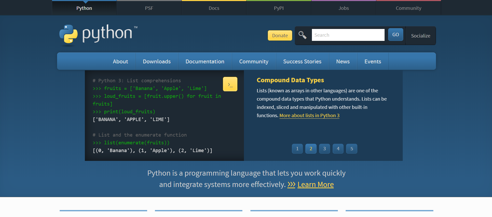

前阵子带学弟学妹们入门Python时自己整理的一些觉得初学者需要知道的Python知识. 我本
身既不是计算机专业的也说不出自己对Python还是挺了解的这样的话, 说实话心里还是有一
点忐忑. 如有错误欢迎指出🙇

<!-- More -->

## Python解释器

## 实现

| 版本       | 实现方式                   | 特点                                                    |
| ---------- | -------------------------- | ------------------------------------------------------- |
| CPython    | C语言写的Python            | 速度快                                                  |
| JPython    | 由Java编写的Python         | 可以直接调用Java的各种函数库                            |
| PyPy       | 由rPython编写的Python      | 更灵活, 易于使用和试验                                  |
| IronPython | 以. NET和Mono实现的[ython   | 面向NET和ECMA CLI的Python实现                           |
| ZhPy       | 只是把Python翻译了一遍而已 | 又称中蟒, 可以完全用中文编程. 但中蟒目前已经停止更新了.|

我们通常所说的Python是**CPython**, 👇Python官方页面提供的是CPython



## 版本

Python这种语言有Python2和Python3两个版本, 两者语法有少许不同, 一般不能直接把另一个版本的程序拿来运行

## 哲学

**万物皆对象**

python在设计初始是一种**面向对象**语言.

:bulb: 面向对象是一种**编程范式**

## 数据类型

Python是一门**动态类型**语言

### 类型注解

在Python3中有了新特性: **类型注解**

``` python
def add(x:int, y:int) -> int:
    return x + y
```

``` python
def add(x, y):
    return x + y
```

正如其名, 注解只是标注一下, 有了类型注解的程序和没有类型注解的程序运行起来没有区别, 但它能帮助程序员更好的发现问题, 也能让IDE提供更准确的代码补全和语法检查.

### 类型检查

有时候为了保证程序的严谨性我们会检查一下变量是不是我们设想它应该是的类型, 这个时候我们用 `isinstance()`

之所以不使用 `type()` 是因为 `type()` 不会认为子类是一种父类类型, 不考虑继承关系. 举例说明:

``` python
class A(object):
    pass

class B(A):
    pass
i = 1
print isinstance(i, int)
print isinstance(A(), A)
print type(A()) == A
print isinstance(B(), A)
print type(B()) == A
```

``` python
# 获取变量内存地址
id(变量名)
# 得到变量类型
type(变量名)
# 得到变量的内存大小
import sys
sys.getsizeof(变量名)
```

### 不可变对象

#### Number (数字)

* int (整数)
* long (长整数)
* float (浮点数, 即小数)
* bool (布尔值, 即 `True` 和 `False` )

Python中的Number我认为是比较特殊的, 因为它**在内存中占用的空间大小是变动**的.(在CPython中是如此, 但不知道为什么在IronPython下不是)String (字符串)

#### Tuple (元组)

:exclamation: 我们可以给不可变对象重新赋值, 但其内存地址会改变. 以下是体现给可变对象/不可变对象重新赋值时它们的内存地址变化的代码.

``` python
x = 3
y = x
print id(x), id(y)
y = 4
print id(x), id(y)
print x, y
a = [1, 2, 3]
b = a
print id(a), id(b)
b.append(4)
print id(a), id(b)
print a, b
```

### 可变对象

#### List (列表)

#### Set (集合)

#### Dictionary (字典)

可变对象可能带来的危险举例:

``` python
def func(l = []):
    l.append('add')
    print(l)
```

``` shell
myfunc([1, 2, 3])
myfunc([1, 2, 3])
myfunc()
```

python中向函数传递参数只是**引用传递**: 如果参数为可变对象, 在函数中变化会影响引用的这个变量, 而不可变对象不会. 在向类传递参数时也是如此.

``` python
l1 = [1, 2, 3]
l2 = [[1, 2, 3],
	[3, 4, 5],
	[6, 7, 8]]
l1x = l1
l1x[0] = 4
print(l1)
l1x = l1.copy()
l1x[0] = 5
print(l1)
l2x = l2.copy()
l2x[1][1] = 'a'
print(l2)
import copy
l2x = copy.deepcopy(l2)
l2x[1][1] = 'b'
print(l2)
```

## 基础语法

### 帮助文档

``` python
help()
```

按 `q` 退出帮助文档

### 注释

在Python中 `#` 开头的为注释

#### 特殊注释

###### shebang

shenbang, hashbang指的是以 `#!` 开头的语句. Linux操作系统的程序加载器会分析 Shebang 后的内容，将这些内容作为解释器指令，并调用该指令，并将载有 Shebang 的文件路径作为该解释器的参数. 因为在很多语言中以 `#` 开头的是注释, 所以不会影响程序.

有的python文件是这么开头的:

``` python
#! /usr/bin/python
# -*- coding:utf-8 -*-
```

第一行是给Linux系统的程序加载器看的, 因此在Windows下不需要这句, 第二句是指定文件的编码格式为**UTF-8**, 避免出现乱码

###### docstring

``` python
def func(int x, int y):
    """
    这里是docstring, 是特殊的注释, 能让IDE, 编辑器在鼠标移动到有docstring的函数, 类上时显示这段docstring
    """
    pass
a = func(i)
```

### 条件语句及循环

#### if elif

``` python
if True:
    pass
elif True:
    pass
else:
    pass
if 2 >3:
    a = 2
else:
    a = 4
```

``` python
a = (2 if (2 > 3) else 4)
```

#### 生成器 ·迭代器·range

语法类似于切片

### 推导式

**推导式comprehensions**（又称解析式）, 是Python的一种独有特性.**推导式是可以从一个数据序列构建另一个新的数据序列的结构体**. 换句话说能从一组数据中求出满足条件的新数据, 比如a, b两个等长列表中都为偶数的项的乘积. 共有三种推导式, 在Python2和3 中都有支持:

* 列表推导式
* 字典推导式
* 集合推导式

列表推导式的语法:

``` python
l = [output_expression for out_exp in input_list if expression]
```

使用举例:

``` python
# 1
a = [i for i in range(30) if i % 3 is 0]
# 2
names = ['Bob','Tom','alice','Jerry','Wendy','Smith']
LONG_NAMES = [name.upper() for name in names if len(name)>3]
# 3
a = [x*y for x in range(1,5) if x > 2 for y in range(1,4) if y < 3]

l = [a[i][0] for i in range(len(a))]

h = ''
for i in range(len(a)):
    h.append(a[i][0])
```

### 矩阵处理

#### 切片

因为tuple, 字符串其实都是特殊的列表, 列表, 字符串, 元组都可以进行切片.

``` python
a = [1, 2, 3, 4, 5, 6, 7]
b = a[begin:end:step]
```

在没有**numpy**库的情况下**多维切片**是通过推导式实现的:

``` python
a = [[1, 2, 3], [4, 5, 6], [7, 8, 9]]
b = [a[i][:-1] for i in range(1, 3)]
```

### 函数

:bulb: 要注意函数名后的 `()` 也是一种运算符, 称为函数调用运算符. 如果调用函数的时候不加()只会创建一个该函数的对象而不会调用它.

#### 定义函数

python中以 `def` 关键字定义函数, 结构如下:

``` python
def 函数名(参数列表):
    函数主体
```

python中的函数可以有返回值也可以没有返回值

``` python
def func1():
    pass
def func2(l):
    l.appeend('add')
def func3(x, y):
    return x + y
```

### 用字典来实现case

``` python
# -*- coding: cp936 -*-

def print1():
    print('111')


def print2():
    print('222')


def printdefault():
    print('default')


dic = {
    'a': print1,
    'b': print2,
	'default': printdefault}

i = input('输入: ')
main = dic[i if (i != 'a' or i != 'b') else 'default']
main()
```

### 编码格式

字符串经过**编码（encode）** 就成为了一堆数据, 反过来, 数据经过**解码（decode）** 就变回我们认识的字符串.


指定文件编码格式为 `utf-8`

``` python
# -*- coding:utf-8 -*-
```

:bulb: 如果不指定文件编码格式在有的Python2版本中无法识别中文, 即便是中文注释也会报错.


Linux系统默认编码格式是**UTF-8**, 系统语言是简体中文时Windows10的编码格式是**GB2312** (也称GBK, 国标扩展, cp936)

在python中 `str` 类型数据都以Unicode码点格式储存, 因此直接打印字符串会看到字符为'\u'开头

### 基本读写

``` python
f = open("test.txt", "r+")
f.read()
f.write("text")
f.close()
```

`r` 是普通模式, `r+` 是读写, `w` 是覆盖写入模式, `w+` 是覆盖读写, `a` 是追加模式, `a+` 是追加读写, b是以二进制方式打开

``` python
with open('test.txt', "r+") as f:
    f.write()
    f.read()
    f.readlines()
    f.readline()
```

## 脚本和普通程序的区别

脚本这个词来源于戏剧, 能用于舞台演出的戏剧文本就称为脚本. 在编程中的脚本是解释执行的程序, 通常只用来做简单的处理, 起辅助作用

## 解释器的使用技巧

在解释器中交互式编程时要注意缩进不要错

### 清屏

python解释器本身没有清屏命令, 只能通过调用命令行的清屏命令来达到效果

``` python
import os
# Windows下
os.system('cls')
# Linux下
os.system('clear')
```

## 代码风格

* 在除了函数调用符的运算符两侧加空格
* 注释时在 `#` 后写个空格再写注释内容
* 行尾注释时先写两个空格再写注释

