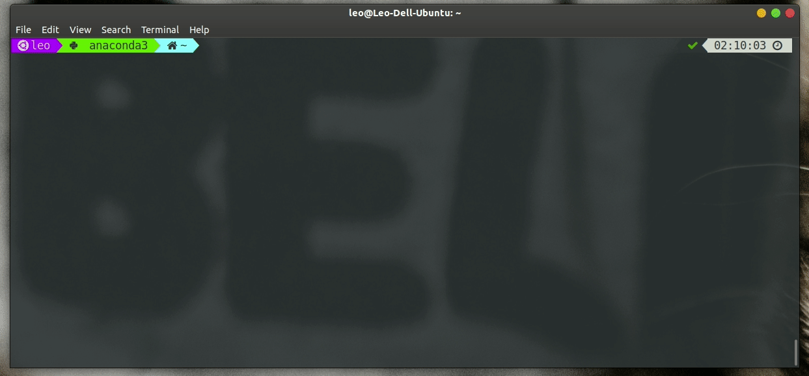

我把shell从**bash**换到**zsh**了. 原本我是根本没动过换shell的念头的, 但因为这段时间用的
笔记本被别人装好了zsh, 我就将就着用了, 谁知真香...

<!-- More -->

不得不说zsh比bash确实好了许多:

- 补全智能了太多! 比如切换路径时的补全不必区分大小写, 比如会根据历史命令给出建
  议, 比如如果命令里有`$(pwd)`这样的取值操作, 按一下<kbd>Tab</kbd>zsh会将其补全
  为对应的值.
- 支持一次输入多行命令再执行. 不像bash只能一行一行运行, 如果其中有命令是需要输入
  确认的, 那么下一条命令就会被当做这条命令的确认用输入中, 然后就会报错 🤷
- Powerlevel9k这个主题很好看很强大, 能显示出包括**git状态**, **当前Python环境**,
  **命令执行时间**, **后台任务数量**, **当前时间**在内的许多有用信息
- zsh有许多很有用的插件

总之我要到zsh去了, bash再见👋

下面是部分功能的展示



下面我大致说一下我的zsh配置

- zsh配置管理工具: [Oh My Zsh](https://ohmyz.sh)
- zsh插件管理工具: [Antigen](https://github.com/zsh-users/antigen)
- zsh主题: [Nerd-Fonts](https://github.com/ryanoasis/nerd-fonts)字体(具体来说是[DejaVuSansMono Nerd](https://github.com/ryanoasis/nerd-fonts/tree/master/patched-fonts/DejaVuSansMono))的[Powerlevel9k](https://github.com/Powerlevel9k/powerlevel9k)主题

以下是我的`~/.zshrc`中部分代码.

有关Powerlevel9k:

```shell
POWERLEVEL9K_MODE='nerdfont-complete'
POWERLEVEL9K_COMMAND_EXECUTION_TIME_BACKGROUND="black"
POWERLEVEL9K_COMMAND_EXECUTION_TIME_FOREGROUND="blue"
POWERLEVEL9K_CUSTOM_OS_ICON="echo   $(whoami) "
POWERLEVEL9K_CUSTOM_OS_ICON_BACKGROUND="purple"
POWERLEVEL9K_CUSTOM_OS_ICON_FOREGROUND="white"
POWERLEVEL9K_ANACONDA_BACKGROUND="chartreuse3"
POWERLEVEL9K_ANACONDA_LEFT_DELIMITER=""
POWERLEVEL9K_ANACONDA_RIGHT_DELIMITER=""
POWERLEVEL9K_DIR_HOME_BACKGROUND='123'
POWERLEVEL9K_DIR_HOME_SUBFOLDER_BACKGROUND='123'
# POWERLEVEL9K_DIR_ETC_BACKGROUND='123'
POWERLEVEL9K_LEFT_PROMPT_ELEMENTS=(custom_os_icon ssh anaconda root_indicator dir dir_writable vcs)
POWERLEVEL9K_RIGHT_PROMPT_ELEMENTS=(command_execution_time status background_jobs time)
ZSH_THEME="powerlevel9k/powerlevel9k"
```

有关zsh插件:

```shell
# Which plugins would you like to load?
# Standard plugins can be found in ~/.oh-my-zsh/plugins/*
# Custom plugins may be added to ~/.oh-my-zsh/custom/plugins/
# Example format: plugins=(rails git textmate ruby lighthouse)
# Add wisely, as too many plugins slow down shell startup.
source ~/Desktop/backup/zsh/antigen.zsh
# Load the oh-my-zsh's library.
antigen use oh-my-zsh
# Bundles from the default repo (robbyrussell's oh-my-zsh).
antigen bundle git
antigen bundle pip
antigen bundle command-not-found
# custom plugins
antigen bundle zsh-users/zsh-syntax-highlighting
antigen bundle zsh-users/zsh-autosuggestions
antigen bundle sobolevn/wakatime-zsh-plugin
# Load the theme.
# antigen theme powerlevel9k/powerlevel9k
# Tell Antigen that you're done.
antigen apply
```