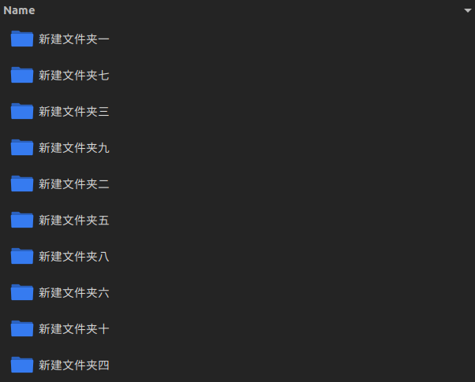

如果待处理文件的文件名中含有一些特殊字符, 有许多程序会因为考虑不完善 (或者说程序员偷懒) 而出现识别不到文件, 文件处理出错, 结果不符合意图, 甚至程序崩溃的问题. 而为了方便自己偷懒, 我总结了一些命名文件的规则.

<!-- More -->

💡 我并不是说文件名命名必须遵循这些准则, 只是在程序设计/输入不够严谨 (也就是想偷懒的情况下) 这样的命名准则是最不容易导致错误的👍

## 文件名中只应该包含数字, 字母, 汉字, 下划线, 连字符, 句点

许多特殊字符会让程序出错, 下面举几个例子:

- `文件名里 有空格.jpg` 这样的文件名很可能让程序以为要处理的文件的名字是`文件名里`, 因而找不到文件或者处理了错误的文件. 而` 有空格.jpg`会被当成无效参数, 多余字符.
- `文件名里/有左斜杠.avi` 这样的文件名在很多程序里会被认为是一个名为`文件名里`的文件夹下的`有左斜杠.avi`文件, 因此可能得到**没有`文件名里`这个文件夹**的报错
- `文件名里(有)括号.gif` 比如在markdown文档中用`括号.gif)`来引用这个gif, 在有的markdown渲染器会被渲染为**\)括号.gif**. 因为前一个\)被认为是markdown引用图片的``语法的结束符了.
- 在一些较老的程序中汉字也算是一种特殊字符. 比如在python2中如果不特意注意编码格式转换问题的话中文很容易被读取为乱码. 当然现在的程序大多是兼容汉字的. (Python2在已经终止维护了🕯)

> 空格用下划线代替, 其他字符用连字符代替

如果你原本想要包含这些特殊字符在文件名中来表达一些逻辑关系, 我的做法是用_来代替空格, 用-来代替其他字符.

## 当文件名包含有排序意图的数字时应当用阿拉伯数字而不是汉字, 并且位数不足的用0在左侧占位

曾经我很困惑下面这两种情况的文件夹排序为什么不是从小到大的, 后来我发现前者是因为文件系统**不把汉字数字作为排序用的数字** (有意思的是我Ubuntu系统和Windows系统里图一情况排序不一样), 后一个是因为文件系统是**逐字比较**而不是把一串数字作为一个数 (windows系统和Ubuntu系统排序图2情况时都能正常排序)

> 图一 Ubuntu系统下含汉字数字文件名排序

> 图二 百度云里含数字文件名排序

因此如果想在文件名中包含有排序功能的数字, 或者表达顺序之意时应当**用阿拉伯数字而不是汉字, 并且位数不足的用0在左侧占位**.