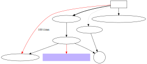
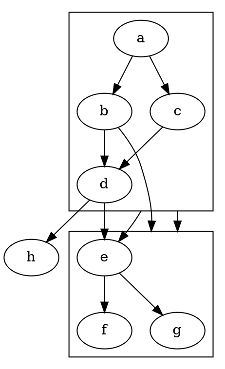

[Graphviz](https://emden.github.io/)是一个很强大的**图形可视化工具**. 它使用**DOT**语言来描述图形, 但它并不单纯是个绘图软件, 而是能接入程序, 进行函数调用流程, 决策树, 数据结构, 日志系统等图形关系生成, 而且可以是**交互式**的 (不过我暂时没研究过所以不太了解). 暂且不提这些扩展功能, graphviz的语法允许我们仅通过文字描述能绘制出样式极其丰富的图形, 这大大方便了对图形的改动的跟踪.

<!-- More -->

## 有关官方文档

graphviz.org这个网站也不知道是不是停止维护了, 所有除了指向其他人的项目的链接都是无效链接了... 我在上面放的graphviz的官网链接是[graphviz的GitLab repo](https://gitlab.com/graphviz/graphviz)提供的地址. (实际上我觉得这个项目对文档的维护**很烂**, 描述得很不清楚, 有些地方甚至有错误. 这也是为什么我要自己总结一篇常用语法).

官方给出的有助于编写DOT文件的文档我觉得就这几个:

- [DOT语言概述](https://emden.github.io/_pages/doc/info/lang.html)
- [节点, 边线, 图形的属性列表](https://emden.github.io/_pages/doc/info/attrs.html)
- [节点的三种形状设定方式及节点的样式详解](https://emden.github.io/_pages/doc/info/shapes.html) (此处又不得不吐槽graphviz开发组的文档组织真的差)
- [箭头的头部形状参数详解](https://emden.github.io/_pages/doc/info/arrows.html)
- [graphviz中可用颜色及颜色主题列表](https://emden.github.io/_pages/doc/info/colors.html)

但其实给我帮助最大的是[**被graphviz开发组嫌弃的旧版文档 (dot布局版)**](https://emden.github.io/_pages/pdf/dotguide.pdf)

❗️ 因为我最常使用的是**dot**布局所以此处涉及的内容大部分为dot布局下的情况.

## 基础语法

### Hello World

还是先来个Hello World 😏

```DOT
digraph G{
    Hello -> World;
}
```


### 常见用法

因为graphviz许多概念解释起来会套娃, 要理解概念A要先理解概念B, 要理解概念B则需要先知道什么是概念A 🤤 因此这里先放上一些常用属性来快速入门.

🌟 不明白到底如何使用属性的话点[这里](#属性)快速跳转后文的实例.

| 用途              | 属性名                  | 可选值                                                       | 作用对象           | 备注                                                         |
| ----------------- | ----------------------- | ------------------------------------------------------------ | ------------------ | ------------------------------------------------------------ |
| 轮廓颜色          | `color`                 | [可用颜色及颜色主题列表](https://emden.github.io/_pages/doc/info/colors.html) | 节点, 边线, 簇     |                                                              |
| 填充颜色          | `bgcolor`               | [可用颜色及颜色主题列表](https://emden.github.io/_pages/doc/info/colors.html) | 簇, 图             | `fillcolor`会覆盖`bgcolor`                                   |
| 填充颜色          | `fillcolor`             | [可用颜色及颜色主题列表](https://emden.github.io/_pages/doc/info/colors.html) | 节点, 边线, 簇     | 需要与`style=filled`一起使用. 如果设置了`style=filled`但没有设置`fillcolor`那么`color`的值将被同时用于轮廓和填充 |
| 字体颜色          | `fontcolor`             | [可用颜色及颜色主题列表](https://emden.github.io/_pages/doc/info/colors.html) | 节点, 边线, 簇, 图 |                                                              |
| 箭头方向          | `dir`                   | "forward", "back", "both", "none"                            | 边线               | 正向/反向/双向/无箭头                                        |
| 箭头形状          | `arrowhead` `arrortail` | 见备注                                                       | 边线               | graphviz提供了极其丰富的箭头形状值, 常用值参见[这里](https://emden.github.io/_pages/doc/info/attrs.html#k:arrowType), 箭头形状值的完整说明见[这里](https://emden.github.io/_pages/doc/info/arrows.html) |
| 样式              | `style`                 | [各对象样式说明](https://emden.github.io/_pages/doc/info/attrs.html#k:style) | 节点, 边线, 簇, 图 | emmm这个style很难准确地翻译为中文, 因为这个属性被很笼统地赋予了四种对象...总的来说是在描述这个对象长什么样, 是虚线的还是加粗的又或是点点的 |
| 边线风格          | `splines`               | none, line, polyline, curved, ortho, spline                  | 图                 | 不显示边线/线段 (false)/线段 (true)/弧线/直角折线/常规. 到底什么样详见[splines说明](https://emden.github.io/_pages/doc/info/attrs.html#d:splines) emmmm我感觉**polyline**和**spline**并没有区别...再次吐槽graphviz开发组的混乱逻辑 😩 |
| label水平对齐方式 | `labeljust`             | "l", "r"                                                     | 图, 簇             | "l"就是和图/簇的左边界对齐, "r"就是和图/簇的右边界对齐. 如果父级显性设置了这一属性, 子图会继承这一属性. :exclamation: 实际上还有一个可选值, 就是不设置这个属性, 那么label就会居中对齐. |
| label垂直对齐方式 | `labelloc`              | "t", "b", "c"                                                | 节点, 图, 簇       | 对于图和簇只有"t"和"b"是可用的, 即标签只能设置在图/簇的顶部或者底部. 如果父级显性设置了这一属性, 子图会继承这一属性. 而对于一个节点, 只有当它的高度大于label这个属性才是可用的. |

### Layout (布局)

💡 graphviz有一点不好的是节点在画布上的位置是**由算法决定**的, 不能**完全**自己设定, 因此有时候无法让图变得那么美观.

graphviz提供了多种**用于排布节点, 边线箭头头部, 边线标签位置**的布局算法.

因为了解graphviz的布局算法有助于我们更好的布局, 此处简单翻译一下[被现在graphviz开发组嫌弃的旧版文档 (dot布局版)](https://emden.github.io/_pages/pdf/dotguide.pdf)描述的**dot布局**的图形绘制主要的四步:

1. 通过反转一些边线的指向来打破输入图形 (我猜这个输入图形说的是.dot文件) 中出现的所有循环 (因为dot布局算法是基于非循环图形的)
2. 给各节点赋予不同的等级 (`rank`). (比如在一个top-to-bottom方向的图中等级决定了节点的纵坐标) 连接跨度超过一个等级的节点的边线会被分割成一串"虚拟"节点以及单位长度的边线

   💡 后文会提及对节点的rank是可以进行一些设置的.

3. 给同等级的节点排序, 避免绘图时出现边线的交叉 (估计只是减少交叉?)
4. 在让边线尽可能短的情况下设定节点的横坐标, 然后绘制边线 (同样是假设是top-to-bottom方向的图)

下面给出一些主要布局算法的简单说明和图例.

💡 以下布局的图例除了最后一个都来自[graphviz-gallary](https://emden.github.io/gallery/)

#### dot

用于绘制**有向图**, 他的布局算法原理上面已经说了, 特点是绘制出的图**很有层次**.

❗️ 注意dot布局和DOT语言不是一个东西.


#### neato

用于绘制**无向图**. neato布局算法的原理是构建一个虚拟物理模型并不断对其迭代最终得到一个**最低总能量排布** (low-energy configuration). 这个虚拟物理模型具体指的是在每个节点间放置一个**理想弹簧**, 这样得到的布局通常很合理. (在统计学中这种算法也被称作**多维缩放**). neato布局很适合用于**通信网络**及**计算机程序**的绘制.

💡 当图较大 (超过100个节点)时就该考虑换成fdp或者sfdp布局了


#### fdp

同样是基于弹簧模型. 区别在于fdp算法的迭代是在试图减小节点间弹簧的力的大小而不是弹簧能量大小.


#### sfdp

为大规模图而生的多尺度版fdp


上面这个图得自🔗 [A Gallery of Large Graphs](http://yifanhu.net/GALLERY/GRAPHS/index.html). 这个网站还有**很多**很壮观的图😳

#### twopi

径向布局.


#### circo

圆形布局. 很适合有许多环路结构的图, 比如电信网络.


### 有关三种主要描述对象

DOT语言主要描述三种对象: **graph**, **node**, **edge**. 这里分别翻译为**图**, **节点**, **边线**. 每一种对象有各自可以设置的一组属性.

#### Graph (图)

最外层的graph (main graph)可以被设定为**有向图**`digraph`(directed graph)或是**无向图**`graph`(undirected graph). main graph内可以用`subgraph`来定义一个节点和边线的集合. 也可以通过设定最外层图为`strict digraph`或者`strict graph`来禁用**multi-edges**. 也就是说`strict digraph`会让有向图中一个指向节点和一个被指向节点间只能有一条边线 (不过反过来还可以有一条, 也就是两节点间最多两条边线), `strict graph`则会让无向图中两节点间只能有一条边线.

最外层的图又称top-level graph, root graph (反正开发组文档都没能统一这东西的叫法). 图可以有子图 (subgraph), 子图会继承父级的显式设置的大部分属性. 有一种特殊的子图被称为[**簇**](#Cluster-簇).

#### Node (节点)

一个节点会**在第一次在DOT文件中出现时被创建**.

#### Edge (边线)

一条边线会在几个节点被用`->`边线操作符连接时被创建.

💡 **在graphviz中可以直接用中文作为节点名.**

### Label (标签)

如果你想要显示的标签中有空格, 那通过把节点名用`""`括起来可以实现, 当然显式声明标签内容是更好的选择. 而**如果你想让一些节点显示相同的标签那就必须显式声明节点的标签了**, 因为节点名不能重复.

💡 label中可以使用转义字符比如`\n`来实现多行标签.

#### HTML-like Label

TODO

### 属性

属性是通过`name=value`形式来设置的. 节点与边线的属性需要放在`[]`方括号中.

> 一个展示属性写法以及属性能做些什么的例子

```DOT
digraph G {
    size ="4,4"; //设置图形尺寸为4英寸长宽
    方形节点 [shape=box];  /*这是一种注释写法*/
    方形节点 -> 上面是加粗线 [style=bold];
    上面是加粗线 -> 和下面的对比;
    方形节点 -> 上面是虚线 [style=dotted];
    方形节点 -> 重量更大导致垂直指下的节点[weight=4];
    "和下面的对比" -> { make_string; 上面是有标签的红线}  //可以一次连接多个节点
    上面是虚线 -> make_string;
    edge [color=red];  // 这是另一种注释写法
    方形节点 -> 上面是有标签的红线 [label="100 times"];
    make_string [label="多行\n标签"];
    node [shape=box,style=filled,color=".7 .3 1.0"];
    和下面的对比 -> 在节点默认属性改变后才创建的节点;
}
```



#### 常用属性的默认值

**图**的默认属性:

- labeljust="c"
- labelloc="b" (簇的默认值为"t")
- clusterrank="local"
- compound=false

**节点**的默认属性是:

- shape=ellipse
- width=0.75
- height=0.5
- 标签为节点名
- labelloc="c"

### Cluster (簇)

簇是一种会将属于这个子图的元素都**框在一个长方形里**的特殊子图. 如果一个子图的名字以**cluster**开头那么这个子图就会被认为是一个簇 (这个判定方式好暴力😅). 但是如果在根图中设置了`clusterrank=none`那么簇这种特殊的子图会被禁用.

这里我又要来吐槽graphviz开发组了! 看看他们是怎么[说明clusterrank这个属性](https://emden.github.io/_pages/doc/info/attrs.html#a:clusterrank)的:

> the modes "global" and "none" **appear** to be identical, both turning off the special cluster processing.

为什么官方开发组都在用这种表推测的语气啊... 🙃这也太迷惑了

如果根图中设置了`compound=true`, 那么dot布局允许用边线连接节点和簇的边框. 这是通过设置边线的`lhead`和`ltail`属性来实现的. 这样以来, 虽然边线仍然是从一个节点指向另一个节点的, 但是设置了`lhead`或者`ltail`的一侧**会看起来像是被簇的边框盖住了**.

> 一个使用簇, 并且有连接节点与簇的边线的例子




## 高级语法

以下是几条我认为**用来提示图的美观程度**的语法.

### 优化布局

<!-- TODO: 关于ratio, rankdir -->

知道了上面提到的[布局的原理](#Layout-布局)我们就可以进行一些更个性化的布局, 比如设置节点的`rank`属性我们可以改变节点的布局. `rank`的可选值有: **same**, **min**, **source**, **max**, **sink**.

> 一个展示设置rank属性能达到什么效果的例子 (代码和图形都截自旧版文档, 因为代码没给全我也懒得写就这么放着吧👍)


### Node Port

TODO

### Concentrators (边线合并)

在根图中设置`concentrate=true`将允许边线融合来避免图变得一团乱麻.

边线合并的条件是:

- 他们的方向相同
- 他们有相同的起点或终点
- 他们的长度大于1

## 相关工具

### VSC的dot语言支持插件

TODO

### 在线编辑器

手绘风 [sketchviz](https://sketchviz.com/new)