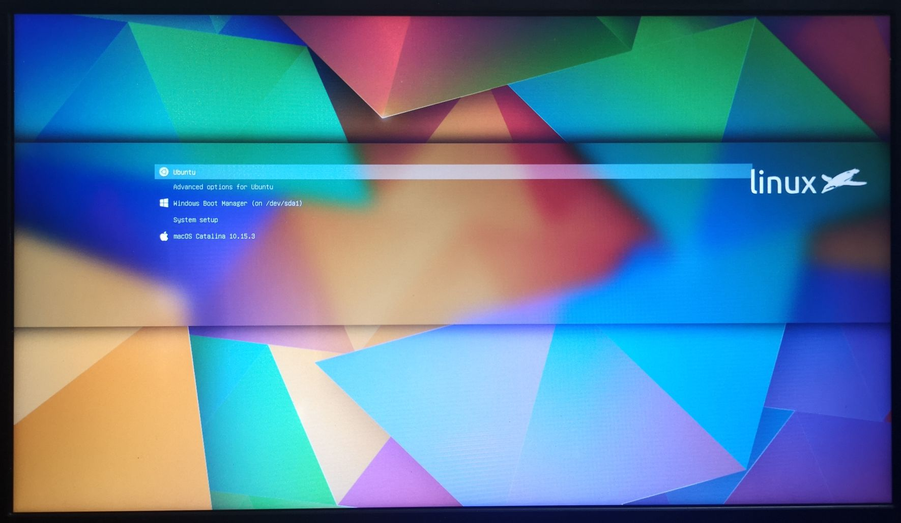

分享一下我在同一个SSD里同时安装Ubuntu, Windows, macOS三个系统并以GRUB作为开机引导的经验. 说实话过程并不复杂.

<!-- More -->

也不知道最近自己时间都浪费哪里去了😑 3月7号弄好的东西现在才得以闲下来记录一番. 先秀一张GRUB界面😏



## 动机

说说我的心路历程😏

直到上大学我都对电脑了解甚少, **只知道有Windows系统**, 并不知道还可以有其他系统, 更别说在这之上的骚操作了😂 上大学后**我逐渐熟悉了Windows系统**并且喜欢上了这个很有现代感的系统. 但随着我对编程的学习逐渐深入, 以及我为了尽早熟悉机器人相关知识而想要了解Linux系统, 在听人介绍后我费了些力气**在虚拟机里装上了Ubuntu16.04**, 不过那时候了解的还是太少, 只是跟着网上的教程将这个东西装好了, 没什么收获. 装好后因为那时也没什么夸张到要开虚拟机在Ubuntu里编程的项目, 所以就体验了几下就束之高阁了. 毕竟那时对于编程, 甚至查找资料的经验都太少了, 只看到一些令人头大的辣鸡资料, 因此并没能学到什么.

大一下的时候我选了一门叫智能嵌入式的课, 其中有个课题是要编写一个能手势识别的程序并移植到树莓派上. 因此我就买了一个树莓派3b+. 不过那时懵懂的我对于怎么给一个SD卡安装系统手足无措, 就在网上搜资料给树莓派依次装了Ubuntu Mate, ArchLinux, 最后才是Raspbian😂 (我记得Mate是因为我当时没有找到arm架构的国内源就抛弃了, 而ArchLinux我就根本没装上...) 费劲心力我最后总算是把那个课题做完了, 但一方面我写得很差, 再加上树莓派3b+对图像处理的性能很一般, 所以我的手势识别程序移植到树莓派后十分卡顿😅 那是我**第一次将程序移植到Linux平台, 也是第一次接触Linux嵌入式**

后来在一个实验室学习时接触到了ROS, 而那时Ubuntu18.04已经较为成熟了, 我就安装了个Ubuntu18.04的虚拟机在里面跟着刷了一遍ROS基础教程, 这回算是**对Ubuntu的基本使用比较了解了**. 不过那时其实并完全不了解ROS的最大作用是什么, 只是知道很牛逼, 跟着教程做了一遍, 没多久就忘了, 只是了解到有那么些概念😁 那时我以为Linux系统也就那样, 我在虚拟机体验到的就是它的全部了. 因此那时有同学和我讨论装Linux虚拟机好还是Windows, Linux双系统好时, 我的想法就是这系统又没那么便利, 误操作带来的危险性又那么大, 当然是装在虚拟机好.

而我装Windows, Ubuntu双系统的契机应该是[我电脑的机械硬盘开始老化](/zh-CN/2019/03/30/我打算换电脑了/), 速度变得极慢. 那应该是我大二下刚开学的时候, 我实在忍受不了在机械硬盘运行本身就很耗资源的Windows系统了, 而那时我的编程活动也开始多起来, 再加上我偶然得知Ubuntu能识别到已经存在的Windows系统并傻瓜式安装, 我就给自己**装了个Windows, Ubuntu双系统**. 不久后我的机械硬盘彻底不行了就买个一个1T的SSD. 不过换了硬盘后我也还是装的双系统, 因为我**逐渐尝到了Linux系统的甜头**.

> 我在[另一篇文章](https://leojhonsong.github.io/zh-CN/2019/05/17/%E4%B8%BA%E4%BB%80%E4%B9%88%E6%88%91%E7%94%A8Linux%E8%80%8C%E4%B8%8D%E6%98%AFWindows/)写了自己对Linux和Windows的对比

而随着我逐渐熟悉Ubuntu, 我开始像大多数Linux用户那样折腾自己的配置, 美化环境😏 期间也尝试了挺多东西, 到现在也形成了自己的使用习惯. 不过很尴尬的是在美化方面, 我经常看到这个好康的在Linux没有但macOS有的字眼. 所以**我开始眼馋macOS**. 不过那时我也就是眼馋, 因为我对比了一番, 发现macOS从接口, 生态等角度都不太适合做嵌入式开发就没有想过安一个试试. (我也在VMware里折腾过macOS虚拟机, 但和Ubuntu虚拟机一样装了没多久就删了)

而直到最近, 我看到了很详细的黑苹果安装教程, 加上我一个同学根据那份教程成功安上了黑苹果, 我也蠢蠢欲动了. 毕竟疫情期间闲着也是闲着+都用双系统了再多一个也不多. 于是我折腾一番**给单硬盘安装了三个系统**😁

P.S. 第一次体验macOS的本土包一开始连怎么删除文件都没搞懂, 还是现查的😅 使用逻辑与Windows/Linux差得真的太多了! 甚至因为别扭一度弃用了几天. 不过光是macOS下终端的美观程度就把俺勾回来了🤤

之前也看到网上有人装三系统的文章, 但基本都用了些杂牌子工具一通瞎操作... 所以我分享一下自己较为**清爽**的安装方法.

❗️ 我的电脑是真的一点不矫情, 安装很顺利, 不保证你的电脑上同样的不会出幺蛾子.

## 关于镜像烧录

### 镜像烧录工具

镜像烧录工具是唯一需要的第三方工具了. 强烈推荐使用[Ventoy](https://www.ventoy.net/cn/doc_start.html)! 这个软件可以将你的U盘创建为一个启动盘, 之后只需要将各种系统镜像放进这个U盘, 到时候以这个U盘启动时会进入一个GRUB界面, 在这个页面再来选择到底进入哪个镜像 👍 有了Ventoy, 装三系统的操作简单了很多!

### 下载镜像

因此将U盘创建为启动盘后就把要用到的三个镜像都放进U盘的**Ventoy**这个分区就完事.

- MacOS镜像: [这个文章最后的百度云链接](https://blog.daliansky.net/macOS-Catalina-10.15.4-19E266-Release-version-with-Clover-5107-original-image-Double-EFI-Version-UEFI-and-MBR.html)
- Windows10镜像: 微软现在提供了[官方的镜像下载网站](https://www.microsoft.com/zh-cn/software-download/windows10ISO) 👍 当然要激活的话还是需要激活码的. 而激活码在淘宝就可以买到, 只是需要巧妙措辞 😏
- [Ubuntu镜像](https://cn.ubuntu.com/download)

安装每个系统平均下来十五分钟, 因此全过程**一个小时内**就能搞定.

## 系统安装

我安装系统的顺序是:

1. macOS10.15.4
2. Windows10
3. Ubuntu18.04

之所以是先安装macOS是因为看网上都说**macOS要求EFI分区不小于200MB**, 否则在安装时会提示无法安装. 然后我搜了搜EFI分区扩容, 似乎并没什么清爽的办法. 因此时刻准备着重装系统的我判定**还是直接格式化硬盘来得清爽**. 然后在安装的时候先安装macOS那它自己就会处理好这个事情, 不需要我担心😁

(不过我把三个系统都装完这个EFI分区也才用了120MB, 也不知道它要那么大干嘛)

而最后才安装Ubuntu是基于两方面考虑:

1. 如果先装Ubuntu就意味着得给Windows系统留下一定空间. 那么就需要在安装Ubuntu过程中"Installation Type"这一页选择`Something else`来**自己给Linux系统分区** (如果不选这种方式, 另外两种方式都会使用硬盘剩余的所有空间). 然而麻烦的是你不光需要给Ubuntu系统分一个主分区, 你还需要讲这个主分区分成几个逻辑分区, 而且每个逻辑分区的大小有一定的讲究. 我目前没有研究过这里的门道并且我对Ubuntu安装程序帮我规划的各个分区的大小没有不满. 因此我决定不去管这种事, **我选择最后来安装Ubuntu, 让安装程序用我给它剩下的空间自己看着办**😏
2. Ubuntu安装程序能识别电脑里已经安装的Windows系统 (识别不到我的黑苹果系统), 并**自动处理好与Windows系统共存的配置**, 将Windows添加到GRUB引导项中. 因为我的主力系统是Ubuntu而且我也很喜欢使用GRUB作为开机引导程序, 因此这帮我省了一些事.

### macOS安装

我使用的黑苹果镜像是[在这个文章最后的百度云链接](https://blog.daliansky.net/macOS-Catalina-10.15.4-19E266-Release-version-with-Clover-5107-original-image-Double-EFI-Version-UEFI-and-MBR.html)

❗️ 我安装完之后才从使用苹果系统的同学们那得知macOS10.15, 也就是Catalina目前bug还比较多, 外观上和10.14也没什么区别, 因此建议安装macOS**10.14**, 而不是10.15.

这个镜像很棒的一点是它不止包含一个macOS系统安装程序, **还有一个Windows PE**, 也就是一个可以从U盘启动的专门魔改过, 用于修复系统的Windows系统. 这个Windows PE中包含了大多数你在网上教你修复系统发中文教程中提到的各种看起来有点不靠谱的工具 😂

我安装macOS使用的是[这个教程](https://blog.daliansky.net/MacOS-installation-tutorial-XiaoMi-Pro-installation-process-records.html). 跟着一步步操作就可以了. 安装好后发现有驱动问题等先放着不管, 把三个系统都装好再来看上面那个镜像的链接里提供的问题解决方案好了, 不然容易心情变得焦躁的 🤗

#### 更改EFI分区文件

看到网上说装黑苹果最重要的就是要有对应自己电脑型号的EFI文件, 过了这一关就八九不离十了.

[这里](https://github.com/daliansky/Hackintosh#%E9%BB%91%E8%8B%B9%E6%9E%9C%E9%95%BF%E6%9C%9F%E7%BB%B4%E6%8A%A4%E6%9C%BA%E5%9E%8B%E6%95%B4%E7%90%86-by-%E6%88%91%E6%84%8F)是一份黑苹果爱好者们提供了EFI分区文件的笔记本和台式机的型号列表, 也有他们自己的安装过程分享. 我使用的是其中的[Dell Inspiron 3568](https://github.com/YGQ8988/dell-3568)

💡 在安装前我也曾担心后续两个系统的安装会不会破坏已经安装好的macOS的EFI文件, 实验表明他们是互不干扰的, 不会看对方不顺眼就删掉对方 😏

#### 网卡问题

这似乎是在实体机安装黑苹果一定会有的问题, 有人是直接买了一个苹果能识别的网卡换上, 而我懒一点, 我买了一个有macOS驱动的外置网卡, Comfast的**CF-811 AC**, 很小一个, 不贵, 速度也很不错. macOS在使用这个外置网卡时不会认为在使用WiFi, 而是认为是接入了一个以太网. 唯一缺点是我还没有搞清如何让使用这样外置网卡的macOS连接上星巴克WiFi这样需要等它弹出登录页面才能用的公共WiFi--并不会有什么页面弹出 😓

### Windows安装

在安装系统的第一步就会要你选择安装在哪里, 在此时创建一个想要的大小的分区选中就可以进行安装了. 因为我的硬盘是1TSSD, 所以我分了一个274G的分区给Windows, 绰绰有余. 如果我真用满了也意味着我该重装了.

#### System Reserved分区

当你安好Windows系统后会发现在给Windows划分的分区前后多了两个分区, 一个叫**System Reserved**, 一个叫**Microsoft Windows Recovery Environment**如果你断定自己不会用到安装在硬盘的Windows系统的恢复模式 (实际上Windows安装盘的恢复模式或者Windows PE盘可能会是你遇到麻烦时的更好选择), 那么**Microsoft Windows Recovery Environment**这个分区可以随便删. 而**System Reserved**这个分区**绝对不能随便删, 最好是别动**. 血泪教训啊! 一次我看这分区不爽一气之下删掉了, 然后就因为缺少文件而无法启动Windows了...

🔗 [Windows的System Reserved分区是什么以及能否删除](https://www.zhihu.com/question/60154583)

我找到了这个[Windows Boot Environment - Murali Ravirala (Microsoft)](http://www.uefi.org/sites/default/files/resources/UEFI-Plugfest-WindowsBootEnvironment.pdf), 里面讲述了Windows系统的启动过程, 提到了这个分区的作用.

总结下来意思就是**System Reserved**这个分区不能随便删, 要删还要不会出错操作很麻烦, 因此就别动它了 🤦‍♂

💡 值得一提的是Windows现在有了**开发人员模式**, 开启这个模式后在Windows开发的体验会好很多, 不会经常弄出些乱七八糟的错误.

### Ubuntu安装

Ubuntu系统的安装就跟着[官网安装教程](https://ubuntu.com/tutorials/tutorial-install-ubuntu-desktop#1-overview)来是最简洁正确的. 唯一需要注意的是在官网教程第六步时, 因为之前安装了Windows系统, Ubuntu安装程序会检测到已安装的Windows系统, 并给出一个**Install Ubuntu alongside Windows 10**的选项. 选择这个是这种情况下最简单的安装方式. 另外选择这个的话Ubuntu安装程序会自动把Windows系统加入到GRUB中, 属实舒服.

**系统安装就全部完成了!** 🎉

## GRUB配置及开机美化

然后是我在这次重装前一直不确定的事: 是否能把macOS引导项也加入GRUB? 经过我的尝试答案是可以!

在网上搜索后我知道了怎么样来配置GRUB的引导项, 其实真心不难.

### 引导项设置

第一步是进入`/etc/grub.d/`, 添加/编辑引导项. ❗️ 建议在先备份这个路径下的文件, 等确认改动成功了再删除备份也不迟.

在我的这个路径下有这样一些文件. 是的这里甚至有一个README 😂

```shell
00_header
05_debian_theme
10_linux
20_linux_xen
20_memtest86+
30_os-prober
30_uefi-firmware
40_custom
41_custom
README
```

这个README的内容是这样的:

> All executable files in this directory are processed in shell expansion order.
>
>  00_*: Reserved for 00_header.  
>  10_*: Native boot entries.  
>  20_*: Third party apps (e.g. memtest86+).  
>
> The number namespace in-between is configurable by system installer and/or
> administrator.  For example, you can add an entry to boot another OS as
> 01_otheros, 11_otheros, etc, depending on the position you want it to occupy in
> the menu; and then adjust the default setting via /etc/default/grub.

也就是说:
- **00_**开头的是为`00_header`这个文件保留的, **10_**开头的是系统自带的引导项, 这个稍后解释. **20_**开头的是一些第三方软件的东西, 比如`20_memtest86+`是一个叫memtest86+的内存测试软件 (虽然不知道是干啥的).
- 除了上面这三个前缀的文件名是可以自由改动的, 要把数字改成多少取决于你想让这个文件代表的引导项出现代GRUB引导菜单的第几个. (这个文件的顺序看起来就是最后生成出的`/boot/grub/grub.cfg`这个文件里引导项的顺序)
- 这些文件写好之后在`/etc/default/grub`这个文件可以调一调设置.

一个引导项文件的写法示例 (也就是我的macOS的引导项文件):

```
#!/bin/sh
exec tail -n +3 $0
# This file provides an easy way to add custom menu entries.  Simply type the
# menu entries you want to add after this comment.  Be careful not to change
# the 'exec tail' line above.

menuentry 'macOS Catalina 10.15.3' --class macosx {
    insmod part_gpt
    insmod fat
    search --no-floppy --fs-uuid --set=root 67E3-17ED
    chainloader /EFI/CLOVER/CLOVERX64.efi
}
```

其中前5行是`40_custom`中给出的注释, 我就抄过来了. 然后由`menuentry`起头声明一个引导项. 然后`--class`用来设置这个引导项的类型, 直观来说就是在GRUB界面里图标的名字. 此处的类型为**macosx**, 也就是说在我使用的GRUB主题的`icons`文件夹中有同名 (除了后缀名) 图标的话到时候这个引导项在GRUB界面里的文字前面的图标就是这个叫`macosx.png`的图标.

在这个引导项大括号里的内容是和在GRUB命令行进入一个系统需要输入的命令是一样的, 我感觉算是一种脚本? 我也不太懂, 只能说说大概理解:
- 第一行指定硬盘分区表的格式
- 第二行指定文件系统
- 第三行指定在uuid为**67E3-17ED**的分区搜索引导项的启动文件
- 第四行指定这个引导项使用的启动文件 (因为黑苹果实际是有Clover启动的, 因此macOS引导项的指定启动文件为Clover的启动文件)

💡 其中`insmod`是**ins**ert **mod**e的缩写.

### Grub tone

在`/etc/default/grub`这个文件里可以进行的设置有`GRUB_CMDLINE_LINUX_DEFAULT`, 这个在显卡不兼容时常用到的设置, 也有`GRUB_THEME`这个设置GRUB图形界面的主题的, 甚至可以通过`GRUB_INIT_TUNE`可以设置开机彩铃 😂

GRUB tone的值是什么意思以及可以看[GRUB_INIT_TUNE tester](https://breadmaker.github.io/grub-tune-tester/), 这里也提供了一些好听的铃声. 我用过这个超级马里奥音效:

```
GRUB_INIT_TUNE="1750 523 1 392 1 523 1 659 1 784 1 1047 1 784 1 415 1 523 1 622 1 831 1 622 1 831 1 1046 1 1244 1 1661 1 1244 1 466 1 587 1 698 1 932 1 1175 1 1397 1 1865 1 1397 1"
```

但是这个音效声音大小无法调节, 只能是最大声, 真的很大声那种😏 所以虽然很好玩, 我后来还是取消了这个设置.

### GRUB图形界面分辨率

如果你像我这样是4k屏幕, 那么当`/etc/default/grub`中分辨率参数为**GRUB_GFXMODE=auto**, 那么GRUB会是4k分辨率, 字会比较小, 然后画面刷新率很低, 导致有点卡. 可以换为`GRUB_GFXMODE=1920x1080`

### 最后微调

调整完上面三个后运行`update-grub`来更新`/boot/grub/grub.cfg`. 最后可以到`/boot/grub/grub.cfg`进行最后微调 (如果需要的话).

### 开机美化

> 因为最开始写这篇文章时我还没体验过Manjaro, 因此这部分就保留好了, 但我要说Manjaro真的比Ubuntu容易个性化太多了!!! ([安利文](/zh-CN/2020/07/26/我从Ubuntu换到了Manjaro/))

Ubuntu开机过程中一共有三处可以美化:

- GRUB theme
- [Plymouth](https://wiki.archlinux.org/index.php/plymouth) theme
- [GDM](https://wiki.archlinux.org/index.php/GDM) theme

我的GRUB主题是[Aurora Penguinis GRUB2 Theme](https://www.gnome-look.org/p/1009533/), Plymouth主题是[Aurora Penguinis Plymouth 2 Theme](https://www.gnome-look.org/p/1009239/). 而Gnome能使用的GDM主题我没看到什么我中意的, 就自行改动了一下`/usr/share/gnome-shell/theme/ubuntu.css`里的样式, 给登录界面加了个背景图片.

```CSS
#lockDialogGroup {
  background: #2c001e url(file:///home/leo/Pictures/login-screen/custom.jpg);
  background-repeat: no-repeat;
  background-size: cover;
  background-position: center; }
```

## 关于启动

最后放上几个在搜索资料过程中看到的好资料:

- [Ubuntu系统安装教程考古](https://help.ubuntu.com/community/Installation?_ga=2.230386906.774703488.1586350910-773002345.1585209571) 在**Either Shrink the Windows C: Drive to Make Room for Linux OR Turn off Windows Updating**这部分可以找到有人遇到的Windows系统更新却破坏了Ubuntu系统是怎么回事. (也很明显我这不会出现这问题)
- [阮一峰-计算机是如何启动的？](http://www.ruanyifeng.com/blog/2013/02/booting.html) 在这里可以看到启动为什么叫**boot**, 也可以对启动过程中发生了什么有个大概了解.