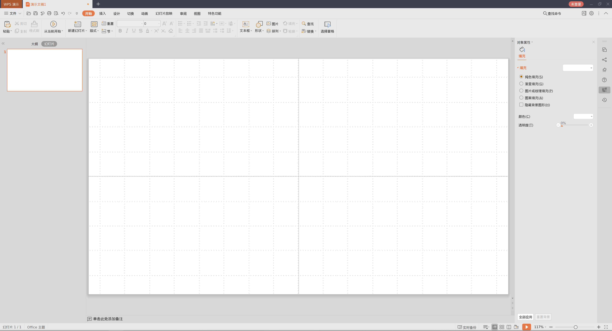
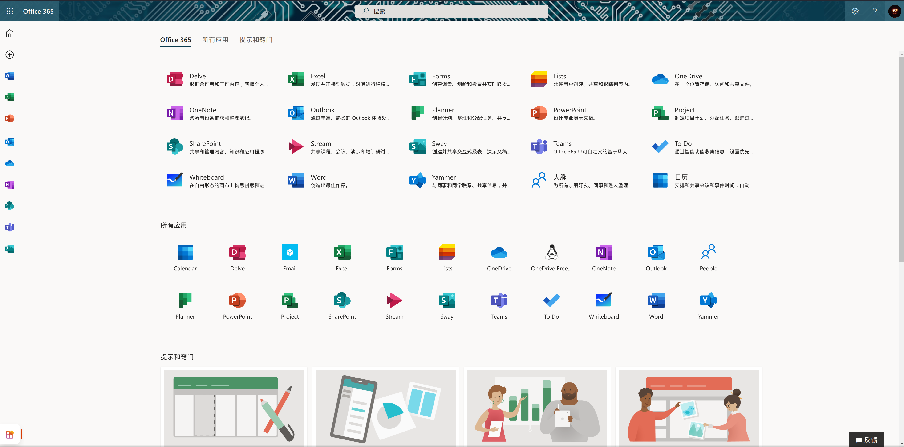
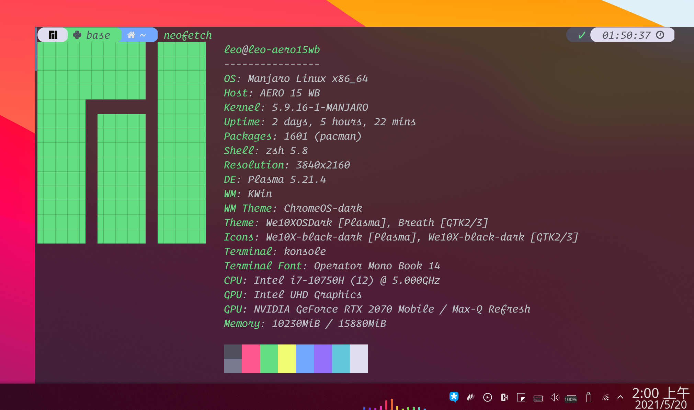

用Linux的时间已经比用Windows的时间还长了, 随着使用逐渐找到了各用途我最认可的工具, 或从软件源安装, 或在线使用. 在此整理一份我的Linux下各用途好用工具推荐. (出于私心将从一个Manjaro用户角度介绍)

💡各位如果有什么推荐的软件也可以跟我说, 我觉得好用会加进去的

<!-- More -->

> 首先, 不得不吹一下Manjaro是一个多么贴心的系统. Manjaro自带了一个叫**Manjaro Hello**的入门程序, 点进这个程序的`Applications`入口能看到Manjaro社区为各常见用途已经提供了一些推荐, 勾选就可以安装. 可以说没有更贴心的系统了!
>
> 

## 日常使用

### 中文输入法

随着fcitx5日渐成熟, 现在有了两种我推荐的中文输入法方案:

#### fcitx5框架+配套中文输入法

```shell
yay -S fcitx5-im
yay -S fcitx5-chinese-addons
yay -S fcitx5-material-color
```

这个**fcitx5-material-color**是一个模仿win10的中文输入法的皮肤, 在fcitx5的设置中可以更换皮肤, 可以做到下面这样的效果 👇


#### fcitx4框架+搜狗输入法

```shell
yay -S fcitx-im fcitx-configtool
yay -S fcitx-sogoupinyin
```

---

安装完输入法框架和中文输入法后还需要在配置文件中设置几个环境变量. 因为有很多配置文件会在用户登录过程中被加载, 所以这里的设置方式其实不唯一. 我是在`~/.pam_environment`中写了这样几行:

```shell
GTK_IM_MODULE DEFAULT=fcitx
QT_IM_MODULE DEFAULT=fcitx
XMODIFIERS DEFAULT=@im=fcitx
```

我目前使用的是fcitx5的方案. 我一个同学体验后觉得搜狗的词库做得更好, 能提供更精确的联想. 这点我倒是没什么感觉, fcitx5这个方案完全满足我的使用. 但另一方面fcitx5配套的中文输入法的优势非常明显:

- 有一个Quick Phrase功能, 支持类似snippets一样根据关键词插入设定好的内容的功能. 默认提供了一些颜文字, emoji, LeTaX片段, 也可以自己加
- 整个方案成体系, 使用体验非常好! fcitx4+搜狗输入法这个方案始终是缝合怪, 很容易有点小问题. 比如我之前用的时候每次从英文输入法切换回搜狗输入法, 我对搜狗输入法的一些设置 (比如使用半角标点符号) 都会恢复默认值
- 支持导入搜狗细胞词库, 可以导入许多专业词汇的词库
- 支持云拼音
- 配置起来很简单直观

**总的来说我是推荐试试fcitx5框架+配套中文输入法这个方案的**

### 截图

很遗憾我没有找到一个像snipaste那样功能非常齐全的Linux平台截图/贴图软件. 我下了两个软件, 和我manjaro-kde自带的spectacle结合着用:

```shell
yay -S spectacle
yay -S flameshot
yay -S deepin-screenshot
```

|                   | 优点                                                         | 缺点                                                         |
| ----------------- | ------------------------------------------------------------ | ------------------------------------------------------------ |
| Spectacle         | 1.作为KDE官方开发的截图软件, 对多屏幕支持是最好的, 下面两款对多屏幕的支持都完全没法看; 2. 全屏截图, 选定窗口截图, 选定矩形截图, 截图后做一些编辑, 设置存储图片的质量这些功能都是全的 | 1. 不能像下面两款软件一样在后台运行; 2. 没有下面两款那样在截图的时候就能编辑, 选是存到剪贴板还是本地的交互界面, 还是不太方便 |
| Flameshot         | 支持像snipaste一样将截图贴在屏幕最上层                       | 1. 在KDE上无法设置截图质量, 只能是原画质; 2. 无法自动贴靠屏幕上的窗口 |
| Deepin Screenshot | 1. 能将截图区域自动贴靠屏幕上的窗口; 2. 可以调节截图质量     | 因为[一些原因](https://github.com/linuxdeepin/deepin-screenshot/issues/8)KDE版无法将截图存到剪贴板 |

### 录屏

```shell
yay -S simplescreenrecorder
yay -S peek
```

SimpleScreenRecorder名字里虽然有simple, 但是实际上关于录屏的功能非常全, 有好几屏的设置项, 可以设置帧率, 视频源可以来自屏幕, 摄像头, 也可以设置音频源, 支持录制成`mkv`, `mp4`, `gif`, `mp3`等多种各种格式, 视频编码参数, etc... 可以说功能非常全面了.

而如果只是想随手录一个gif, 那使用**peek**还是很好的.

### 显示按键

```shell
yay -S screenkey
```

这个可以在屏幕上显示按下了的键盘按键, 鼠标按键. 在演示, 示教时很好用 👍

## 驱动

### 显卡驱动

这里又不得不点名表扬一下Manjaro, 在装机时勾选了安装**Proprietary Driver** (非自由驱动)的话会自动装好N卡驱动! 比如我的笔记本有一个UHD Graphics (集显) 和一个RTX2070 (独显), 安装好系统后已经自动安装了采用最新的intel集显与Nvidia独显共存的[Prime方案](https://wiki.archlinux.org/index.php/PRIME)的混合驱动**video-hybrid-intel-nvidia-prime** 🎉

我也没有细看Prime方案和Bumblebee方案的具体差异, 看起来大概意思就是Bumblebee是软件实现, 有一定性能损失, 而Prime方案是更为推荐的新一代方案.

Prime技术让我们能够同时使用两个显卡: 以intel核显渲染画面, 以独显运行高负荷任务. ~~但是目前无论Prime方案还是Bumblebee方案都有个缺陷: 同时使用两个显卡时N卡无法输出画面, 即从直连N卡的HDMI接口无法输出画面, 但仅使用N卡的话可以从N卡输出画面. 仅使用N卡从性能方面没什么问题, 但是耗电, 发热会很夸张, 这对日常使用来说很不划算. 因此我们还是需要一个方法让我们能在需要N卡输出画面时能切换到仅N卡模式.~~

> ~~至于外接屏幕, 我的解决办法是买一个有雷电接口 (雷电接口是直连CPU的, 其视频输出由intel核显承担) 的电脑, 这样一来在混合模式也能从雷电接口输出视频信号 😅~~

卧槽我前几天试了一下现在在混合显卡模式也能从直连N卡的HDMI接口输出视频信号了! 😲

```shell
yay -S optimus-manager-qt
```

💡 optimus-manager的文档说Manjaro KDE用户[需要编辑一个文件](https://github.com/Askannz/optimus-manager#important--manjaro-kde-users), 但我没动似乎使用起来也没什么问题

[optimus-manager](https://github.com/Askannz/optimus-manager)允许我们在**仅intel显卡模式**, **仅N卡模式**, **混合模式**三种模式间切换. 而optimus-manager-qt则为我们提供了一个GUI界面来进行设置, 一个系统托盘小图标来进行快速切换 (和装饰)

除了显卡模式切换这个主要功能, optimus-manager也能用来进行独显的电源管理, 根据自己的情况选择适合的方案. 因为我的笔记本满足 "N卡为Turing架构及以上, intel CPU为CoffeeLake架构及以上" 的条件, 因此用N卡自带的动态电源管理, Runtime D3 Power Management, 省心又省电 👍 不用时我的N卡功耗可以低到**4W**, 整个电脑的功耗最低到过9W (虽然还是被长续航轻薄本吊打)

### OLED屏幕亮度调节

[我自己写的脚本](https://github.com/LeoJhonSong/Shell-Scripts/blob/master/oled-brightness) 😏

目前Linux对OLED屏幕支持很差, 似乎还没有发行版默认支持OLED屏幕亮度调节. 普通LCD屏幕的亮度调节是通过调整屏幕背光板的电压, 即背光板亮度来实现的. 当你在滑动你的Linux系统提供的亮度调节滑条时, `/sys/class/backlight/intel_backlight/brightness`的值会被改动, 然后系统会根据这个值和`/sys/class/backlight/intel_backlight/max_brightness`所记录的亮度最大值来调节背光板电压. 然而OLED屏幕根本没有背光板, 每个LED的亮度是可以单独调节的. 因此目前调节OLED屏幕亮度的方案是调整画面的Gamma值. 于是我写了这个基于`xrandr`的脚本, 这个脚本会监控`/sys/class/backlight/intel_backlight/brightness`值的变化并据此改变指定屏幕 (默认为主屏幕) 画面的gamma值.

顺带一提`xrandr`是一个功能很强大的设置屏幕画面的分辨率, 方向, 位置等参数的强大工具.

### 镜像烧录

```shell
yay -S ventoy-bin
# 使用的时候用:
sudo ventoyweb
```

有了[Ventoy](https://www.ventoy.net/cn/index.html)这个项目, balenaEtcher, rufus这些传统意义上的镜像烧录软件就可以丢弃了! Ventoy支持一个U盘里放多个镜像, 在以这个U盘启动时会进入一个GRUB界面, 在这个页面再选择到底进入哪个镜像 🐮 我在我U盘里放了Windows镜像, Manjaro-KDE, Ubuntu20.04, 还有一个可以用来修复分区的[GParted](https://gparted.org/download.php)镜像, 还换了个GRUB主题, 爽到.

## 系统工具

### 资源管理器

**Dolphin**绝对是最好用的资源管理器! 多标签页, 显示预览等功能不在话下. Dolphin的右键菜单很贴心, Gnome自带资源管理器所没有的右键新建文件功能 (就离谱) 当然是有的, 也有创建快捷方式, 解压 (不论是rar还是zip还是tar都是同一个按键), 也可以很方便地自己创建脚本添加右键菜单的功能.

而Dolphin最突出的功能是按<kbd>F4</kbd>可以直接打开一个**Dolphin内嵌终端**. 这个终端的路径会随着在资源管理器里点击自动切换 (除非已经打开类似vim这样的程序), 使用起来超方便, 结合了终端的便捷和GUI的可视化等优势.


### 任务管理器

**htop**是升级版的top. 一是交互人性化很多, 支持鼠标交互, 设置页面分了页, 直观很多. 二是能以列表或者树的样式显示丰富得多的值, 比如该进程的线程数等, 还支持以关键词过滤显示的进程等功能.

### 磁盘管理器

```shell
yay -S filelight
yay -S partitionmanager
```

**Filelight**是KDE的图形化磁盘空间使用情况分析工具, 能以很多环同心扇形的形式直观地显示出哪里有大文件. **partitionmanager**是KDE的磁盘管理工具, 就类似Windows的磁盘管理器. 这两个应用Gnome社区也有类似的, 但感觉还是KDE的做得更人性化一些.

💡 用`du -sh /path/to/check/* | sort -hr`可以在命令行列出指定文件夹下按大小降序列出各文件夹/文件

### "电脑管家"

```shell
yay -S stacer
```

虽然很多Linux老哥们认为Linux用户不需要这种东西, 但如果是习惯了在各种电脑管家打卡的Windows用户, 我推荐**Stacer**. 这是一个系统优化与监控软件 (和CCleaner等电脑管家画风很像), 可以看系统资源使用该要, 有任务管理器一栏, 可以清理垃圾, 可以管理开机自启项, 卸载已安装软件等... (是个很Windows画风的东西😅)

### TCP调试助手

```shell
yay -S nmap
```

netcat被称为网络编程的瑞士军刀, 功能属实很多👍 要注意netcat有好几个版本, 给的参数略有区别. **ncat**是为Nmap项目写的netcat, 包含在nmap包中. 在其man中自称是诸多netcat版本中的巅峰之作 (水平有限俺也不知道是不是). **nmap**同样是一个用法很多的网络编程工具, 我主要用来扫端口.

```shell
# ncat监听本地8080端口
ncat -l 8080
# ncat连接本地8080端口
ncat 127.0.0.1 8080
# ncat监听本地8080端口, 发送一串16进制数据 (socket一个字节的内容为两位16进制数)过去并以双字节16进制显示输出
# 如果不满意显示格式的话可以换用hexdump -C然后加参数设置显示格式. hexdump支持的显示格式比xxd要丰富些. 注意不加-C参数的话hexdump默认按双字节小端转换
echo '0006303030304e43' | xxd -r -p | ncat -l 8080 | xxd
# nmap扫描当前路由器192.168.1.1下所有设备的端口 (找树莓派之类设备IP时很方便)
nmap 192.168.1.1/24
```

## 通讯

### QQ/微信

这两个软件在国内基本是必备了吧 :man_shrugging:. 在Linux上我体验下来最推荐的版本是以deepin-wine为容器, 星火应用商店打包版:

```shell
yay -S wqy-microhei  # 需要装一个文泉驿版微软雅黑来让deepin-wine系软件正常显示中文文字 (不然会显示为方框)
yay -S com.qq.tim.spark  # 比起QQ我更喜欢简洁的TIM (夹带私货)
yay -S com.qq.weixin.spark
```

如果使用的是高清屏, deepin-wine系软件显示得很小, 可以在**deepin-wine5中**设置屏幕分辨率. 比如设置**com.qq.tim.spark**的分辨率:

```shell
env WINEPREFIX=$HOME/.deepinwine/Spark-TIM deepin-wine5 winecfg
```

然后会打开一个设置界面. 调节其中的`Graphics > Screen resolution`一项. 我是4k屏幕, 感觉设成**192dpi**比较OK

### 会议

```shell
yay -S zoom-system-qt
yay -S teams
yay -S com.tencent.meeting.deepin
```

我在Linux目前体验能用的视频会议软件有三个:

- **zoom**: AUR里还有一个就叫**zoom**的版本, 但是看起来没有适配显示的全局缩放 (高分屏笔记本肯定是要设置个缩放的), 会变得很大一个. 随着国内疫情几乎目前大陆帐号已经无法发起zoom会议了, 但是用教育邮箱登录的话是可以发起会议的 👍 
- **Microsoft Teams**: teams不是专门的视频会议软件, 是微软Office中的办公聊天软件, 不过它的视频会议版块功能丝毫不比zoom少, 甚至得益于Office套件间的联动使用体验非常流畅, 有很多类似到时间提醒参会成员, 自动生成会议云录制的字幕等很贴心的功能. 其界面非常现代, 功能也很多 (有很多插件). 其实这个也支持在网页参加会议, 体验很好的.
- **腾讯会议**: 前两个的问题是会议用的服务器似乎都在国外, 网络质量不是很有保障. 腾讯会议的速度是很有保障的, 可惜是deepin-wine版, 功能不全.

其中zoom和teams是有官方全平台安装包的. zoom甚至提供很多个Linux发行版的安装包, 因此这两个软件的各种功能和Windows/Mac版没有任何区别, 支持共享屏幕, 远程控制, 会议录制 (本地/云), 摄像头, 音频等功能都没有问题. 而腾讯会议则是deepin-wine版, 一开启摄像头程序就会崩溃 (可以通过放一个播放摄像头画面的vlc小窗口在屏幕上的方式来解决), 观看别人共享屏幕时有时候会出现画面闪烁问题, 总之只是勉强能用的程度. 另外, 用海外手机号注册的腾讯会议用户无法通过链接下载云录制的视频.

总结下来就是: 如果有翻墙条件, 参会成员都能接受, 那teams是最好选择 ✔

## 下载/云盘

```shell
yay -S baidunetdisk-bin
# yay -S xunlei-bin
yay -S aria2
# 后台运行启用了RPC, aria2
nohup aria2c --enable-rpc --allow-piece-length-change &
# yay -S motrix-bin
# sudo motrix --no-sandbox  # 然后右键系统托盘里的图标退出
```

在国内的话总体来说下载大文件体验最好的可能还是百度云... 现在百度云盘出了官方的Linux版deb系安装包, 有热心网友适配后发布到arch源里了. Linux版的和Windows版用起来并没有区别, 仍然是有限速的 😁

磁力链和torrent我是用chrome插件[Aria2 for Chrome](https://chrome.google.com/webstore/detail/aria2-for-chrome/mpkodccbngfoacfalldjimigbofkhgjn)下的. 这个插件以aria2为后端, 能够自动拦截chrome中http, 磁力链, FTP等协议下载任务, 也支持torrent. 在插件的设置页面中设置触发自动拦截下载任务的文件大小为0MB的话torrent文件也会通过aria2下载, 而aria2默认开启了下载的是torrent文件时自动开始BT下载任务的选项, 体验会很好. 有点遗憾的是这个插件所使用的前端虽然可以对aria2进行设置, 但是这些设置在aria2重启后会丢失. 如果想要每次启动aria2后都能自动加载这些配置的话还是需要写一个aria2的配置文件`~/.config/aria2/aria2.conf`:

```shell
# 默认下载路径
dir=/home//Downloads
# 断点续传
continue=true
# 最大同时下载任务数
max-concurrent-downloads=10
# 单服务器最大连接数
max-connection-per-server=15
# 最小文件分片大小
min-split-size=10M
# 允许所有来源
rpc-allow-origin-all=true
# 允许非外部访问
rpc-listen-all=true
# 最小做种时间. 当设置为0时在BT下载任务完成后不再做种
seed-time=0
```

然后运行来自[P3TERX/aria2.conf](https://github.com/P3TERX/aria2.conf/blob/master/tracker.md)的脚本`bash <(curl -fsSL git.io/tracker.sh) "/home/leo/.config/aria2/aria2.conf"`添加一个Tracker列表给aria2配置文件, 提升torrent下载速度.

如果想用本地客户端下载磁力链和torrent的话强推**motrix**: 集成了每日自动更新的Tracker服务器列表的支持, 支持迅雷链接下载协议, 而且因为是electron做的所以界面非常美观! 不过除了Ubuntu镜像我能以30MB/s的速度下载我暂时还没下到过速度超过100Kb/s的... 这个软件在Arch系下似乎有bug, 安装好后需要用上面那条命令sudo启动然后关闭一次, 然后就能正常使用了.

💡据我同学说迅雷对一些资源有更快的速度, 我试了下还真是... 比用tracker的qbittorrent还要快很多 (是正经资源)

## 图片/视频处理

### 视频压缩

```shell
yay -S handbrake
```

handbrake是一个支持非常丰富的视频格式转换/压缩工具. 视频编辑方面接触不多的人会意识不到一个录屏只需放进压缩软件简单**无损压缩**一下通常可以减小为原本体积的**一半以下**.而handbrake提供了许多直观的预设参数组. 我通常就用的`Offical>General>Very Fast 1080p30`这个预设. handbrake支持批量处理, 操作起来也很简单.

### 图片压缩

```shell
yay -S jpegoptim
yay -S optipng
yay -S imagemagick
```

**jpegoptim**, **optipng**这两个终端程序可以分别对jpg/jpeg, png进行无损压缩, 调用也很简单, 普通无损压缩的话跟的参数就图片名就可以.

**imagemagick**是一套用于创建, 编辑, 显示图片的强大终端工具, 其中有一个**magick**终端程序可以实现jpg转png, 也可以压缩jpg, png等. 但是参数比上面两个复杂一些, 我反正记不住.

💡没有用到透明图层的png图片可以转为jpg, 能大幅压缩体积

### 视频播放器

```shell
yay -S vlc
```

**vlc是一个很神奇的播放器**.

它不光支持非常多种视频文件格式, 还可以播放网络视频流, 比如RTSP视频流, IPTV网络电视, 还可以播放摄像头视频流... 加上它有截取视频一帧画面, 录制视频流, 高倍速播放, 在截取的画面上显示当前视频时间等功能, 他可以:

- 当Linux上的相机软件
- 用来调试usb摄像头/IP摄像头
- 当网络电视 (顺便放一个非常全的[IPTV频道合集](https://github.com/iptv-org/iptv))
- 看网课视频利器

🐮🍺

### 视频编辑器

```shell
yay -S kdenlive
```

**Kdenlive**是一个界面很像Adobe Premiere的软件, 现在是KDE旗下项目. Kdenlive的语言看起来是继承的系统语言, 支持中文 (汉化得还是比较全面的). Kdenlive操作起来还是很简单的, 零基础随便看一看教程也就会用个大概了. Kdenlive的特效种类我感觉和Pr差不多多, 定位应该是和Pr一样也是视频剪辑软件 (Linux平台也有对标Ae的软件, Natron). Kdenlive也有Windows版, 而且安装包只有80MB, 很值得尝试的 👍

### 制图

#### 图片

因为我处理图片的需求不大, 因此普通一些的需求我就在WPS的PPT软件里处理的, 有稍微复杂一点的PS需求时都是使用的这个[在线PS](https://www.uupoop.com/#/old), 支持PhotoShop的**PSD**, sketch的**sketch**格式, GIMP的**XCF**格式等, 覆盖了常见格式, 十分方便 😆

#### UML图

- Graphviz: 这是一个根据代码自动生成图形的程序, 有[在线版](https://dreampuf.github.io/GraphvizOnline/), 也有[VSCode插件版本](https://marketplace.visualstudio.com/items?itemName=joaompinto.vscode-graphviz)什么的. (顺便[这里](/zh-CN/2020/03/12/Graphviz简要语法/)是我写的介绍Graphviz语法的博客)
- [**diagrams.net**](https://www.diagrams.net/): 这个是全平台的, 有在线版, 也有各系统的安装包. 它有非常丰富的元素, 能画出很好看很复杂的UML图, 但是无法自动整理布局. 不过它**可以打开Visio的.vsdx文件** 👍
- [PlantUML](): 这个则是以代码生成UML图的强大工具, 后端其实也是Graphviz (Graphviz本身用起来真的有点阴间), 提供有很多种类的模板, 可以几行代码画出一个非常好看的UML图! [在线编辑器](https://www.planttext.com/)在此
- [ASCIIFlow Infinity](http://asciiflow.com/): 这个在线绘图工具是用来绘制**纯文本**框图. 不过因为它开源了, 因此也可以在本地使用 `yay -S asciiflow2-git`

#### 其他

- [Text to ASCII Art Generator (TAAG)](http://patorjk.com/software/taag/): 是一个生成文本的ASCII Art的在线工具 (就是oh-my-zsh更新时会显示的那种文本拼出来的大logo)

## 办公

### 文档

```shell
yay -S typora
yay -S okular
yay -S google-chrome
```

做文档我首推Markdown, Markdown编辑器我首推**Typora**. (我还写过[Markdown安利&Typora简要使用教程](/zh-CN/2019/09/23/Markdown安利-Typora简要使用教程/))

普通看pdf的话KDE的**okular**和GNOME的**evince**我觉得界面还比较简洁而不简陋, 现代. 相比起来okular功能更多一些, 对触控笔/手写等操作支持好许多 (虽然我不怎么用). 看文章时我更喜欢在**Chrome**的[沙拉查词](https://saladict.crimx.com/)插件提供的pdf.js的pdf阅读器里看, 查单词, 搜索很方便. 如果要做笔记的话我是在我的Windows系统平板上看的. 顺带一提用下面这行代码可以实现pdf.js暗黑模式效果. 解释见[这里](https://github.com/mozilla/pdf.js/issues/2071#issuecomment-830446509).

```javascript
javascript:void(document.documentElement.style.filter='invert(64%) contrast(228%) brightness(80%) hue-rotate(180deg)')
```

```shell
yay -S ps2pdf
```

补充一个压缩pdf的小工具, 还是挺实用的. 用`ps2pdf -dPDFSETTINGS=/ebook input.pdf output.pdf`就可以将pdf压缩为150dpi的质量. `-dPDFSETTINGS=/prepress`参数的话能得到质量为300dpi的pdf, 完全满足打印的需求了.

### latex

```shell
yay -S visual-studio-code-bin
yay -S texlive-most texlive-lang biber
# 进入cpan后添加阿里源
o conf urllist push https://mirrors.aliyun.com/CPAN/
o conf commit
# 在cpan中安装包
install YAML::Tiny
install File::HomeDir
install Log::Dispatch
install Log::Log4perl
```

TeX Live是很大一套软件, 嫌麻烦的话最好就直接把包含了绝大多数部件的**texlive-most**以及语言包**texlive-lang**下下来. 其中CTeX包含在**texlive-langchinese**这个包中. **biber**则是比biblatex更先进的引用处理工具. TeX Live中的一些工具比如**latexindent.pl**需要perl并且依赖于一些perl包. 输入`cpan`后首先会要求进行一下交互式配置, 然后用上面的语句添加阿里源, 然后安装缺少的包.

在Linux上使用LaTeX我只推荐两种方案:

1. 在[Overleaf](https://www.overleaf.com/)中在线编辑

   Overleaf以TeX Live作为后端, 开箱支持选择编译器, 支持基础的vim键映射, 提供看得过去的补全, 提供拼写和语法 (指LaTeX)检查... 点开Overleaf就有了一个还不错的LaTeX环境, 不需要担心缺少依赖, 不需要设置编译工具链, 编辑界面还算好看, 编译速度也很快, 是真的很省心了 👍 除此以外Overleaf支持git同步, 也支持多人协作编辑, 对于不想费心配置环境的人来说是真的很棒了

2. 借助[LaTeX Workshop](https://marketplace.visualstudio.com/items?itemName=James-Yu.latex-workshop)插件在VSCode中本地编辑

   曾经看了[这篇文章](https://zhuanlan.zhihu.com/p/60049290?utm_source=qq&utm_medium=social&utm_oi=911363543885045760)我也一度想试试在vim中编辑TeX文件, 以Okular显示的方案, 但体验后发现用vim编辑富文本文档真是傻逼. 我原本是馋这样快捷的补全, 但事实证明装几个补全插件, 都还不需要自己添加snipet补全体验就已经很不错了 (毕竟我不是数学专业, 并不会频繁用到奇怪公式). 另一方面, 我试了好几个pdf软件, 反向搜索都只能具体到行, 不能让光标精确定位到我在pdf中点到的词/图上, 而LaTeX Worshop提供的VSC内置pdf阅读器支持精确的反向搜索. 另外我在VSC中装了[拼写检查](https://marketplace.visualstudio.com/items?itemName=streetsidesoftware.code-spell-checker)和[查单词](https://marketplace.visualstudio.com/items?itemName=CodeInChinese.EnglishChineseDictionary)的插件, (有拼写检查很重要!) 而我很久以前搜的时候并没有搜到好用的vim拼写检查插件. 其他方面vim倒是和VSC差不多.

### Office套件

```shell
yay -S wps-office-cn  # wps套件国内版
yay -S wps-office-mui-zh-cn  # wps中文语言包
yay -S ttf-wps-fonts  # wps需要的字体和符号
```

我体验了Office365 Online, LibreOffice, Google Docs, WPS后发现在Linux用Office套件只能是用WPS, 而且很好用. 其他软件简直是一坨💩

Office365 Online当然是格式兼容最好的, 但是必须在线使用, 而且打开一个本地文件时会先把这个文件上传到onedrive中然后从云端打开, 文件稍微大点那体验很差. 在线版Office表面看岁月静好, 其实功能阉割非常严重. Google Docs虽然可以安装为chrome插件离线使用, 但是功能更加简陋了! 而LibreOffice就很离谱了, 明明是一个本地使用的Office套件, 但支持的功能并不比前两者多多少, 同时界面还有点古老.

这三者的功能缺失到底有多严重呢? 我来举几个例子:

1. 都没有内置插入富文本公式的功能
2. 都不可以设置插入的矩形的透明度 (有时候我会用一个带透明度的矩形来作为图片蒙版)
3. Office365 Online和LibreOffice的PPT软件都不支持插入本地视频, Google Docs我就没试了. Office365 Onlineq其实是可以插入视频, 但是只支持来自于youtube等几个有限选择的联机视频... 而LibreOffice的PPT软件在编辑时可以插入本地视频, 但是保存为`.ppt`后这个视频不知道为什么没了... (我没试保存为它自己的格式的话能不能行, 因为那也没什么用)
4. ...如果上面几个功能都不支持我不如写Markdown文档了所以不用试了

而另一边, **WPS出乎我意料的好!** 以上功能WPS统统支持, 用起来和MS Office真的是区别不大了👍 目前注意到的也就是没有平滑切换效果和不支持3D模型编辑 (但是也能显示成图片) 这两个MS Office的特色功能, 以及选中一些对象右键另存为图片时不能另存为svg或其他矢量图格式, 无伤大雅. 格式不完全兼容这个问题当然还是存在, 但是在接受范围内. 而且, WPS现在还挺好看的🐮



至于MS Office套件提供的其他我使用的软件:

- Outlook, 微软待办事项, 日历我使用的是网页版 (在Windows我也用的网页版, 因为可以和微软待办事项, 日历联动我觉得体验反而比Outlook本地客户端体验更加良好)

- teams则是有官方Linux版本, 可以执行`yay -S teams`安装. 不过网页版也能获得完整的体验, 我感觉没什么差别

- OneDrive的话虽然有人开发了[OneDrive Linux客户端](https://abraunegg.github.io/), 但我并没有使用. 虽然我平时使用Linux系统, 但是我把我的Windows盘挂载在了我的Linux系统里, 可以访问并编辑OneDrive文件夹里的文件, 然后我对同步频率的要求没多高, 因此暂时没感觉不方便 (主要是很久以前试过这个客户端, 当时体验很一般). 比较有意思的是目前在企业版Office365 (学校给的) 的应用列表中直接有列出OneDrive Linux版的图标, 但链接到的是一个[有很多bug功能很不全的版本](https://github.com/skilion/onedrive), 而且我的个人版Office365的应用列表并没有列出这个 😅

  在[这个issue](https://github.com/skilion/onedrive/issues/518)中可以看出skilion完全不想为社区开发, 但同时拒绝向abraunegg的版本引流或注明自己的版本的问题... 👎

## 工程

```shell
yay -S minicom  # 终端串口调试助手, 也有GUI版, cutecom
# 未完待续...
```


### 命令行工具

```shell
yay -S zsh
chsh -s /usr/bin/zsh  # 切换默认shell为zsh, 要注意你的zsh也许不在/usr/bin/zsh

yay -S tmux
# 使用gpakosz的tmux主题
cd ~ && git clone https://github.com/gpakosz/.tmux.git
ln -s -f .tmux/.tmux.conf
cp .tmux/.tmux.conf.local .

yay -S lsd
git clone --depth 1 https://github.com/junegunn/fzf.git ~/.fzf
~/.fzf/install
yay -S bat
```

在这里我想先辨析一下`终端`, `shell`, `命令行`这三个词:

- **终端** (terminal), 最开始指的是一种用来与计算机主机交互的输入输出设备, 是硬件, 而我们如今绝大多数情况下说的终端实际上是终端模拟器 (terminal emulator) 的简称, 是一类模拟终端这种提供与计算机交互界面的功能的软件.  有的终端模拟器不仅可以显示字符还可以显示图像. 我用的终端是KDE提供的**Konsole**. 去掉标题栏及边框后能达到👇这样的效果, 我感觉还挺好看😁 

- **shell**, 指的是一种让用户能够与操作系统内核进行交互的软件 (我们通常说的是命令行界面shell, 但实际上shell这个概念还包含了GUI的shell, 比如KDE). Ubuntu及Manjaro等系统自带的shell程序是bash, MacOS自带的shell则是zsh. 实际上zsh是比bash体验好很多的shell程序, 自身的补全更加智能, 有很丰富的插件选择, 有[Oh My Zsh](https://ohmyz.sh/)这样的便利shell配置管理框架... 反正谁用谁知道 👍 我也不清楚为什么一种Linux系统仍将bash作为系统默认shell, 这点表扬MacOS. 用下面的命令来安装并切换默认shell为zsh.

- **命令行**, 看了前两者的描述能发现指的只是相对于图形化界面操作的一种操作方式, 一般是纯文本界面, 少数命令行程序支持鼠标操作, 比如vim (需要设置), htop (命令行任务管理器), ranger (命令行资源管理器), w3m (命令行浏览器), tmux.

然后我来介绍几个好用的命令行工具:

- tmux是一个终端复用器 (解释起来比较复杂, 建议自行搜索一下), 我主要用来在一个终端里开多个窗口 / 连服务器. tmux的设计使得与服务器交互时在服务器侧开一个tmux后即便丢失与服务器的连接, 服务器端tmux中的任务仍会正常执行下去, 并且下次连上服务器后进入tmux就可以回到这个工作现场. 推荐一下[这个tmux主题](https://github.com/gpakosz/.tmux), 开箱就能有很不错的体验, 颜值很高, 配置也很容易个性化.


- lsd是`ls`命令的替代品, 最主要的价值是让ls命令的输出变成彩色而且每种文件有对应图标显示的了 😁 要注意需要安装[特定类型的字体](https://github.com/ryanoasis/nerd-fonts/blob/master/readme.md)

- fzf是一个模糊查找器, 不止可以在zsh里用, vim, tmux中也有支持. 我主要喜欢用来在zsh中能模糊输入我设定了的几个命令, 结合**bat**, 这个升级版cat, 能获得很流畅的 (装逼) 体验. 之所以不从aur装fzf是因为从aur装的fzf不知为什么会缺少`.fzf.zsh`这个文件. 贴上我在`.zshrc`中对fzf的配置:

  ```shell
  # fzf config
      export FZF_COMPLETION_TRIGGER=']'
      # Use fd (https://github.com/sharkdp/fd) instead of the default find
      # command for listing path candidates.
      # - The first argument to the function ($1) is the base path to start traversal
      # - See the source code (completion.{bash,zsh}) for the details.
      _fzf_compgen_path() {
        fd --hidden --follow --exclude ".git" . "$1" --exclude ".deepinwine"
      }
  
      # Use fd to generate the list for directory completion
      _fzf_compgen_dir() {
        fd --type d --hidden --follow --exclude ".git" . "$1" --exclude ".deepinwine"
      }
      # (EXPERIMENTAL) Advanced customization of fzf options via _fzf_comprun function
      # - The first argument to the function is the name of the command.
      # - You should make sure to pass the rest of the arguments to fzf.
      _fzf_comprun() {
        local command=$1
        shift
  
        case "$command" in
          cd)           fzf "$@" --preview 'lt {} | head -200' ;;
          export|unset) fzf "$@" --preview "eval 'echo \$'{}" ;;
          ssh)          fzf "$@" --preview 'dig {}' ;;
          vim)          fzf "$@" --preview 'bat --style=numbers --color=always --line-range :500 {}' ;;
          *)            fzf "$@" ;;
        esac
      }
  
  [ -f ~/.fzf.zsh ] && source ~/.fzf.zsh
  ```

### 服务器相关

```shell
yay -S sshfs
yay -S frp
```

sshfs允许以SFTP将SSH服务器的指定路径挂载到本机, 在懒得配服务器的IDE/编辑器时可以用这种方式在本地编辑, 对不需要IDE/编辑器的高阶调试时还是挺方便的. frp则是一种以反向代理的方式让我们能非常方便地ssh到一台内网服务器的方式! 使用非常简单, 在要访问的内网机器和作为跳板的公网服务器上分别放一个程序和配置文件就能用了👍 参见[frp文档](https://gofrp.org/docs/setup/)