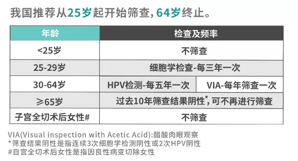
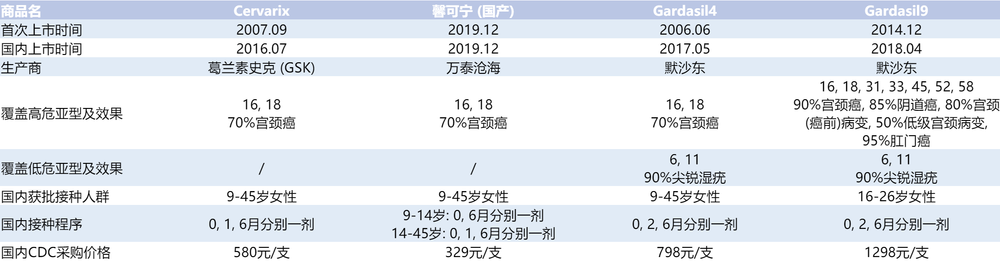
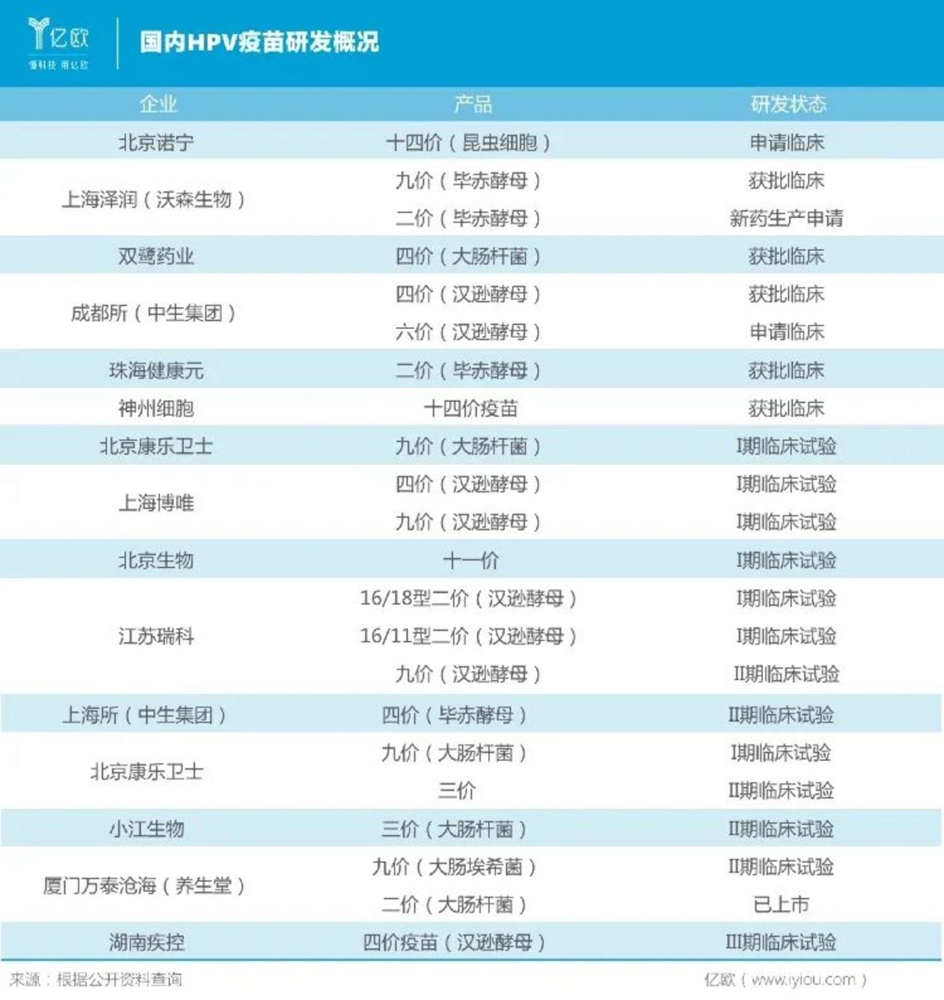

帮人查HPV疫苗的信息整理了一份资料出来, 就分享一下好了.

<!-- More -->

## HPV

HPV (human papilloma virus), 即**人类乳头状瘤病毒**. 和乳头没有关系, 是大部分类型得了会长出乳头状的瘤 (即疣, 皮肤上的粗糙, 坚硬颗粒), 有近200种类型. **不论是一般身体部位或生殖器的皮肤, 只要有鳞状上皮, 就可以被人类乳突病毒感染的, 但每种HPV通常只能感染特定区域皮肤.**

### 较常见HPV与疣的种类

❗ 大多数时候感染后没有任何临床症状, 也就是说连下面这些疣都不会有. 而出现了疣的话大致可以分以下几种情况.

| 疣类型                   | 说明                                                         | HPV类型                                                      | 危害程度 |
| ------------------------ | ------------------------------------------------------------ | ------------------------------------------------------------ | -------- |
| 普通疣 (瘊子)            | 有着粗糙的表面, 通常发生在手及脚部, 但亦有可能在身体其他区域发生 | 2, 4 (最常见), 1, 3, 26, 29, 57                              | 良性     |
| 扁平疣                   | 扁平而光滑的疣, 呈现肉色, 可能一长就是许多个；最常发生在头、脸、颈部、手、手肘及膝盖 | 3, 10, 28                                                    | 良性     |
| 丝状疣                   | 呈螺丝或者指头状, 在颈部, 脸部, 尤其是嘴唇以及眼皮周围上发生, 常见于中老年, 孕妇等 (因为抵抗力下降). **注意与皮赘区别** | 1, 2, 4, 7, 26, 27, 28, 29                                   | 良性     |
| 跖疣                     | 发生在足底部. **注意与鸡眼, 老茧区别**                       | 1 (最常见), 2, 3, 4, 27, 28, 58                              | 良性     |
| 肛门生殖器疣 (尖锐湿疣)  | 长在肛门/生殖器附近. **注意与珍珠疹, 假性湿疣区别**          | **6, 11** (90%), 13, 40, 42, 43, 44, 54, 61, 72, 81, 89      | 低危     |
| (癌和子宫颈细胞化生不良) | 与癌症有关, 特别是子宫颈癌, 并且还可能会导致一些外阴, 阴道, 阴茎, 肛门和口咽的癌. 男性也可能感染 | **16, 18** (70%宫颈癌, 90%肛门癌, 很大比例阴道癌), **31, 33, 45, 52, 58**(20%宫颈癌), 35, 39, 59 | 高危     |

💡 高危/低危根据致癌性划分. 无论是高危类型的HPV还是低危类型的HPV, **目前都没有明确有效的抗病毒治疗手段**, 只能治疗HPV导致的病变

💡 **由此可见只有四十余种HPV通过性行为传播且有危害性, 大部分HPV性质和脚气类似, 并非性传播** (但是能通过疫苗预防的几种HPV确实只有与性相关的几种)

💡 从整体上看, 我国的感染型别与国际以及亚洲地区其他国家略有差异, 在细胞学正常人群中, 全球范围内最常见的HPV型别依次是 HPV 16/52/31/53, 而在我国排名前四的型别依次是HPV 16/18/58/52. **除了广泛流行的 HPV 16/18 型, HPV 58/52 型在中国宫颈癌中占比为 14.7%, 明显高于全球占比  7.4%**.

80%感染的HPV会在6-24个月内会被身体的免疫系统自动清除, 医学上称为**一过性感染**.

### 感染HPV的常见途径

2. 间接接触传播 (共用拖鞋, 共用毛巾, 共用剃须刀, 公用马桶, 私人衣物等)
2. 性传播
3. 母婴传播
4. 医源性感染

## 宫颈癌

到目前为止, 宫颈癌是人类唯一一个找到病因且可预防的癌症种类. 中国女性 HPV 感染率按年龄呈[双峰] 分布：第一个高峰在[17-24 岁], 第二个高峰在[40-44 岁].

宫颈癌与hpv关联: 只有少数高危型的 HPV 持续感染才会有一定几率引发宫颈癌, 通常情况下持续感染经过 10-20 年的自然演化发展, 才可能会发展成为宫颈癌.

### 中国《子宫颈癌综合防控指南》提出的三级预防策略

1. **一级预防 (治未病)**: 开展健康教育和接种 HPV 预防性疫苗
2. **二级预防 (治初病)**: 对所有适龄妇女定期开展宫颈癌筛查
3. **三级预防 (治已病)**: 根据宫颈癌的临床分期, 开展适宜的手术、放疗、化疗及姑息疗法

🌟 筛查比hpv疫苗重要得多

## HPV疫苗

### 工作原理

以L1蛋白外壳模拟HPV病毒, 本身不是病毒, 不会造成感染

### 意义

- 预防大部分有致癌风险的HPV

- **感染过HPV也仍有接种价值**: HPV感染或由此引发的宫颈病变治愈后, 进行HPV疫苗接种可以减少疾病的复发率. 理论上认为, 人体自然感染HPV后, 抵抗病毒的体系是细胞免疫, 主要在宫颈局部起作用, 产生的抗体水平很低, 不足以对抗病毒的再次进攻. 而疫苗是肌肉注射, 会引发人体产生强烈有效的免疫反应, 产生的抗体的滴度是自然感染的40倍以上, 这样就可以防止病毒的感染.

### 接种条件及方式

- 对疫苗活性成分 (L1蛋白) 或任何辅料成分有超敏反应者禁用
- 目前大陆没有开放男性接种HPV疫苗 (国外可以)
- 肌肉注射 (首选上臂三角肌), 每次0.5ml

### 类型

共二, 四, 九价三种HPV疫苗, "价"指疫苗能预防的HPV亚种数. 目前全世界只有葛兰素史克 (英国), 默沙东 (美国), 万泰沧海 (中国) 三家能生产HPV疫苗, 其中四价, 九价疫苗目前只有默沙东能生产.

### 性价比

**万泰沧海二价 > GSK二价 > 默沙东九价 > 默沙东四价**

- 万泰沧海疫苗价格低的原因在于研发原理带来的低成本. 默沙东疫苗基于酒酿酵母表达体系, GSK 疫苗基于**昆虫细胞**表达系统, 万泰沧海疫苗基于**大肠杆菌**表达体系.

- 万泰对16/18型保护效力高于进口疫苗, 且不良反应小
- 四价只比二价多了对尖锐湿疣的预防, 但是尖锐湿疣看网上信息意思基本是良性的, 因此不如九价性价比高

- 国内目前都是自费接种, 因此其实大部分人还是选择等九价. 不过可能出现打完一针后缺货的情况.
- 打过了二价或四价, 也可以再接种九价, 不过要等完成接种的一年后才可以, 而且有点亏

### 周期

打疫苗要按周期, 一共打三次. 可以比建议时间晚几天, 但最好不要提前打. 这是为了产生最多的抗体. 提前打浪费. **一年内完成三针产生的抗体量都是够的**.

### 保护能力持续时间

尚不清楚, 目前可以确保是10年以上. (因为这个疫苗一共出现才十多年)

### 年龄限制

九价建议注射年龄是16~26岁, 指第一针需要在26岁半前接种, 27岁前完成三针. 之所以国内对默沙东九价疫苗限制年龄段比国外窄是因为国内的默沙东九价疫苗临床数据目前只做了16-26岁女性的  (同时也有疫苗资源紧张的原因).也因为同样原因大陆没有开放男性接种HPV疫苗.

### 供应量

九价供应短缺原因:

- 国内缺口大: 国家统计局最新数据显示, 九价HPV疫苗的适龄人群 (16-26岁) 约**1.2亿**. 而按照智飞生物2019年九价HPV疫苗批签发量332.4万计算, 能够接种到该疫苗的人数还**不足总数的1%**. (按照10%的核心人群渗透率算)
- 九价国内审批只用了八天, 默沙东产量预估不足, 并且增加产能决心不强烈
- 目前国外很多市场已经淘汰二价, 四价疫苗, 以售卖九价疫苗为主.

现状:

- 目前只有默沙东一家生产九价疫苗. 2023年默沙东新生产线将投产.

- 截至2020年7月国内HPV疫苗研发概况👇 (可以看到甚至十一, 十四价HPV疫苗也已经开始研发了), 但是我看网上消息的意思, 直到2026年估计不会有国产九价疫苗上市 🤦‍♂ ️

