最近在用LaTeX写毕业论文 (学院支持甚至提供了LaTeX模板真是太幸运了), 在此记录下我写论文用到的一些语法方便以后抄.

<!-- More -->

为了专注一个主题, 我只想在这里记录一些我可能用到的语法 (要是你只是想写一份精美本科毕设论文的话也不用管太多). 想更系统更详细了解LaTeX的话, 我推荐下列三个详细程度递减的教程:

- [一份不太简短的LaTeX2ε介绍 (lshot中文版)](http://mirrors.ctan.org/info/lshort/chinese/lshort-zh-cn.pdf): 这是一份比较详细的入门教程的中文翻译版, 看完会解开许多初学时可能会有的疑惑, 比如它甚至列出了一些写LaTeX时可能用到或生成的文件类型都是什么用途. 网上各种中文LeTaX资料的名词翻译很不统一, 可以以这份教程的翻译为准. 这份lshort中文版其实不是单纯的翻译, 还增添了涉及中文使用的内容, 这无疑是十分有用的 (对于以后可能要写中文论文的我)
- [简单粗暴LaTeX](https://github.com/wklchris/Note-by-LaTeX): 这份入门教材比上面这个短许多, 因为它更注重实用性内容, 讲解相对更少. 但对于在有模板的情况下写本科毕业论文的需求仍然是妥妥够用的. 而且因为这本书给出了源代码, 你甚至可以看看作者到底是怎么用LaTeX的 (如果你有那个闲心的话)
- [Overleaf的LaTeX文档](https://www.overleaf.com/learn): Overleaf的文档更是讲解很少, 基本每个内容直接是使用示例.
- 要是你还想看更多内容, 可以先看看[LaTeX工作室推荐的资料](https://www.latexstudio.net/archives/51802.html).

另外推荐一个[LaTeX命令参考手册](http://latexref.xyz/), 可以在这搜索想查的命令.

## 给我用Overleaf/VSCode写

我是在Linux系统下用安装了[LaTeX Workshop](https://marketplace.visualstudio.com/items?itemName=James-Yu.latex-workshop)插件的VSCode写的LaTeX, 这个插件通过调用你安装的LeTaX发行版来提供丰富的LeTaX支持. 我使用的发行版正是LaTeX Workshop最推荐的[Tex Live](https://www.tug.org/texlive/). 这东西的离线安装包有点大, 而且很有可能需要单独下一些包, 有点麻烦. 幸好我Manjaro系统一句`yay -S texlive-most texlive-lang biber`就把我下面需要用到的所有工具都安装好了. **如果你目前没有安装Tex Live, 不妨先试试在[Overleaf](https://www.overleaf.com/)在线编辑LaTeX试试, 操作很简便, 下述操作中除了[术语表](#术语表)处我的方案需要额外工具`bib2gls`Overleaf上没有外都支持, 非常省事.** 比本地编辑器好的一点是Overleaf开箱即用地支持多人在线协作.

只要你不是要写上百页的论文, Overleaf绝对是够用的, 但反正Manjaro上Tex Live下着很容易, 而且我又喜欢折腾, 我就试着本地写LaTeX. 试了一圈后**我只推荐用VSCode当本地编辑器**. 那些LaTeX专用编辑器看网上说法体验起来功能并没有比Overleaf多什么, 而且很丑 (我已经搜的是这些软件最新版的截图了)... 而用VSCode就不一样了, 如果你熟悉VSCode你就应当知道VSCode能做到非常高度的自定义 (补全, 代码段, 语法检查, 拼写检查, 皮肤等), 而且因为VCSode是基于Chromium开发的因此天然支持内置浏览pdf. 相比`vim + Okular`这样的尴尬方案, VSCode的LaTeX Workshop插件使得在VSCode中的LaTeX与pdf的正反向搜索 (正向搜索就是在生成的pdf中搜索指定LaTeX源代码对应的内容, 反向搜索就是反过来) 精度非常高, 比起`vim + Okular`方案只能精准到对应行, VSCode能精准到单词! 此外LaTeX Workshop也提供了许多贴心的功能, 比如可以很容易地自己配置编译工具链, 自动格式化并排序bib引用文件等, 支持[pdf反色](https://github.com/James-Yu/LaTeX-Workshop/wiki/View#invert-mode)晚上长时间写LaTeX也不怕泪目...

💡 关于如何安装Tex Live可以看看[这个说明](https://oi-wiki.org/tools/latex/#_4).

<!-- TODO: 是哪个没法实现最好指出 基本就bib2gls? -->


## 项目结构

首先是关于这东西从哪开始写. 不了解的话会觉得LaTeX的文件又多语法又乱七八糟, 那么要写个LaTeX的"Hello World"该怎么做? 这个其实很简单:

1. 创建一个tex文件, 比如**first.tex**:
   ```latex
   \documentclass{article}

   \begin{document}
   Hello World
   \end{document}
   ```
2. 如果你已经正确安装了Tex Live那么环境里应当已经有`xelatex`这个可以生成tex文件对应pdf的工具了. 在**first.tex**所在文件夹执行`xelatex first.tex`. 然后你会发现文件夹里多了三个文件: **first.pdf**, **first.aux**, **fisrt.log**. 后两个文件基本是无关紧要的东西, 我在我的VSCode里设置了每次构建后删除这些文件. 而这个**first.pdf**正是我们需要的pdf文件 🎉

要用LaTeX写一个简单文档需要的语法都很简单没有争议, 需要的工具也只有`xelatex`. 想快速了解LaTeX最基本的语法可以看看[Overleaf的30min入门教程](https://www.overleaf.com/learn/latex/Learn_LaTeX_in_30_minutes). 不过其实用不了30分钟, 因为只讲了最基础的内容因此大致看一遍了解一下就好😂. 看了一些教程后我觉得Overleaf的文档是非常简短 (因此很不详细) 但足够全面的了, 最重要的是**基本用的都是最新最简洁的语法** (正如现在有些python问题还有人在给出python2的绕来绕去的方案, 随便看网上说法会觉得LaTeX怎么这么麻烦功能这么少 🤦‍♂️). 因此后文的文档参考我也基本是给出的是Overleaf的文档.

大致看了一遍上面链接后就知道怎么用LaTeX写一份用Markdown或者word写也很方便的文档啦. 但要用来写一份高逼格论文的话还需要深入一些, 不然LaTeX的优势也体现不出来了. 首先来看一些绕不开且容易的语法, 然后是各种插入富文本的语法, 最后是关于让引用不管是插入还是看起来体验都更好的内容 (因为需要更改构建工具链这个部分在overleaf无法实现).

```
.
├── 📁Appendices        各个附录的tex文件文件夹
├── 📁Figures           图片文件夹
├── 📁Front             前置页的tex文件文件夹
├── 📁Sections          各个章节的tex文件文件夹
├── 📑main.tex          根文件
└── 📑References.bib    所有引用的bibtex放这里
```

在Overleaf的快速教程中能看到只用一个tex文件就可以写LaTeX了, 但一般见到的论文模板都是多个文件的 (比如我更新的[学院毕设模板](https://github.com/LeoJhonSong/UESTC-Glasgow-Final-Year-Report-Template/blob/master/README.md)), 类似上面☝这样的结构. 将不同内容分别放在不同文件, 不然太长了不方便组织以及查找出错地方. 通常在根目录的**main.tex**被作为根文件 (root file), **只有根文件中有`\begin{document}`**. 通常习惯将各种全局设置, 包的引用, 标题, 作者, 自己定义的新命令, 宏定义等导言 ([preamble](https://www.overleaf.com/learn/latex/Learn_LaTeX_in_30_minutes#The_preamble_of_a_document)), 都放在**main.tex**中. 而`\begin{document}`后的正文内容基本是以`\include{}`插入在**Front**, **Sections**, **Appendices**中的tex文件, 以及插入目录, 插入图表索引, 插入引用的语句等. 也就是说**main.tex**中没有具体内容, 基本是环境配置, 参数设置, 大纲这样子. 给一个毕设论文的main.tex的大致结构:

```latex
\documentclass{article}
% 导言部分 (preamble)
% 一些包的导入, 一些全局设置等
% ...
% 将图表目录, 术语表, 参考文献列表显示在目录中. nottoc参数是不将目录本身显示在目录中
\usepackage[nottoc]{tocbibind}
% 如果想让术语可点击, 需要在导入hyperref包后导入glossaries-extra, 而hyperref包是最好最后导入的.
% 也就是说现在是hyperref倒数第二个导入, glossaries-extra最后导入
\usepackage[symbols, nogroupskip, record]{glossaries-extra}
\GlsXtrLoadResources[
 src={Notations},  % 术语都放在根目录下Notations.bib文件里
 type=symbols,  % put these entries in the 'symbols' glossary (这两句英语注释我抄来的, 懒得管到底什么意思了)
 save-locations=false  % don't save locations
]

% 正文部分 (指大纲)
\begin{document}
\pagestyle{plain}
\include{Front/Cover.tex}

\pagenumbering{roman}  % 正文前页数页码用罗马数字计数 (如果显示在目录里, 也会是罗马数字页码)
\include{Front/Abstract.tex}
\include{Front/Acknowledgement.tex}
% 一些目录
\tableofcontents  % 目录
% \pagebreak  % 如果图表目录另起一页目录页最后也不会显得空那就另起一页
\listoffigures  % 图目录
\listoftables  % 表目录
\pagebreak  % 另起一页
\printunsrtglossary[type=symbols,style=long,title={List of Notations}]  % 术语表
\pagebreak

% 这开始是文章内容了
\pagestyle{headings} % 切回正文的页眉页脚格式
\pagenumbering{arabic}  % 这里开始用阿拉伯数字页码
\include{Sections/Section1.tex}
\include{Sections/Section2.tex}
\include{Sections/Section3.tex}
\include{Sections/Section4.tex}
\include{Sections/Section5.tex}
% 参考文献列表
\setcounter{biburllcpenalty}{7000}  % 这两句是为了参考文献列表中跨行的网页链接也能正常使用
\setcounter{biburlucpenalty}{8000}
\printbibliography[heading=bibintoc]
\appendix  % 告诉LaTeX这后面的章节都是附录. 在目录里附录章节就不是12345排序的了, 是ABCD这样大写字母顺序的
\include{Appendices/Appendix.tex}
\end{document}
% 这后面即便有内容也会被忽略
```


如果有看不懂到底怎么操作的地方, 可以看看我搓的[学院毕业论文的完整模板](https://github.com/LeoJhonSong/UESTC-Glasgow-Final-Year-Report-Template)


💡 也有的模板是单独将导言放在一个文件, 根文件中则只有正文. 到底怎么分割文件其实都可以, 最重要的是要**能让自己分清哪部分是导言**. 具体正文中引用哪些包, 配置什么全局参数会出问题我没有一一试过, 但文档推荐放在导言部分的语句就尽量听文档的, 免得出问题 👍

- 插入tex文件内容可以用`\include{}`或者`\input{}`, 区别在于`\include{}`会另起一页再插入内容, 如果刚好一个文件放一章的话, 那每章开头都会另起一页 (看着会比较多).
- `\pagestyle{}`是用来设置页眉页脚样式的. 在[Overleaf的页眉页脚文档](https://www.overleaf.com/learn/latex/Headers_and_footers#Setting_page_style_for_current_page_only)中可以看到`plain`样式是没有页眉, 有显示页码的页脚. 因为我**Cover.tex**中的内容包含在`titlepage`环境中, 所以不显示页码. 之所以把`\pagenumbering{roman}`放在插入封面页后面是因为要是调换顺序, 封面页还是不会显示页码, 摘要页页码则是**ii**, **i**页就消失了. 我这种写法目录页, 图表目录和术语表也会有罗马数字页码, 不想要的话可以在这几页前设置`\pagestyle{empty}`, 就什么页眉页脚都没有了.

### 术语表

<div>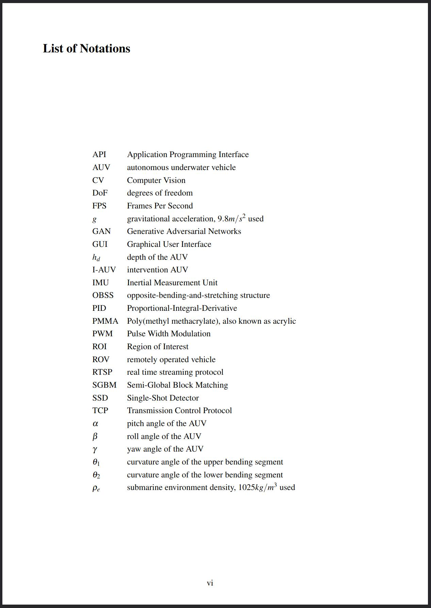</div>

论文中有很多专业名词/缩写/符号的话可以放一个术语表在前头, 类似上面☝这样, 在这个表上也可以反向列出这些词都在哪里出现过. 在术语表的实现上[overleaf给出的方案](https://www.overleaf.com/learn/latex/Glossaries#Compiling_the_glossary)只是最基础的方式, 这里有个[术语表实现方案比较表](http://mirror.ctan.org/macros/latex/contrib/glossaries/glossaries-user.html#tab:options), 不过对比得比较细节. 大意就是用`bib2gls`的方案除了需要额外安装`bib2gls`和java的缺点全是优点. 而这两个东西一点都不难安: `bib2gls`似乎并不需要额外安装, 至少我这安装了*texlive-most*后就已经有了. 而Java, 至少在Linux系统上, 网上随便一搜就一堆教程, 基本也就是几句命令的事. 从上图我的示例可以看出这个方案生成的术语表可以很好的排序混杂有希腊字母以及下标的各种术语, 而且用一个单独的bib文件管理所有术语, 只有文章里实际用到的术语才会列在术语表里, 很省心.

安好了`bib2gls`和java, 如果你是用VSCode来编辑LaTeX的, 那事情很简单. 打开VSCode的用户级配置json, 然后把LaTeX Workshop的编译工具链方案配置改成这个 (反正默认配置json里还有默认配置, 别担心):

```json
"latex-workshop.latex.recipes": [
    {
        "name": "xelatex ➞ bib2gls ➞ biber ➞ xelatex",
        "tools": [
            "xelatex",
            "bib2gls",
            "biber",
            "xelatex"
        ]
    },
],
```

等你重启VSCode后你会发现LaTeX Workshop插件的面板里**Build LaTeX project**一栏里就只有*xelatex ➞ bib2gls ➞ biber ➞ xelatex*这一个方案了 😏 这样一来就配置好了, 接下来只需要想上面的模板一样导入***glossaries-extra***包, 在自己的术语表bib文件中加点术语, 就可以在正文中用`\gls{}`来插入术语了! 具体例子看[这个回答](https://tex.stackexchange.com/a/366282)的**Method 4** (得往下翻翻).

💡 之所以要调用两次**xelatex**是因为文中对图表的引用, 术语表的引用等交叉引用第一次编译只会生成在辅助文件 (aux) 中, 第二次编译才会生成完整的文章. **biber**是干嘛用的[后文](#引用)会说到.

## 版式

在`main.tex`最开头:

💡 方括号中为可选参数, 我只是列出我觉得比较有用的参数, 按需添加.

```latex
\documentclass[
    12pt,  % 设置字号为12pt. 默认字号为10pt, 但好像一般都要求12pt
    twoside,  % 设置双开页. article和report默认为单页
    twocolumn,  % 设置为全文双栏排版. 默认为单栏. 使用multicols环境更好用, 可以设置多栏
    showframe,  % 用线框可视化显示当前布局各边距大小
    draft  % 指定为草稿模式, 会进行简化使生成更快, 在断行不良/溢出出加黑色方块给出提示. 默认为final (终稿模式)
]{article}  % 设置文档类型为article (常规文档), 可能的文档类型还有report (较长的报告, 如博士论文, 技术报告等), book等

\usepackage[
    a4paper,  % 纸张大小在\documentclass的参数中也可以设置, 但在这统一管理尺寸问题比较省事. 默认大小为美式信纸 (letterpaper)
    inner=2.5cm,
    outer=2cm,
    top=2cm,  % 上边距
    bottom=2cm  % 下边距
]{geometry}  % 使用geometry这个包设置更具体的页面大小和页边距

% 将行间距设置为1.5倍 (显得多一些)
\usepackage{setspace}
\onehalfspacing{}
```

### 布局/页边距设置

[Overleaf相关文档](https://www.overleaf.com/learn/latex/Page_size_and_margins)

因为我的本科毕业论文是要打印的 (但最后也没打印555), 我就设置了**双开页**, 作用在于页面会有左右之分了. 比如我们学院要求内侧页边距2.5cm, 外侧页边距2cm, 那么左边这页的左页边距为2cm, 右页边距为2.5cm, 而右边这页的左页边距为2.5cm, 右页边距为2cm. 之所以内侧页边距多一些是给装订留一些出血 (就是会被装订得看不到的余地). 使用`showframe`这个选项的话生成的pdf会以线框的形式可视化显示到底布局是怎样的, 就能很明心啊看出左右两页不一样了. 另外页眉页脚位置, 页码位置也会是左右对称的, 如果你设置了显示这些的话.

### 字体及中文支持

全文的字体大小在`\documentclass[]{}`的参数中指定, 基本就用12pt. 在此处指定字体大小后文中想改变字体大小实际是通过`\large`, `\small`这样的命令给出的, 并不使用具体字号. 关于字体大小更多的设定我暂时没有研究过.

实际上想用latex文件生成pdf有好几个编译器可以用, 最常被提到且速度最快的是`pdflatex`, 但pdflatex对UTF-8支持不够好, 对现代字体支持也不够好, 而且可能因为我的文档页数不够多, 我真没体验出速度有什么差别. `xelatex`对特殊字符及现代字体支持很好, 对中文兼容也很好, 因此目前我更偏向使用xelatex. 这个编译器生成的pdf文件会比pdflatex无参数生成的小不少, 因为它默认会进行无损压缩.

```latex
\usepackage{fontspec}
\setromanfont{Times New Roman}  % 指定普通字体
\setsansfont{Arial}  % 指定无衬线字体
\setmonofont{Courier New}  % 指定等宽字体
\usepackage{xeCJK}  % 中文支持
```

当使用`xelatex`作为编译器时可以使用***fontspec***包来指定字体. 更详细的指定方式参见[Overleaf的文档](https://es.overleaf.com/learn/latex/XeLaTeX). 不过虽然我们学院的论文格式要求也对字体提出了要求, 但所要求的**Times New Roman**, **Arial**这几个字体其实都是Windows系统专有的. 我的Manjaro系统虽然也有替代字体, 但是我感觉默认字体看着也挺好而且老师其实没管所以就没折腾. 实际写作我并没有主动使用过切换字体的命令, 暂时感觉用不到.

当设置好全文字体大小及字体后, 在文中想设置文字的样式, 比如加粗/斜体/下划线/小型大写字母, 或者大点/小点的, 用到的命令[这里](https://www.overleaf.com/learn/latex/Font_sizes%2C_families%2C_and_styles#Reference_guide)有一个列表可查. 注意变更样式的部分用大括号括起来, 不然后面所有字符的样式都会维持这样.

### 两个常见问题

#### 如何创建能在目录中显示的四级标题

LaTeX原生提供了7级标题:

- **-1** `\part{}` (只有report和book类型文档中可用)
- **0** `\chapter{}` (只有report和book类型文档中可用)
- **1** `\section{}`
- **2** `\subsection{}`
- **3** `\subsubsection{}`
- **4** `\paragraph{}`
- **5** `\subparagraph{}`

💡如果刻意不想让某一章节/子章节之类出现在标题中, 那就用`\section*{}`, `\subsection*{}`这样带星号的.

`\paragraph{}`和`\subparagraph{}`无法被显示在目录中, 在文中看着也不太像是标题, 更像加粗的正文. 下图中**test 1**为`\paragraph{}`, **test 2**为`\subparagraph{}`, **test 3**为`\subsubsection{}`.

<div>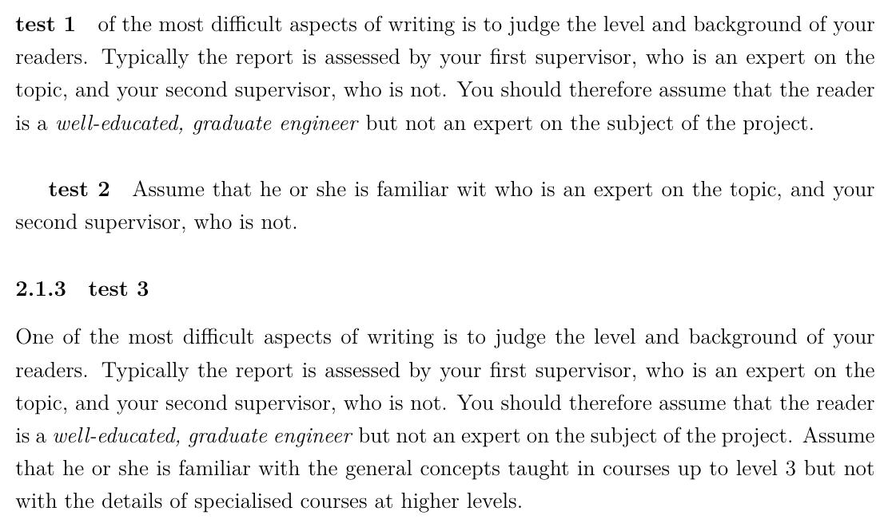</div>

因此真要说的话在article这种文档类型中LaTeX原生提供的标题只有三级. 要是写短篇论文的话确实也不需要更小的标题了, 但是记个笔记之类还是有可能需要更多级的标题. [这个stackoverflow问题](https://tex.stackexchange.com/questions/60209/how-to-add-an-extra-level-of-sections-with-headings-below-subsubsection)有给出一些解决方案.

#### underfull和overfull警告是什么

这两种警告是在编译后非常常见的警告, 意味着编译器在这一行找不到合适的换行的地方, 导致这一行在文字框限制内排版出来要不是太空了 (underfull) 要不就是太挤了 (overfull). 也就是说这基本是英文这样的字母语言才会遇到的问题. Overleaf[这篇文章](https://www.overleaf.com/learn/how-to/Understanding_underfull_and_overfull_box_warnings)很详细讲了原因, 但几乎没给处理办法. 💡 要注意其中提到的***microtype***包xelatex[目前几乎不支持](https://tex.stackexchange.com/questions/118713/is-microtype-fully-supported-now-by-xelatex-if-not-how-can-i-keep-myself-up-to), 但我感觉我就用默认排版工具生成的pdf排版也还挺好的? 以下是一些关于断行的小技巧.

##### 断词与不要断词

实际上遇到行末长单词干扰LaTeX排版的时候LaTeX会自动按音节将这个长单词断词, 在行末留个`-`. 不过有时会想要指定一些单词的断词位置, 有两种方式:
1. 在正文中通过加入`\-`允许在此处断词. 可以指定多处允许断词的地方, 然后LaTeX会选择其中一个位置来断词:
   ```latex
   what a phen\-omen\-on.
   ```
2. 在导言部分用`\hyphenation{}`指定一组词的断词位置. 同样, 需要断词时LaTeX会从指定的几个位置之一断词. 💡注意这些词是大小写不敏感的:
   ```latex
   \hyphenation{hy-phe-n-a-tion t-est}  % 指定hyphenation和test的断词位置
   ```

而有时甚至会不想这个词断掉, 还是有两种方式:
1. 在正文中用`\mbox{}`强制一串字符不被断开:
   ```latex
   KFC phone number is \mbox{400 823 823}
   ```
2. 其实`\hyphenation{}`也可以用来指定一组禁止被断词的单词. 只要不给出断词位置, 就会被认为不能断词:
   ```latex
   \hyphenation{hyphenation python}  % 指定hyphenation和python不能被断开
   ```

##### 空格

看教程前我其实是没注意到的, LaTeX排版出的空格竟然有这么些细小区别...

- 在LaTeX中多个空格会被当成一个空格 (多个回车也只会产生到下一段的效果). 想用word那样的空格魔法或者回车魔法的话用`\hspace{len}`和`\vspace{len}` 😏.
- **带子** (tie) `~`. 在两个单词间加`~`而不是空格能产生一个不会被断行的空格. 一般用在人名之类的地方.
- 句末标点 (**小写字母**后的./?/!) 后的空格会比普通空格长一些. 之所以强调是小写字母后的, 是因为以大写字母结尾会被LaTeX认为最后这个词是人名因而不加长空格. 此时 (如果你真在意这个的话) 用`\@`手动指明. 你会发现下面这个图里`OK.`后的空格长度确实有区别, 但区别非常小:
  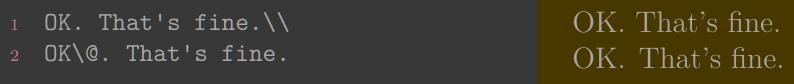
  另一种情况则是非句末标点被识别为句末标点了, 比如"Prof. Smith". 此时可以用`~`或者`\ ` (👈 注意\\后面有个空格)来缩短间距. 不过`~`不允许空格处断行而`\ `允许.
- 还有时会看到`\Tex{} Live`或`\Tex\ Live`这样明明不支持参数的命令 (如`\Tex`) 后却有{}或者`\ `, 这是为了让不支持参数的命令后的空格能被正常排版.

##### 手动断行

用`\\`可以在段落内手动换行. 但不同于在word中到处用回车, [无脑`\\`似乎是不被推荐的](https://www.overleaf.com/learn/how-to/Understanding_underfull_and_overfull_box_warnings?#Notes_on_using_.5C.5C). 在上文中推荐的*一份不太简短的LaTeX2ε介绍*中**2.4.2 手动断行和断页**这节有提到几种断行命令的具体区别 (但我感觉没必要管就没看).

## 超链接

```latex
\usepackage[svgnames]{xcolor}  % colouring
\definecolor{bleu_cite}{RGB}{34,111,212}

\usepackage{hyperref}  % 这个包的导入最好放在导言区最后
\hypersetup{
    colorlinks=true,
    linkcolor=LightSlateGray,  % 默认值red
    citecolor=bleu_cite,  % 默认值green
}
```

这年代写论文超链接肯定得有, 不然逼格不太够. 导入了***hyperref***这个包, 目录, 参考文献引用, 图表的交叉引用, 网页链接等才会具有超链接的特性. 上面是我的配置. 导入***xcolor***包可以用`\definecolor{}`命令自定义一些颜色, 带参数的话也可以使用***xcolor***提供的很多种颜色, 比如上面用的`svgnames`这个颜色集里有`LightSlateGray`. 我基本就用这个颜色集, 下图列出了*svgnames*提供的所有颜色. 这里的*linkcolor*指的不是网页链接的颜色, 是页内链接的, 比如目录, 术语到术语表的跳转链接等. 网页链接的颜色值对应的是*urlcolor*, 默认颜色是品红色, 还挺好看的, 我就没改. 正如在有的论文中见到的那样, 超链接也可以改成带颜色框的样式, 操作方式参考[这个回答](https://tex.stackexchange.com/questions/50747/options-for-appearance-of-links-in-hyperref).

<div>
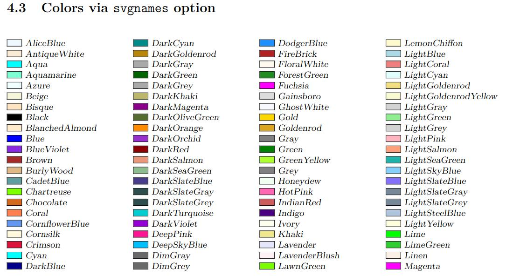
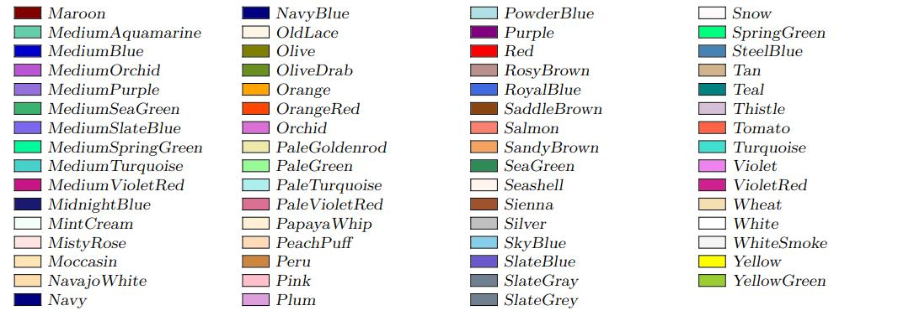
</div>

## 加速生成

### 草稿模式

随着工程大起来生成pdf会变慢, 有一些技巧可以加速生成不完整的pdf, 在写作过程中快速检查. 因为LaTeX每次生成并不能利用.

一种方式是开启草稿模式. 方式是在上面提到的`\documentclass[]{}`的参数里加个`draft`. 以草稿模式生成的pdf里图片不会实际插入, 是用一个同样大小的方框来表示. 超链接, 书签等功能也会被关闭. 另外比较好的一点是在underfull/overfull的行会被在行末添加一个黑色方块标记出来.

### xelatex的pdf压缩等级

xelatex在生成pdf时默认会进行压缩, 这会让生成的pdf相对很小, 同时也会耗时更长. 写作过程中其实并没有必要压缩pdf, 那可以设置压缩等级为0加速pdf生成, 等生成最终版pdf时再把压缩等级拉满设为9.

```latex
% 放在导言部分
\special{dvipdfmx:config z 0}  % 👈这个0换成9就是最大压缩等级了.
```

## 插入

### 数学公式, 样式

这个CSDN上的[LaTeX基本数学公式语法](https://blog.csdn.net/ethmery/article/details/50670297)列出了希腊字母, 上下标, 矢量, 特殊符号, 矩阵等数学公式常用命令, 还挺全的.

作为一个菜鸟我还没用LaTeX写过很复杂的公式, 因此还没有用过***amsmath***这个增强[公式排版](https://www.overleaf.com/learn/latex/Aligning%20equations%20with%20amsmath)的包, 但据overleaf这篇文章原生支持对排版支持不够好, 因此我先码住.

然后这还有一篇Overleaf的[数学相关内容合集](https://www.overleaf.com/learn/latex/Mathematics) 🐮

### 浮动体

figure和table是LaTeX原生的两种浮动体环境, 用于灵活排版图片和表格, 并且为图表标题 (caption) 提供环境 (就是说即便不放在浮动体里也可以将图片表格插入LaTeX). 而且其实这两种环境中什么都能放, 没有限定只能放图片或表格. 这两种环境都可以给[*placement*]参数 (默认是`btp`), 通过指定`htb`限制只能放在这三种位置 (也就是不允许单独成页). 可用参数参见[这附近有的一个表格](https://www.overleaf.com/learn/latex/Inserting_Images#Positioning). 值得一提的是LaTeX总是以h-t-b-p的优先级来决定浮动体位置, 和填的参数的顺序无关. 💡 除单独成页外, 默认每页不超过3个浮动体, 其中顶部不超过2个, 底部不超过1个以及浮动体空间占页面的百分比 (默认顶部不超过70%, 底部不超过30%)

关于双栏环境下浮动体的排版以及其他细节见*一份不太简短的LaTeX2ε介绍*的**3.9 浮动体**.

#### 图片

先上一个论文利用的懒人模板样例 (效果如图):

<div>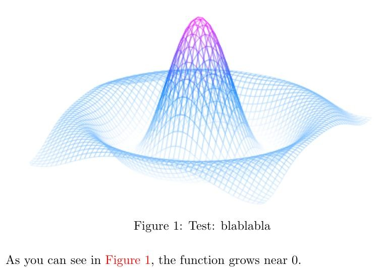</div>

```latex
% 导言部分
\usepackage{graphicx}  % 图片插入支持宏包
\graphicspath{{./}}  % 将之后插入图片的检索路径设为根文件所在目录, 不然插入图片时的图片地址是相对于当前tex文件的, 会比较麻烦
% \graphicspath{{./Figures}}  % 其实更常见的是直接将检索路径设为你的图片文件夹, 但我为了能触发我VSC的路径补全所以只设成了根文件所在目录
\usepackage[
   colorlinks=true,
]{hyperref}  % 给交叉引用的引用编号添加超链接支持

% 正文部分
\begin{figure}[htb]
      \centering  % 让图片居中. 默认是左对齐
      \includegraphics[width=0.8\textwidth]{Figures/mesh.jpg}  % 限制图片宽度为0.8倍版面宽度
      \caption[Test]{Test: blablabla}\label{f:mesh}
\end{figure}

As you can see in \autoref{f:mesh}, the function grows near 0.
```

用`\caption`命令可以给图片等浮动体加标题, 在`{}`中的是长标题, 就是显示在图下那个. 而在`[]`中的短标题是会显示在图目录中的标题 (用`\listoffigures`来生成图目录). 我习惯在长标题里开头用短标题, 能实现很多论文里**概要: 详细描述**的图标题形式.

`\lable`是交叉引用, 可以用来在文中提及章节/公式/图表等. 导入***hyperref***包能支持点击引用处跳转, 这样体验才够良好. 用`\autoref`而不是`\ref`能让整个引用编号 (比如上面的红色的**Figure 1**)而不是只有**1**是超链接. `\ref{}`或者`\autoref{}`的参数可以随便写, 之所以加个`f:`的前缀是为了将图片, 表格等类交叉引用区别开, 方便管理, 比如说VSC的LaTeX Workshop支持交叉引用的补全提示.

细节解释可以参考这几个链接:
- [Overleaf的插入图片全教程](https://www.overleaf.com/learn/latex/Inserting_Images#Generating_high-res_and_low-res_images)
- [如何添加图片短标题](https://tex.stackexchange.com/questions/24496/use-caption-and-long-description-for-figure/422496)
- [如何在表格中插入图片](https://tex.stackexchange.com/a/53062)
- [如何旋转图片](https://tex.stackexchange.com/questions/101645/how-to-turn-latex-figure-by-90-degrees-along-with-the-caption)

还有一点是如何插入矢量图形. 目前所有LaTeX编译器都没有对svg提供原生支持, 倒是[有办法可以强行插入svg](https://tex.stackexchange.com/questions/2099/how-to-include-svg-diagrams-in-latex), 但是也很麻烦. 其实解决办法很简单: **不要插入svg** 😁 svg可以很容易地被转为pdf, 而LaTeX对pdf插入支持很好 (其实现在这年代LaTeX中插入矢量图片就是插入pdf). 在Linux下可以用**inkscape**打开svg然后直接另存为pdf. ❗注意不要勾选*Omit text in PDF and create LaTeX file*. 这狗屎东西会把你svg里的文字无脑转为LaTeX然后你会发现你好不容易排版的文字在LaTeX里绘制出来后大小, 字体都是正文字体, 经常直接没法看. 直接转为pdf的话会生成一个和svg同样尺寸的pdf, 透明部分会被填充为白色, 不过写论文的话这样刚好.

关于制作论文用矢量图, 因为我目前并不需要绘制复杂的矢量图, 基本是给位图或者程序生成的矢量图加点箭头文字然后排版一下之类. 因此我目前就是PPT做图, 全选当前页上所有东西 (如果你也是一页PPT画一张图的话), 然后另存为svg, 免得想在其他电脑/WPS编辑时发现不太兼容 (更保险一点你可以[将字体嵌入PPT](https://support.microsoft.com/zh-cn/office/%E5%B5%8C%E5%85%A5%E8%87%AA%E5%AE%9A%E4%B9%89%E5%AD%97%E4%BD%93%E7%9A%84%E5%A5%BD%E5%A4%84-cb3982aa-ea76-4323-b008-86670f222dbc), 防止出字体问题). 如果你做的这张图用到了PPT的背景, 存svg是没法把背景一块存下来的. 此样的话选打印, 然后选仅打印当前页, 这样就能获得一个单页的pdf矢量图了!

#### 表格

同样先上个懒人模板:
```latex
% 导言部分
\usepackage{tabularx}  % 表格插入支持宏包
\usepackage{booktabs}  % 好像只是拿来画分隔线的

% 正文部分
\begin{table}[htb]
    \renewcommand*{\arraystretch}{1.3}  % 增大一点行间距让表格不那么紧凑
    \centering
    \caption[Short Title]{Short Title: long description}\label{t:table_test}
    \begin{tabularx}{0.6\textwidth}{Xcc}
        \toprule
        title1 & title2 & title3 \\
        \midrule
        experiment 1 & item 11 & item 12 \\
        experiment 2  & item 21  & item 22 \\
        \bottomrule
    \end{tabularx}
\end{table}
```

<div>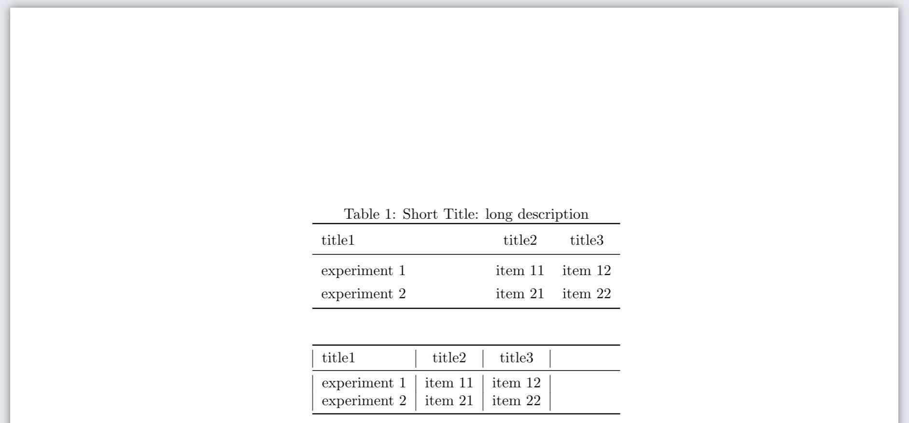</div>

图中前一个表格是上面的模板的效果, 后一个表格是没有增大行间距的表格的效果. 插入表格有几种环境可用, `tabularx`这个环境是允许指定整个表的宽度和每列的对齐方式后自动计算每列宽度, 我觉得比`tabular`环境更智能省心. `tabularx`环境接受两个参数, 前一个是整个表格的宽度, 后一个是每列的对齐方式. `X`和`l`都是左对齐, 但`X`会让这列的列宽更宽, 让内容能占满整个表格. 比如上图前面的表格第一列就是`X`而后一个表格第一列是`l`, 就只有刚好适应单元格内容的列宽. 从单元格的侧边框可以看出最后一列确实是居中对齐, 但因为LaTeX是从左到右排版表格的, 因此多了些空余... `c`和`r`则是适应单元格宽度的居中对齐和右对齐. 想要智能宽度的居中对齐和右对齐的话用`>{\centering\arraybackslash}X`和`>{\raggedleft\arraybackslash}X` (没错这一长串和`l`一样往里填)

`&`用来分隔一行中的单元格, `\\`表示一行的末尾. ***booktabs***这个包里好像只有一些分隔线, `\toprule`, `\midrule`这些的. 更多画边框线的方式参加[overleaf-表格](https://www.overleaf.com/learn/latex/tables).

### 列表

有序列表用`enumerate`环境, 无序列表用`itemize`环境. 这个没啥难的, 有问题参见[overleaf-列表](https://www.overleaf.com/learn/latex/lists).

💡 另外这里有个通过给`itemize`和`enumerate`环境的选项的方式[调整列表行间距的方法](https://tex.stackexchange.com/questions/10684/vertical-space-in-lists).

### 代码

`lstlisting`环境 (需要导入***listings***宏包) 是传统的插入代码用环境, 只是插入个代码的话倒是语法也很简单, 但是要想让插入的代码有语法高亮的话就必须[这样](https://www.overleaf.com/learn/latex/Code_listing#Code_styles_and_colours)自己在导言区放一个语法高亮配色方案, 很不简洁. 强推一下`minted`环境 (需要导入***minted***宏包), 这是一个自带多种语法高亮配色方案且支持绝大多数语言语法高亮的很现代的代码插入环境! 使用方式见[overleaf-用minted语法高亮](https://www.overleaf.com/learn/latex/Code_Highlighting_with_minted#Introduction). 如果你追求比较高, 觉得minted自带的语法高亮不够细致,  比如minted对yaml的语法高亮不会像VSC那样将布尔值, 数字, 字符串等类型值用颜色标示出来, 那可以看看stackoverflow上这个[自定义语法高亮问题](https://tex.stackexchange.com/questions/152829/how-can-i-highlight-yaml-code-in-a-pretty-way-with-listings).

💡 ***minted***包依赖于一个叫*Pygments*的python包. 如果你环境里本来就有python那事情就很简单了, 一句`pip install pygments`搞定.

补充: [跨页代码无法caption问题](https://tex.stackexchange.com/questions/12428/code-spanning-over-two-pages-with-minted-inside-listing-with-caption).

### 特殊符号

<div>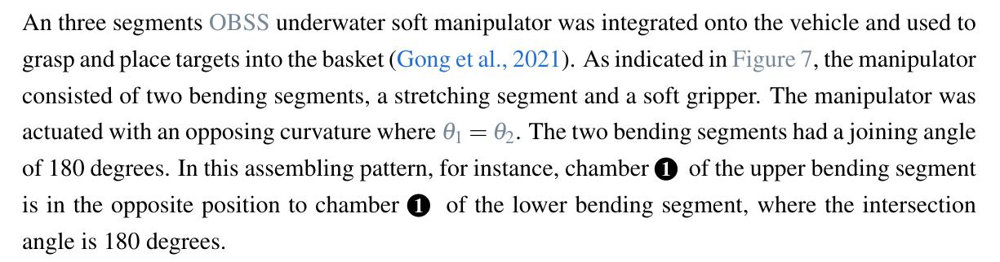</div>

LaTeX里更特殊的符号其实是靠***tkiz***包绘制出来的, 比如上面这段话里的圆圈1, 是通过在导言区定义了一个新的命令`\ballnumber{}`然后在文中调用的方式来实现的:

```latex
% 导言区
\usepackage{tikz}  % 绘图宏包
\newcommand{\ballnumber}[1]{
    \tikz[baseline=(myanchor.base)]
    \node[circle,fill=.,inner sep=1pt](myanchor){\color{-.}\bfseries\footnotesize #1};
}
```

这样的东西要用只能是现场上网搜了. 在这个[手绘查询符号网站](http://detexify.kirelabs.org/classify.html)可以通过手绘的方式查到绝大多数符号 (但上面说的这个圆圈1查不到). 这里再吹一下VSC的LaTeX Workshop插件, 提供了一个快速插入常见符号LaTeX命令的面板, 还能快速插入常用tkiz绘制 🐮

<div>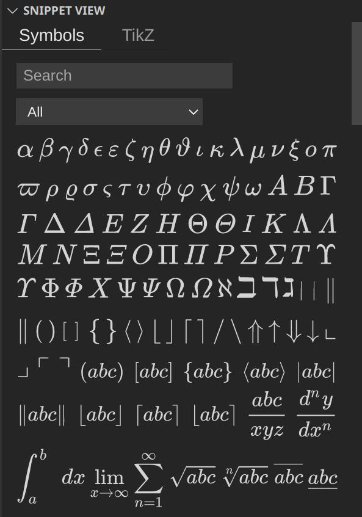</div>

## 中文支持

我目前还没用LaTeX写过中文内容, 不过看起来***xeCJK***宏包提供的中文支持效果还不错 (前提是用xelatex作为编译器), 不知道大量使用中文时会不会出问题. 这篇[overleaf-中文支持](https://www.overleaf.com/learn/latex/Chinese#xeCJK_with_XeLaTeX)我先码住.

## 引用

`biblatex`是毋庸置疑比`bibtex`更现代使用更简洁灵活的参考文献管理工具. 先上个我偏好的配置:

```latex
% 导言区
\usepackage[
    backend=biber,
    style=ieee,  % 参考文献列表显示格式
    citestyle=authoryear,  % 引用显示格式
    backref=true,  % 在参考文献列表中反向列出当前引用条目被引用的页码
    maxcitenames=1,  % 在引用处最多显示作者数量
    maxbibnames=999,  % 在参考文献列表中最多显示作者数量. 直接拉到一个很大的数强制显示全部作者
    sorting=ynt,  % 参考文献列表中条目排序主键: year-name-title
]{biblatex}
% 添加参考文献bib文件 (可以有多个)
\addbibresource{References.bib}  % 然后放一个References.bib在根目录
% 让链接包含整个\cite{}对应的内容
\makeatletter
    \let\abx@macro@citeOrig\abx@macro@cite{}
    \renewbibmacro{cite}{\bibhyperref{\let\bibhyperref\relax\relax\abx@macro@citeOrig{}}}
\makeatother{}
% 使\citetitle{}对应内容支持超链接
\DeclareCiteCommand{\citetitle}{\usebibmacro{prenote}}{
    \ifciteindex{\indexfield{indextitle}}{}\printtext[bibhyperref]{\printfield[citetitle]{labeltitle}}
}{\multicitedelim}{\usebibmacro{postnote}}

\usepackage[colorlinks=true]{hyperref}  % 开启超链接支持

% 正文
\cite{test}  %在要引用的地方用个这个就行, 参数填bib文件中这个参考文献条目的标识 (大括号后第一个东西)

\printbibliography  % 输出参考文献列表
```

<div>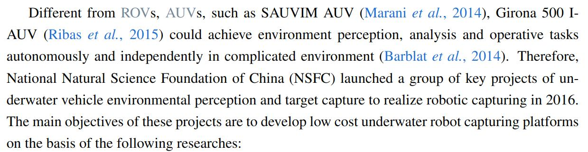
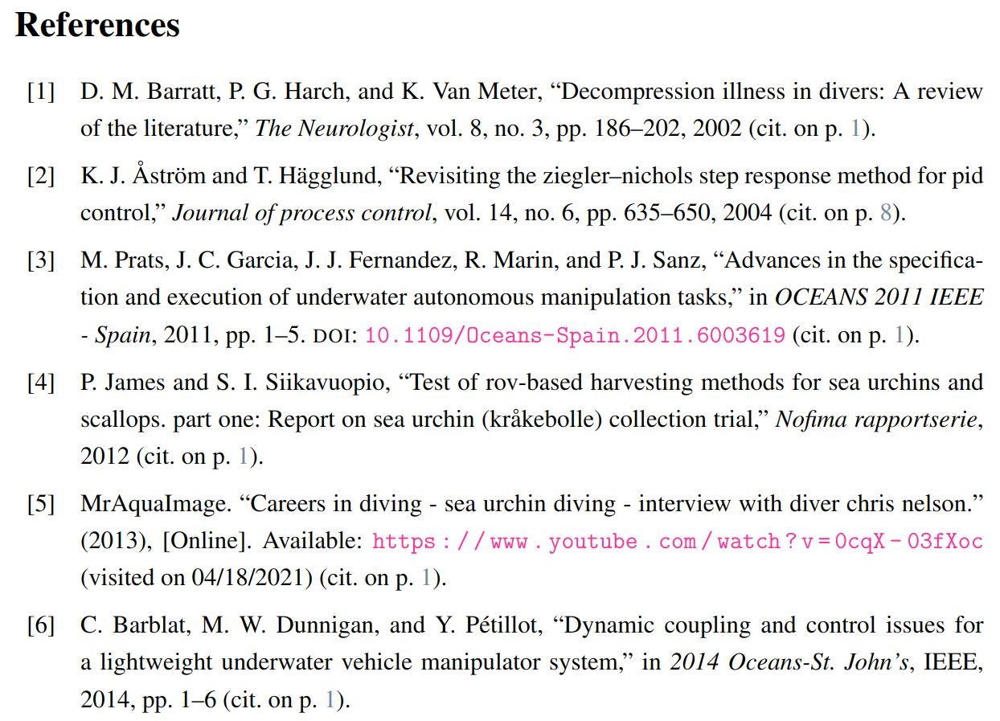</div>

- `backend=biber`是因为`biblatex`需要额外工具**biber**作为后端来生成参考文献列表. 因此我[这附近](#术语表)给出的VSCode的LaTeX编译工具链配置里有一环是**biber**.
- `style=ieee`指的参考文献列表显示参考文献信息的格式, [这里](https://www.overleaf.com/learn/latex/Biblatex_bibliography_styles)有一个各种格式的列表. 基本我看到的短篇论文用的是*authoryear*格式, 长篇论文用的是*ieee*格式. 我个人相对更喜欢*ieee*格式一些, 因为有序号.
- `citestyle=authoryear`则是指在文中引用处用`\cite{}`显示出的内容的格式. *Zhangsan et al. 2020*这样的格式是我最常见到的引用格式 (Overleaf有列出[biblatex可用的引用格式](https://www.overleaf.com/learn/latex/Biblatex_citation_styles#Citation_styles)). 要实现上面这样整个引用内容被包含在超链接中, 而不是只有年份带超链接还需要自己加一段宏. biblatex的维护者在[github仓库的issue](https://github.com/plk/biblatex/issues/1024)回答了之所以不将超链接包含整个引用内容做成一个自带功能, 是因为这会使有其他自定义需求的用户实现起来更麻烦 (咱也不知道是不是, 反正自己想实现的话一小段网上找的宏就实现了). 这块要想玩得花很有可能需要自定义一段宏, 那自己不会写能咋办, 只能上网偷几段呗.
- `maxcitenames=1, maxbibnames=999`是为了像上图展示的那样在引用处只显示一个作者, 而在参考文献列表里显示全部作者. 如果不强制拉满的话有时候在参考文献列表中作者也列不全, 带"et al.". 这不是什么大问题, 但看着尴尬了点.
- 想让引用内容可点击且颜色不一样还需要导入***hyperref***这个包, 这个稍后介绍.

之所以说biblatex是比bibtex更现代的参考文献管理工具, 一大原因是因为biblatex原生支持一些现代人写论文会用到的"参考文献"类型, 比如网页对应*online*类型 (对我目前就多用到这一个). 给出[overleaf上biblatex支持的参考文献类型列表](https://www.overleaf.com/learn/latex/Bibliography_management_with_biblatex#Reference_guide). 顺带一提我还看到了能让[biblatex中@online的urldata字段自动更新到今日](https://tex.stackexchange.com/questions/149506/biblatex-urldate-set-to-today)的神奇代码, 但想了想写论文出于严谨态度就该哪天确认的网页有效就写哪天, 单纯自动更新日期没有意义.