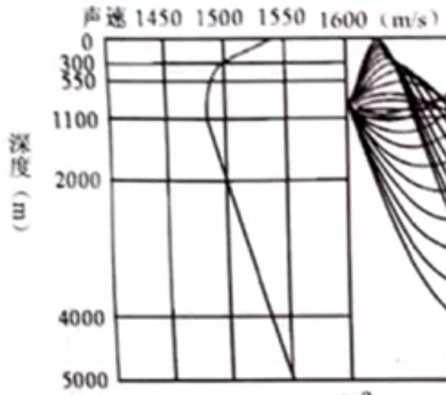
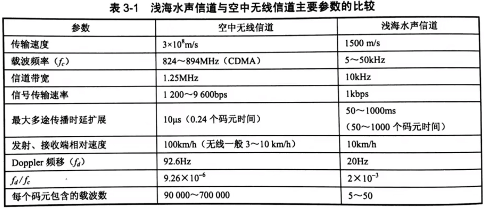
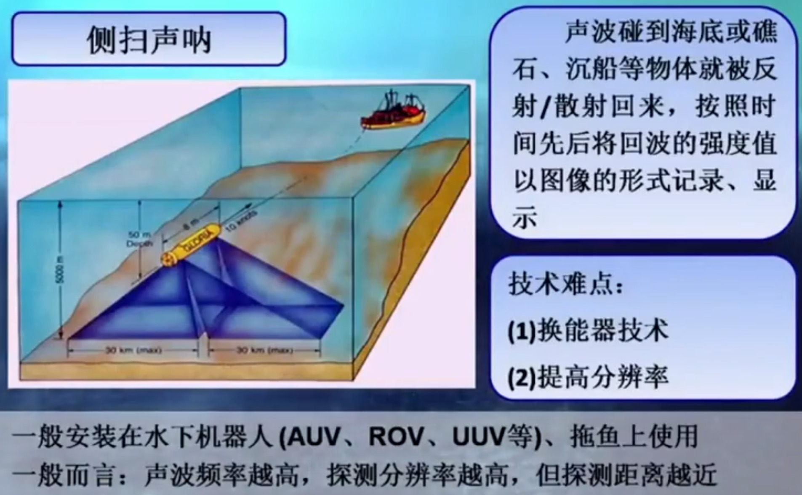
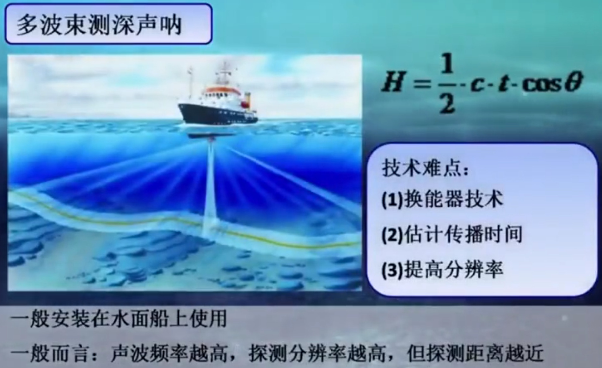
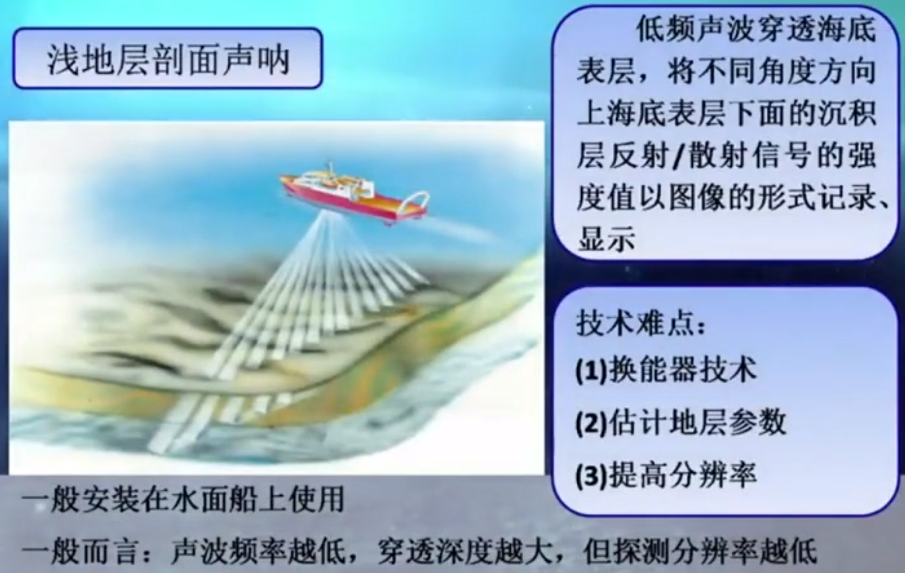
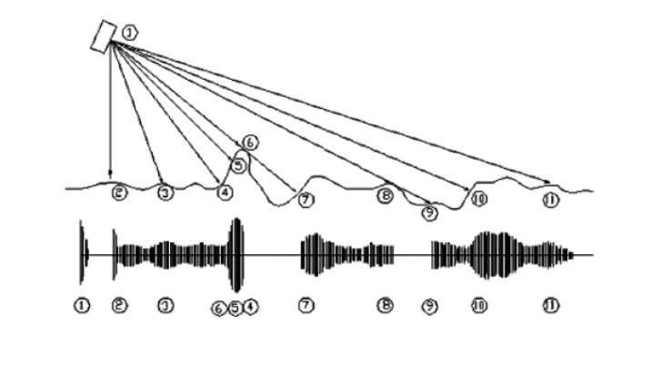
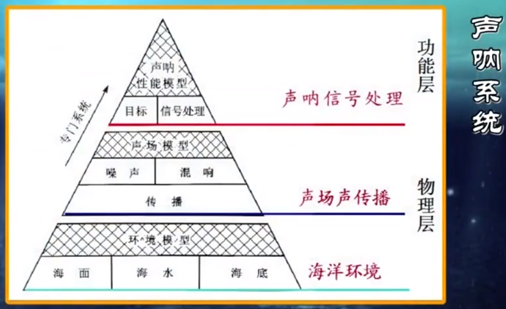
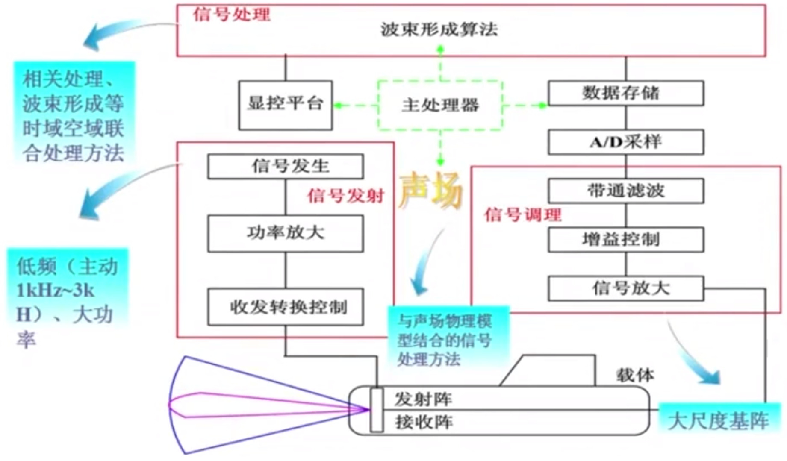
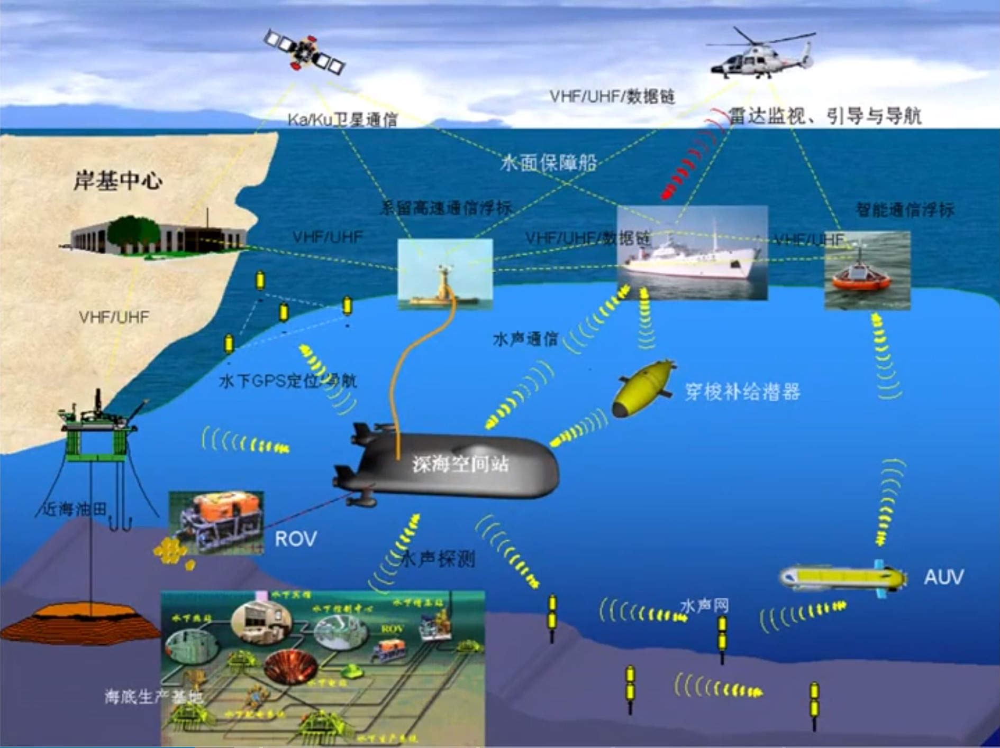
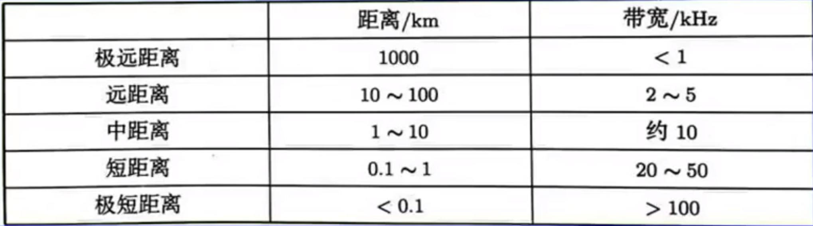

看了[哈工程公开课-探海利器-声呐](https://www.bilibili.com/video/BV1qu411679n)这门概论性质的课对声呐有了一个最基础的了解, 看的过程中记了一些笔记. 搜索的时候还发现另外两门更深入的课程: [哈工程-水声学](https://www.icourse163.org/course/HRBEU-1002013001), [海军航空大学-声纳技术](https://www.xuetangx.com/course/nau07021002103/10327221), 有机会也来看一看.

<!-- More -->

## 定义和发展方向

现代声呐: 在水下利用声波进行探测, 导航, 定位, 识别, 通信等所有电子设备的总称.

发展特点: 低频, 大功率, 宽频带, 高搜索率, 高定位精度

发展方向:

- 先进的信号处理技术
- 水声通信和声呐组网技术
- 被动声呐技术
- 低频大功率主动声呐技术

## 海洋

- 是双界面波导, 上面是波浪起伏的海面, 下面是凹凸不平的海底

- 海水中声速受该点温度, 盐度, 压力影响

  - 温度+1, 声速+4.2m/s

  - 盐度+1‰, 声速+1.3m/s (淡水中盐度变化对声速影响可以忽略不计)

  - 压力+1atm, 声速+0.17m/s

  - 声速随海水深度先降后升, 声速最小处称**声道轴**. 在海面附近由于阳光照射温度较高, 越往下温度越低.水深到一定程度后温度几乎不变, 由于盐度和压力也在增加所以速度又增大. 💡淡水中目前没有发现声道轴, 主要受温度影响, 会有声线弯曲.

    

- 海水是时变空变的水声信道 (滤波器). 水声信道特性:

  - 多途效应
    - 引起信号的时间展宽(浅海几百毫秒, 深海几秒), 码间干扰, 改变码元波形并产生误码, 降低系统可靠性和通信速率
    - 抗多途干扰措施:
      1. 增加码元保护间隔 (会降低通信速率)
      2. 使用指向性换能器
      3. 利用衰落的各种选择性, 使用合适的分集技术
      4. 使用合理的调制技术, 扩频技术
      5. 使用合适的自适应技术
      6. ...
  - 频散效应: 不同频率声波在海中传播的群速度不同, 因此会有信号的变形
  - 多普勒频移: 由发射接收相对运动或水流引起, 与相对运动速度和工作频率成正比.
  - 声传播方向偏转
  - 在浅海传播时的低频截止现象
  - 在深海传播时的会聚现象

## 水声技术与电磁波技术对比

- 有多少种运用电磁波的观通设备, 水下就大致有多少种功能类似的声呐
- 电磁波速度$3\times10^8m/s$, 声波在水中速度$1500m/s$, 决定
  - 雷达工作频率约$10^9Hz$, 声呐频率约$10^3Hz$
  - 声呐分辨率差, 声图像模糊
- 信息载体不同 (声波/ 电磁波), 信道不同 (海洋/空气)

## 类型

### 按工作方式

- 主动声呐

  - 最重要三个影响因素: 环境噪声, 平台噪声, 混响 (来源于气泡, 冷热水团, 不均匀性, 界面的不平整性)

- 被动声呐

  - 需要获得的信息: 目标自身发出的声信号或者辐射噪声 (机械噪声, 螺旋桨噪声, 水动力噪声)
  - 干扰: 环境噪声, 平台自噪声 (近场噪声)

### 按用途分 (测绘声呐)

💡 不知道有没有类似平行光源 (比如激光) 概念的平行声源, 理论上是否可实现. 等我有机会问问老师.

  

    
  

  

    
  

  

  
  

- 测扫声呐: 探测海底底质. 收发合置的测扫声呐只能发射完成再接收, 收发分置的测扫声呐可以边发边收.
  

  > 测扫声呐工作原理 ⚠ 注意6的回波比5先回到换能器.
- 多波束测深声呐: 探测海底地形地貌
- 浅地层剖面声呐: 探测海底表面以下分层结构及分层介质的构成
- 多功能集成: 基于参量阵, 实现地形, 底质, 地层构造等信息的一体化探测
  - 高频/原频: 地形/底质
  - 低频/差频: 地层构造

## 声呐信号处理

  

    
  

  

    
  

> 上右图为声呐系统典型构成

声呐信号处理的基础是**海洋环境**和**声场声传播条件**.

经典声呐信号处理任务: 目标检测, 定位, 识别

声呐信号处理面临的难题:

- 水声信号带宽窄, 数据传输速度低, 声呐搜索速度慢
- 波束展宽引起分辨率降低
- 性能受环境影响大
- 目标及其信号的种类多, 特征复杂

## 海底测绘常用海底特性:

- 海底表面的起伏
- 海底表面沉积物类别
- 海底表面以下的地层构造 (分层结构及沉积物类别)

## 水声通信

蛟龙号水声通信种类:

- 相干水声通信: 高速, 可传输图像
- 非相干水声通信: 中速, 用于传输文字, 指令, 数据
- 扩频通信: 远程, 低速, 用于传输指令

> 水声信道典型带宽

