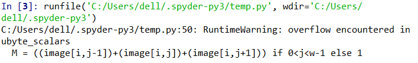

我想记录一下我遇到过的各种bug, 不论大小. 原本我从一开始学编程的时候就在这么做了, 但我也忘了我什么
时候竟然怠慢了这件事! 我会想到记录这些是上大学前的暑假看到
[这篇让人深受启发的教诲](https://zhuanlan.zhihu.com/p/22266788)而想要养成的习惯之一.
我认为这绝对不是浪费时间. 正如初高中学习时的错题本 (虽然我那时的错题本一共也没能记几笔)
只要我偶尔能想起来记几笔, 我想总是能为以后节省一些时间的.

# 有时候等号两侧不能加空格

- 在bash中赋值时等号两侧不能有空格
- 在swift中等号两侧要不都加等号, 要不都不加, 不可只有单侧有等号

# 此python非彼python

有时会遇到明明刚安装了一个包但调用的时候报错未找到该包, 再次安装显示已安装最新版的神奇情况

有以下几种可能 (总体来说是安装包的python环境和调用包的python环境不一样):

1. 如果你是用命令行安装的 (或者你安装了Anaconda,用conda安装的), 在IDE中调用的, 那你应当检查一
   下你的IDE调用的pytohn interpreter和cmd调用的是不是一个了. 比如Anaconda自带的Spyder默认的
   是python2.7, 但我设置的cmd调用的是一个3.6.4的python

   :heavy_check_mark: Anaconda中切换Spyder环境可以参考
   [这里](https://www.zhihu.com/question/49144687)
2. 如果环境中同时有python2和python3, 有可能将包安装到了python2的环境中但你的程序是
   python3的程序, 可以将`pip install` 换为 `pip3 install` 试试

:warning: 如果安装了conda那么安装python库最好使用conda, 尽量不要混用conda和pip,
**conda和pip的包格式不同, 两者是不兼容的, 甚至有的库在conda和pip中名字不同**.
有关在conda中没有某库但pip中有的情况可以
参考[这里](https://www.zhihu.com/question/49144687), 而关于混用conda与pip的危害可以
参考[这位日本兄弟的文章](http://onoz000.hatenablog.com/entry/2018/02/11/142347)

# 谨防数据溢出

这个例子是我在尝试细化图像的时候遇到的

## 代码

```python
def Xihua(image, array, num=1):
    iXihua = np.zeros(image.shape, np.uint8)
    iXihua = image.copy()
    for i in range(num):
        VThin(iXihua, array)
    return iXihua


def VThin(image, array):
    h = height
    w = width
    NEXT = 1
    for i in range(h):
        for j in range(w):
            if NEXT == 0:
                NEXT = 1
            else:
                M = (image[i, j-1] + image[i, j] + image[i, j+1]) if 0<j<w-1 else 1
                if image[i, j] == 0 and M != 0:
                    a = [0] * 9
                    for k in range(3):
                        for l in range(3):
                            if -1<(i-1+k)<h and -1 <(j-1+l)<w and image[i-1+k, j-1+l]==255:
                                a[k*3+l] = 1
                    sum = a[0]*1+a[1]*2+a[2]*4+a[3]*8+a[5]*16+a[6]*32+a[7]*64+a[8]*128
                    image[i, j] = array[sum] * 255
                    if array[sum] == 1:
                        NEXT = 0
    return image
```

## 报错信息



## 原因

M默认与image[i, j]同数据类型，而image[i, j]设定的是ubyte类型，范围-255~256，M极有可能数据溢出。

## 解决方法

将18行改为下面代码, 将M数据类型强制转为int

```python
M = (int(image[i, j-1]) + int(image[i, j]) + int(image[i, j+1])) if 0<j<w-1 else 1
```

<!-- TODO -->